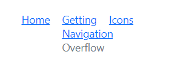
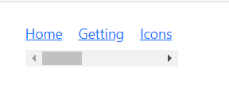

# Overflow Mode in Blazor Breadcrumb Component

The [Blazor Breadcrumb](https://www.syncfusion.com/blazor-components/blazor-breadcrumb) component provides extensive control over how its items are displayed when the available space is limited. This is achieved through the [MaxItems](https://help.syncfusion.com/cr/blazor/Syncfusion.Blazor.Navigations.SfBreadcrumb.html#Syncfusion_Blazor_Navigations_SfBreadcrumb_MaxItems) property and various [OverflowMode](https://help.syncfusion.com/cr/blazor/Syncfusion.Blazor.Navigations.SfBreadcrumb.html#Syncfusion_Blazor_Navigations_SfBreadcrumb_OverflowMode) options. These properties enable you to efficiently manage the number of visible Breadcrumb items and how hidden items are presented.

In the following examples, [MaxItems](https://help.syncfusion.com/cr/blazor/Syncfusion.Blazor.Navigations.SfBreadcrumb.html#Syncfusion_Blazor_Navigations_SfBreadcrumb_MaxItems) is set to `3`, and the [OverflowMode](https://help.syncfusion.com/cr/blazor/Syncfusion.Blazor.Navigations.SfBreadcrumb.html#Syncfusion_Blazor_Navigations_SfBreadcrumb_OverflowMode) as [Default](https://help.syncfusion.com/cr/blazor/Syncfusion.Blazor.Navigations.BreadcrumbOverflowMode.html#Syncfusion_Blazor_Navigations_BreadcrumbOverflowMode_Default). To prevent Breadcrumb item navigation, the [EnableNavigation](https://help.syncfusion.com/cr/blazor/Syncfusion.Blazor.Navigations.SfBreadcrumb.html#Syncfusion_Blazor_Navigations_SfBreadcrumb_EnableNavigation) property is set as `false`.

The following overflow modes are available in the Breadcrumb component.

* Collapsed
* Menu
* Wrap
* Scroll
* Hidden
* None

## Collapsed

The `Collapsed` mode displays the first and last Breadcrumb items, while consolidating the intermediate items behind a collapsed icon (represented by `...`). When this icon is clicked, all hidden items become visible and navigable. This mode is ideal for saving horizontal space when many items are present, prioritizing only the start and end of the path.

```cshtml
@using Syncfusion.Blazor.Navigations

<SfBreadcrumb MaxItems="3" EnableNavigation="false" OverflowMode="BreadcrumbOverflowMode.Collapsed">
    <BreadcrumbItems>
        <BreadcrumbItem Text="Home" Url="https://blazor.syncfusion.com/documentation/breadcrumb/introduction"></BreadcrumbItem>
        <BreadcrumbItem Text="Getting" Url="https://blazor.syncfusion.com/documentation/breadcrumb/getting-started"></BreadcrumbItem>
        <BreadcrumbItem Text="Icons" Url="https://blazor.syncfusion.com/documentation/breadcrumb/icons"></BreadcrumbItem>
        <BreadcrumbItem Text="Navigation" Url="https://blazor.syncfusion.com/documentation/breadcrumb/navigation"></BreadcrumbItem>
        <BreadcrumbItem Text="Overflow" Url="https://blazor.syncfusion.com/documentation/breadcrumb/overflow"></BreadcrumbItem>
    </BreadcrumbItems>
    <BreadcrumbTemplates>
        <SeparatorTemplate>
            <span class="e-icons e-arrow"></span>
        </SeparatorTemplate>
    </BreadcrumbTemplates>
</SfBreadcrumb>
```



## Menu

The `Menu` mode displays the maximum number of Breadcrumb items that can fit within the container's width. Any remaining items are placed into a submenu, accessible via an overflow indicator (e.g., a "more" button or ellipsis). This mode is suitable when intermediate items are less critical but should still be easily accessible through a secondary interaction.

```cshtml
@using Syncfusion.Blazor.Navigations

<SfBreadcrumb MaxItems="3" EnableNavigation="false" OverflowMode="BreadcrumbOverflowMode.Menu">
    <BreadcrumbItems>
        <BreadcrumbItem Text="Home" Url="https://blazor.syncfusion.com/documentation/breadcrumb/introduction"></BreadcrumbItem>
        <BreadcrumbItem Text="Getting" Url="https://blazor.syncfusion.com/documentation/breadcrumb/getting-started"></BreadcrumbItem>
        <BreadcrumbItem Text="Icons" Url="https://blazor.syncfusion.com/documentation/breadcrumb/icons"></BreadcrumbItem>
        <BreadcrumbItem Text="Navigation" Url="https://blazor.syncfusion.com/documentation/breadcrumb/navigation"></BreadcrumbItem>
        <BreadcrumbItem Text="Overflow" Url="https://blazor.syncfusion.com/documentation/breadcrumb/overflow"></BreadcrumbItem>
    </BreadcrumbItems>
    <BreadcrumbTemplates>
        <SeparatorTemplate>
            <span class="e-icons e-arrow"></span>
        </SeparatorTemplate>
    </BreadcrumbTemplates>
</SfBreadcrumb>
```



## Wrap

The `Wrap` mode allows Breadcrumb items to flow onto multiple lines if the component's total width exceeds the available container space. This mode ensures all items remain visible without truncation or hiding, making it suitable for designs that can accommodate variable height.

```cshtml
@using Syncfusion.Blazor.Navigations

<SfBreadcrumb MaxItems="3" EnableNavigation="false" OverflowMode="BreadcrumbOverflowMode.Wrap">
    <BreadcrumbItems>
        <BreadcrumbItem Text="Home" Url="https://blazor.syncfusion.com/documentation/breadcrumb/introduction"></BreadcrumbItem>
        <BreadcrumbItem Text="Getting" Url="https://blazor.syncfusion.com/documentation/breadcrumb/getting-started"></BreadcrumbItem>
        <BreadcrumbItem Text="Icons" Url="https://blazor.syncfusion.com/documentation/breadcrumb/icons"></BreadcrumbItem>
        <BreadcrumbItem Text="Navigation" Url="https://blazor.syncfusion.com/documentation/breadcrumb/navigation"></BreadcrumbItem>
        <BreadcrumbItem Text="Overflow" Url="https://blazor.syncfusion.com/documentation/breadcrumb/overflow"></BreadcrumbItem>
    </BreadcrumbItems>
    <BreadcrumbTemplates>
        <SeparatorTemplate>
            <span class="e-icons e-arrow"></span>
        </SeparatorTemplate>
    </BreadcrumbTemplates>
</SfBreadcrumb>
```




## Scroll

The `Scroll` mode introduces an HTML scrollbar when the Breadcrumb's content overflows its container. This allows users to horizontally scroll through all items. This mode is best used when maintaining a single line of breadcrumbs is critical, even if it requires horizontal scrolling.

```cshtml
@using Syncfusion.Blazor.Navigations

<SfBreadcrumb MaxItems="3" EnableNavigation="false" OverflowMode="BreadcrumbOverflowMode.Scroll">
    <BreadcrumbItems>
        <BreadcrumbItem Text="Home" Url="https://blazor.syncfusion.com/documentation/breadcrumb/introduction"></BreadcrumbItem>
        <BreadcrumbItem Text="Getting" Url="https://blazor.syncfusion.com/documentation/breadcrumb/getting-started"></BreadcrumbItem>
        <BreadcrumbItem Text="Icons" Url="https://blazor.syncfusion.com/documentation/breadcrumb/icons"></BreadcrumbItem>
        <BreadcrumbItem Text="Navigation" Url="https://blazor.syncfusion.com/documentation/breadcrumb/navigation"></BreadcrumbItem>
        <BreadcrumbItem Text="Overflow" Url="https://blazor.syncfusion.com/documentation/breadcrumb/overflow"></BreadcrumbItem>
        <BreadcrumbItem Text="Overflow1" Url="https://blazor.syncfusion.com/documentation/breadcrumb/overflow"></BreadcrumbItem>
        <BreadcrumbItem Text="Overflow2" Url="https://blazor.syncfusion.com/documentation/breadcrumb/overflow"></BreadcrumbItem>
    </BreadcrumbItems>
    <BreadcrumbTemplates>
        <SeparatorTemplate>
            <span class="e-icons e-arrow"></span>
        </SeparatorTemplate>
    </BreadcrumbTemplates>
</SfBreadcrumb>
```




## Hidden

The `Hidden` mode displays the maximum possible number of items within the container's space and simply hides any excess items without providing an explicit overflow indicator. Clicking on a visible previous item will reveal sequentially hidden items. This mode is suitable for minimalistic designs where screen space savings are prioritized and users are expected to navigate backwards to find hidden items.

```cshtml
@using Syncfusion.Blazor.Navigations

<SfBreadcrumb MaxItems="3" EnableNavigation="false" OverflowMode="BreadcrumbOverflowMode.Hidden">
    <BreadcrumbItems>
        <BreadcrumbItem Text="Home" Url="https://blazor.syncfusion.com/documentation/breadcrumb/introduction"></BreadcrumbItem>
        <BreadcrumbItem Text="Getting" Url="https://blazor.syncfusion.com/documentation/breadcrumb/getting-started"></BreadcrumbItem>
        <BreadcrumbItem Text="Icons" Url="https://blazor.syncfusion.com/documentation/breadcrumb/icons"></BreadcrumbItem>
        <BreadcrumbItem Text="Navigation" Url="https://blazor.syncfusion.com/documentation/breadcrumb/navigation"></BreadcrumbItem>
        <BreadcrumbItem Text="Overflow" Url="https://blazor.syncfusion.com/documentation/breadcrumb/overflow"></BreadcrumbItem>
    </BreadcrumbItems>
    <BreadcrumbTemplates>
        <SeparatorTemplate>
            <span class="e-icons e-arrow"></span>
        </SeparatorTemplate>
    </BreadcrumbTemplates>
</SfBreadcrumb>
```



## None

The `None` mode ensures that all Breadcrumb items are rendered on a single line.