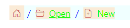

# Styles and Appearance in Blazor Breadcrumb Component

To modify the visual presentation of the Blazor Breadcrumb component, you need to override the default CSS of Breadcrumb component. Find the list of CSS classes and its corresponding section in Breadcrumb component. Also, you have an option to create your own custom theme for the controls using our [Theme Studio](https://blazor.syncfusion.com/themestudio/?theme=material).

### Common CSS Classes for Customization

The following table lists key CSS classes and their corresponding sections within the Breadcrumb component, which you can target for styling:

|CSS Class | Purpose of Class |
|-----|----- |
|.e-breadcrumb .e-breadcrumb-item|To customize the background of a breadcrumb item.|
|.e-breadcrumb .e-breadcrumb-text|To customize the color of breadcrumb text.|
|.e-breadcrumb .e-breadcrumb-icon|To customize the color of breadcrumb icon.|
|.e-breadcrumb .e-breadcrumb-separator|To customize the breadcrumb separator.|
|.e-breadcrumb |To customize the entire background of breadcrumb.|

## Customizing the Appearance of the Breadcrumb

The following example demonstrates how to apply custom styles to change the background and text color of Breadcrumb items, as well as the icon and separator colors:

```cshtml
@using Syncfusion.Blazor.Navigations

<SfBreadcrumb class="e-custom">
    <BreadcrumbItems>
        <BreadcrumbItem IconCss="e-icons e-home"></BreadcrumbItem>
        <BreadcrumbItem IconCss="e-icons e-folder-open" Text="Open" Url="https://blazor.syncfusion.com/demos/datagrid/overview"></BreadcrumbItem>
        <BreadcrumbItem IconCss="e-icons e-file-new" Text="New"></BreadcrumbItem>
    </BreadcrumbItems>
</SfBreadcrumb>

<style>
    .e-custom.e-breadcrumb .e-breadcrumb-item {
        background: antiquewhite;
    }
    .e-custom.e-breadcrumb .e-breadcrumb-text {
        color: lime !important;
    }
    .e-custom.e-breadcrumb .e-breadcrumb-icon {
        color: indianred !important;
    }
    .e-custom.e-breadcrumb .e-breadcrumb-separator {
        color: blue;
    }
    .e-custom.e-breadcrumb {
        background-color: azure;
    }
</style>
```



