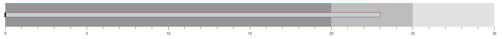

# Actual Bar in the Blazor Bullet Chart (SfBulletChart)

To display the primary data or the current value of the data being measured known as the **Feature Measure** that should be encoded as a bar. This is called as the **Actual Bar** or the **Feature Bar** in the Bullet Chart, and to display the actual bar the [`ValueField`](https://help.syncfusion.com/cr/blazor/Syncfusion.Blazor.Charts.SfBulletChart-1.html#Syncfusion_Blazor_Charts_SfBulletChart_1_ValueField) should be mapped to the appropriate field from the data source.

```cshtml
@using Syncfusion.Blazor.Charts

<SfBulletChart DataSource="@BulletChartData" ValueField="FieldValue" Minimum="0" Maximum="30" Interval="5">
    <BulletChartRangeCollection>
        <BulletChartRange End=20> </BulletChartRange>
        <BulletChartRange End=25></BulletChartRange>
        <BulletChartRange End=30></BulletChartRange>
    </BulletChartRangeCollection>
</SfBulletChart>

@code{
    public class ChartData
    {
        public double FieldValue { get; set; }
    }
    public List<ChartData> BulletChartData = new List<ChartData>
    {
        new ChartData { FieldValue = 23}
    };
}
```


## Types of Actual Bar

The shape of the actual bar can be customized using the [`Type`](https://help.syncfusion.com/cr/blazor/Syncfusion.Blazor.Charts.SfBulletChart-1.html#Syncfusion_Blazor_Charts_SfBulletChart_1_Type) property of the Bullet Chart. The actual bar contains [`Rect`](https://help.syncfusion.com/cr/blazor/Syncfusion.Blazor.Charts.FeatureType.html#Syncfusion_Blazor_Charts_FeatureType_Rect) and [`Dot`](https://help.syncfusion.com/cr/blazor/Syncfusion.Blazor.Charts.FeatureType.html#Syncfusion_Blazor_Charts_FeatureType_Dot) shapes. By default, the actual bar shape is [`Rect`](https://help.syncfusion.com/cr/blazor/Syncfusion.Blazor.Charts.FeatureType.html#Syncfusion_Blazor_Charts_FeatureType_Rect).

```cshtml
@using Syncfusion.Blazor.Charts

<SfBulletChart DataSource="@BulletChartData" Type="FeatureType.Dot" ValueField="FieldValue" Minimum="0" Maximum="30" Interval="5">
    <BulletChartRangeCollection>
        <BulletChartRange End=20> </BulletChartRange>
        <BulletChartRange End=25></BulletChartRange>
        <BulletChartRange End=30></BulletChartRange>
    </BulletChartRangeCollection>
</SfBulletChart>
```

> Refer to the [code block](#feature-bar) to know more about the property value of the **BulletChartData**.


## Actual Bar Customization

The following properties will be used to customize the actual bar.

* [`ValueFill`](https://help.syncfusion.com/cr/blazor/Syncfusion.Blazor.Charts.SfBulletChart-1.html#Syncfusion_Blazor_Charts_SfBulletChart_1_ValueFill) - Specifies the fill color of the actual bar.
* [`ValueHeight`](https://help.syncfusion.com/cr/blazor/Syncfusion.Blazor.Charts.SfBulletChart-1.html#Syncfusion_Blazor_Charts_SfBulletChart_1_ValueHeight) - Specifies the width of the actual bar.
* [`BulletChartValueBorder`](https://help.syncfusion.com/cr/blazor/Syncfusion.Blazor.Charts.BulletChartValueBorder.html) - Specifies the border color and the border width of the actual bar.

```cshtml
@using Syncfusion.Blazor.Charts

<SfBulletChart DataSource="@BulletChartData" ValueFill="lightblue" ValueHeight="15" ValueField="FieldValue" Minimum="0" Maximum="30" Interval="5">
    <BulletChartValueBorder Color="red" Width="1"></BulletChartValueBorder>
    <BulletChartRangeCollection>
        <BulletChartRange End=20></BulletChartRange>
        <BulletChartRange End=25></BulletChartRange>
        <BulletChartRange End=30></BulletChartRange>
    </BulletChartRangeCollection>
</SfBulletChart>
```

> Refer to the [code block](#feature-bar) to know more about  the property value of the **BulletChartData**.


