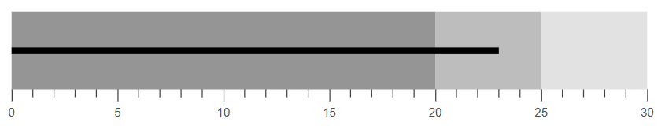

# Actual Bar in Blazor Bullet Chart Component

The **Actual Bar** (also known as the **Feature Bar**) visually represents the primary or current value being measured in the Bullet Chart. To display the actual bar, map the [ValueField](https://help.syncfusion.com/cr/blazor/Syncfusion.Blazor.Charts.SfBulletChart-1.html#Syncfusion_Blazor_Charts_SfBulletChart_1_ValueField) property to the appropriate field in your data source.

```cshtml

@using Syncfusion.Blazor.Charts

<SfBulletChart DataSource="@BulletChartData" ValueField="FieldValue" Minimum="0" Maximum="30" Interval="5">
    <BulletChartRangeCollection>
        <BulletChartRange End=20></BulletChartRange>
        <BulletChartRange End=25></BulletChartRange>
        <BulletChartRange End=30></BulletChartRange>
    </BulletChartRangeCollection>
</SfBulletChart>

@code {
    public class ChartData
    {
        public double FieldValue { get; set; }
    }

    public List<ChartData> BulletChartData = new List<ChartData>
    {
        new ChartData { FieldValue = 23}
    };
}

```




## Types of Actual Bar

The shape of the actual bar can be customized using the [Type](https://help.syncfusion.com/cr/blazor/Syncfusion.Blazor.Charts.SfBulletChart-1.html#Syncfusion_Blazor_Charts_SfBulletChart_1_Type) property. The available shapes are [Rect](https://help.syncfusion.com/cr/blazor/Syncfusion.Blazor.Charts.FeatureType.html#Syncfusion_Blazor_Charts_FeatureType_Rect) (default) and [Dot](https://help.syncfusion.com/cr/blazor/Syncfusion.Blazor.Charts.FeatureType.html#Syncfusion_Blazor_Charts_FeatureType_Dot).

```cshtml

@using Syncfusion.Blazor.Charts

<SfBulletChart DataSource="@BulletChartData" Type="FeatureType.Dot" ValueField="FieldValue" Minimum="0" Maximum="30" Interval="5">
    <BulletChartRangeCollection>
        <BulletChartRange End=20></BulletChartRange>
        <BulletChartRange End=25></BulletChartRange>
        <BulletChartRange End=30></BulletChartRange>
    </BulletChartRangeCollection>
</SfBulletChart>

```

N> Refer to the [code block](#actual-bar-in-blazor-bullet-chart-component) to know more about the property value of the **BulletChartData**.




## Customizing the Actual Bar

The following properties are available to customize the appearance of the actual bar:

* [ValueFill](https://help.syncfusion.com/cr/blazor/Syncfusion.Blazor.Charts.SfBulletChart-1.html#Syncfusion_Blazor_Charts_SfBulletChart_1_ValueFill) – Sets the fill color of the actual bar.
* [ValueHeight](https://help.syncfusion.com/cr/blazor/Syncfusion.Blazor.Charts.SfBulletChart-1.html#Syncfusion_Blazor_Charts_SfBulletChart_1_ValueHeight) – Sets the width of the actual bar.
* [BulletChartValueBorder](https://help.syncfusion.com/cr/blazor/Syncfusion.Blazor.Charts.BulletChartValueBorder.html) – Sets the border color and width of the actual bar.

```cshtml

@using Syncfusion.Blazor.Charts

<SfBulletChart DataSource="@BulletChartData" ValueFill="lightblue" ValueHeight="15" ValueField="FieldValue" Minimum="0" Maximum="30" Interval="5">
    <BulletChartValueBorder Color="red" Width="1"></BulletChartValueBorder>
    <BulletChartRangeCollection>
        <BulletChartRange End=20></BulletChartRange>
        <BulletChartRange End=25></BulletChartRange>
        <BulletChartRange End=30></BulletChartRange>
    </BulletChartRangeCollection>
</SfBulletChart>

```

N> Refer to the [code block](#actual-bar-in-blazor-bullet-chart-component) to know more about the property value of the **BulletChartData**.




