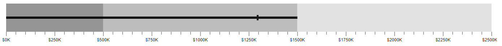
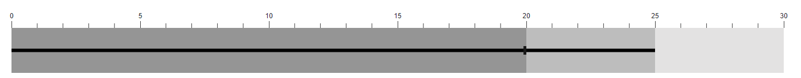

# Axis Customization in Blazor Bullet Chart Component

## MajorTickLines and MinorTickLines Customization

The following properties can be used to customize [MajorTicklines](https://help.syncfusion.com/cr/blazor/Syncfusion.Blazor.Charts.BulletChartMajorTickLines.html) and [MinorTicklines](https://help.syncfusion.com/cr/blazor/Syncfusion.Blazor.Charts.BulletChartMinorTickLines.html).

* **Width** - Specifies the width of ticklines.
* **Height** - Specifies the height of ticklines.
* **Color** - Specifies the color of ticklines.
* **EnableRangeColor** - Specifies the color of ticklines and represents the color from corresponding range colors.

```cshtml
@using Syncfusion.Blazor.Charts

<SfBulletChart DataSource="@BulletChartData" ValueField="FieldValue" TargetField="Target" Minimum="0" Maximum="30" Interval="5">
    <BulletChartMinorTickLines Width="4" Height="10" EnableRangeColor="true"></BulletChartMinorTickLines>
    <BulletChartMajorTickLines Width="5" Height="15" Color="red"></BulletChartMajorTickLines>
    <BulletChartRangeCollection>
        <BulletChartRange End=20 Color="#DBE7F3"></BulletChartRange>
        <BulletChartRange End=25 Color="#BBCEE7"></BulletChartRange>
        <BulletChartRange End=30 Color="#96B2D7"></BulletChartRange>
    </BulletChartRangeCollection>
</SfBulletChart>

@code{
    public class ChartData
    {
        public double FieldValue { get; set; }
        public double Target { get; set; }
    }
    public List<ChartData> BulletChartData = new List<ChartData>
    {
        new ChartData { FieldValue = 25, Target = 20 }
    };
}
```



## Tick placement

The major and the minor ticks can be placed [Inside](https://help.syncfusion.com/cr/blazor/Syncfusion.Blazor.Charts.TickPosition.html#Syncfusion_Blazor_Charts_TickPosition_Inside) or [Outside](https://help.syncfusion.com/cr/blazor/Syncfusion.Blazor.Charts.TickPosition.html#Syncfusion_Blazor_Charts_TickPosition_Outside) the ranges using the [TickPosition](https://help.syncfusion.com/cr/blazor/Syncfusion.Blazor.Charts.SfBulletChart-1.html#Syncfusion_Blazor_Charts_SfBulletChart_1_TickPosition) property.

```cshtml
@using Syncfusion.Blazor.Charts

<SfBulletChart DataSource="@BulletChartData" TickPosition="TickPosition.Inside" ValueField="FieldValue" TargetField="Target" Minimum="0" Maximum="30" Interval="5">
    <BulletChartRangeCollection>
        <BulletChartRange End=20> </BulletChartRange>
        <BulletChartRange End=25></BulletChartRange>
        <BulletChartRange End=30></BulletChartRange>
    </BulletChartRangeCollection>
</SfBulletChart>
```

N> Refer to the [code block](#majorticklines-and-minorticklines-customization) to know about the property value of **BulletChartData**.




## Label format

The axis labels support all the globalize formats and can be changed using the [Format](https://help.syncfusion.com/cr/blazor/Syncfusion.Blazor.Charts.SfBulletChart-1.html#Syncfusion_Blazor_Charts_SfBulletChart_1_Format) property. The following code shows the axis label in the currency format.

```cshtml
@using Syncfusion.Blazor.Charts

<SfBulletChart DataSource="@BulletChartData" Format="C" ValueField="FieldValue" TargetField="Target" Minimum="0" Maximum="30" Interval="5">
    <BulletChartRangeCollection>
        <BulletChartRange End=20> </BulletChartRange>
        <BulletChartRange End=25></BulletChartRange>
        <BulletChartRange End=30></BulletChartRange>
    </BulletChartRangeCollection>
</SfBulletChart>
```

N> Refer to the [code block](#majorticklines-and-minorticklines-customization) to know about the property value of **BulletChartData**.




The following table describes the result of applying some commonly used formats to numeric axis values.

<!-- markdownlint-disable MD033 -->
<table>
<tr>
<td><b>Label Value</b></td>
<td><b>Label Format property value</b></td>
<td><b>Result </b></td>
<td><b>Description </b></td>
</tr>
<tr>
<td>1000</td>
<td>n1</td>
<td>1000.0</td>
<td>The result is rounded to 1 decimal place.</td>
</tr>
<tr>
<td>1000</td>
<td>n2</td>
<td>1000.00</td>
<td>The result is rounded to 2 decimal places.</td>
</tr>
<tr>
<td>1000</td>
<td>n3</td>
<td>1000.000</td>
<td>The result is rounded to 3 decimal places.</td>
</tr>
<tr>
<td>0.01</td>
<td>p1</td>
<td>1.0%</td>
<td>The result is converted to percentage with 1 decimal place.</td>
</tr>
<tr>
<td>0.01</td>
<td>p2</td>
<td>1.00%</td>
<td>The result is converted to percentage with 2 decimal places.</td>
</tr>
<tr>
<td>0.01</td>
<td>p3</td>
<td>1.000%</td>
<td>The result is converted to percentage with 3 decimal places.</td>
</tr>
<tr>
<td>1000</td>
<td>c1</td>
<td>$1000.0</td>
<td>The currency symbol is appended to the result and it is rounded to 1 decimal place.</td>
</tr>
<tr>
<td>1000</td>
<td>c2</td>
<td>$1000.00</td>
<td>The currency symbol is appended to the result and it is rounded to 2 decimal places.</td>
</tr>
</table>

## Grouping separator

To separate the groups of thousands, set the [EnableGroupSeparator](https://help.syncfusion.com/cr/blazor/Syncfusion.Blazor.Charts.SfBulletChart-1.html#Syncfusion_Blazor_Charts_SfBulletChart_1_EnableGroupSeparator) property to **true**, and specify the numeric axis label by setting the [Format](https://help.syncfusion.com/cr/blazor/Syncfusion.Blazor.Charts.SfBulletChart-1.html#Syncfusion_Blazor_Charts_SfBulletChart_1_Format) property to **N0**.

```cshtml
@using Syncfusion.Blazor.Charts

<SfBulletChart DataSource="@BulletChartData" EnableGroupSeparator="true" Format="N0" ValueField="FieldValue" TargetField="Target" Minimum="0" Maximum="2500" Interval="250">
    <BulletChartRangeCollection>
        <BulletChartRange End=500> </BulletChartRange>
        <BulletChartRange End=1500></BulletChartRange>
        <BulletChartRange End=2500></BulletChartRange>
    </BulletChartRangeCollection>
</SfBulletChart>

@code{
    public class ChartData
    {
        public double FieldValue { get; set; }
        public double Target { get; set; }
    }
    public List<ChartData> BulletChartData = new List<ChartData>
    {
        new ChartData { FieldValue = 1500, Target = 1300 }
    };
}
```




## Custom label format

Using the [LabelFormat](https://help.syncfusion.com/cr/blazor/Syncfusion.Blazor.Charts.SfBulletChart-1.html#Syncfusion_Blazor_Charts_SfBulletChart_1_LabelFormat) property, axis labels can be specified with a custom defined format in addition to the axis value. The label format uses a placeholder such as **${value}K**, which represents the axis label.

```cshtml
@using Syncfusion.Blazor.Charts

<SfBulletChart DataSource="@BulletChartData" LabelFormat="${value}K" ValueField="FieldValue" TargetField="Target" Minimum="0" Maximum="2500" Interval="250">
    <BulletChartRangeCollection>
        <BulletChartRange End=500> </BulletChartRange>
        <BulletChartRange End=1500></BulletChartRange>
        <BulletChartRange End=2500></BulletChartRange>
    </BulletChartRangeCollection>
</SfBulletChart>
```

N> Refer to the [code block](#grouping-separator) to know about the property value of **BulletChartData**.





## Label placement

Label can be placed [Inside](https://help.syncfusion.com/cr/blazor/Syncfusion.Blazor.Charts.LabelsPlacement.html#Syncfusion_Blazor_Charts_LabelsPlacement_Inside) or [Outside](https://help.syncfusion.com/cr/blazor/Syncfusion.Blazor.Charts.LabelsPlacement.html#Syncfusion_Blazor_Charts_LabelsPlacement_Outside) of the ranges using the [LabelPosition](https://help.syncfusion.com/cr/blazor/Syncfusion.Blazor.Charts.SfBulletChart-1.html#Syncfusion_Blazor_Charts_SfBulletChart_1_LabelPosition) property.

```cshtml
@using Syncfusion.Blazor.Charts

<SfBulletChart DataSource="@BulletChartData" LabelPosition="LabelsPlacement.Inside" ValueField="FieldValue" TargetField="Target" Minimum="0" Maximum="30" Interval="5">
    <BulletChartRangeCollection>
        <BulletChartRange End=20></BulletChartRange>
        <BulletChartRange End=25></BulletChartRange>
        <BulletChartRange End=30></BulletChartRange>
    </BulletChartRangeCollection>
</SfBulletChart>
```

N> Refer to the [code block](#grouping-separator) to know about the property value of **BulletChartData**.




## Opposed position

To place an axis opposite to its original position, set the [OpposedPosition](https://help.syncfusion.com/cr/blazor/Syncfusion.Blazor.Charts.SfBulletChart-1.html#Syncfusion_Blazor_Charts_SfBulletChart_1_OpposedPosition) property to **true**.

```cshtml
@using Syncfusion.Blazor.Charts

<SfBulletChart DataSource="@BulletChartData" OpposedPosition="true" ValueField="FieldValue" TargetField="Target" Minimum="0" Maximum="30" Interval="5">
    <BulletChartRangeCollection>
        <BulletChartRange End=20></BulletChartRange>
        <BulletChartRange End=25></BulletChartRange>
        <BulletChartRange End=30></BulletChartRange>
    </BulletChartRangeCollection>
</SfBulletChart>
```

N> Refer to the [code block](#grouping-separator) to know about the property value of **BulletChartData**.





## Category label

The [Bullet Chart](https://help.syncfusion.com/cr/blazor/Syncfusion.Blazor.Charts.SfBulletChart-1.html) supports X-axis label by specifying the property from the data source to the [CategoryField](https://help.syncfusion.com/cr/blazor/Syncfusion.Blazor.Charts.SfBulletChart-1.html#Syncfusion_Blazor_Charts_SfBulletChart_1_CategoryField). It helps to understand the input data in a more efficient way.

```cshtml
@using Syncfusion.Blazor.Charts

<SfBulletChart DataSource="@BulletChartData" CategoryField="Category" ValueField="FieldValue" TargetField="Target" Minimum="0" Maximum="30" Interval="5">
    <BulletChartRangeCollection>
        <BulletChartRange End=20></BulletChartRange>
        <BulletChartRange End=25></BulletChartRange>
        <BulletChartRange End=30></BulletChartRange>
    </BulletChartRangeCollection>
</SfBulletChart>

@code{
    public class ChartData
    {
        public double FieldValue { get; set; }
        public double Target { get; set; }
        public string Category { get; set; }
    }
    public List<ChartData> BulletChartData = new List<ChartData>
    {
        new ChartData { FieldValue = 23, Target = 25, Category="Product A" }
    };
}
```




## Axis label and category label customization

The label color, opacity, font size, font family, font weight, and font style can be customized by using the [BulletChartCategoryLabelStyle](https://help.syncfusion.com/cr/blazor/Syncfusion.Blazor.Charts.BulletChartCategoryLabelStyle.html) setting for category and the [BulletChartLabelStyle](https://help.syncfusion.com/cr/blazor/Syncfusion.Blazor.Charts.BulletChartLabelStyle.html) setting for axis label. The [EnableRangeColor](https://help.syncfusion.com/cr/blazor/Syncfusion.Blazor.Charts.BulletChartCommonFont.html#Syncfusion_Blazor_Charts_BulletChartCommonFont_EnableRangeColor) property specifies the color of the axis label and represents the color from the corresponding range colors.

```cshtml
@using Syncfusion.Blazor.Charts

<SfBulletChart DataSource="@BulletChartData" CategoryField="Category" ValueField="FieldValue" TargetField="Target" Minimum="0" Maximum="30" Interval="5">
    <BulletChartCategoryLabelStyle Color="red" Opacity="0.8" Size="15px" FontStyle="italic"></BulletChartCategoryLabelStyle>
    <BulletChartLabelStyle Color="red" Opacity="1" Size="15px" FontStyle="italic" EnableRangeColor="true"></BulletChartLabelStyle>
    <BulletChartRangeCollection>
        <BulletChartRange End=20 Color="#959595"></BulletChartRange>
        <BulletChartRange End=25 Color="#BDBDBD"></BulletChartRange>
        <BulletChartRange End=30 Color="#E3E2E2"></BulletChartRange>
    </BulletChartRangeCollection>
</SfBulletChart>
```

N> Refer to the [code block](#category-label) to know about the property value of **BulletChartData**.



