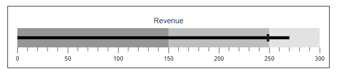

# Bullet Chart Dimensions in Blazor Bullet Chart Component

## Size for container

The size of the [Blazor Bullet Chart](https://help.syncfusion.com/cr/blazor/Syncfusion.Blazor.Charts.SfBulletChart-1.html) is determined by its container, and can be adjusted inline or through CSS as shown below.

```cshtml

@using Syncfusion.Blazor.Charts

<div style="width:650px; height:100px;">
    <SfBulletChart DataSource="@BulletChartData" ValueField="FieldValue" TargetField="Target" Minimum="0" Maximum="300" Interval="50" Title="Revenue">
        <BulletChartTooltip TValue="ChartData" Enable="true"></BulletChartTooltip>
        <BulletChartRangeCollection>
            <BulletChartRange End=150> </BulletChartRange>
            <BulletChartRange End=250></BulletChartRange>
            <BulletChartRange End=300></BulletChartRange>
        </BulletChartRangeCollection>
    </SfBulletChart>
</div>

@code {
    public class ChartData
    {
        public double FieldValue { get; set; }
        public double Target { get; set; }
    }

    public List<ChartData> BulletChartData = new List<ChartData>
    {
        new ChartData { FieldValue = 270, Target = 250 }
    };
}

```



## Size for Bullet Chart

The [Width](https://help.syncfusion.com/cr/blazor/Syncfusion.Blazor.Charts.SfBulletChart-1.html#Syncfusion_Blazor_Charts_SfBulletChart_1_Width) and [Height](https://help.syncfusion.com/cr/blazor/Syncfusion.Blazor.Charts.SfBulletChart-1.html#Syncfusion_Blazor_Charts_SfBulletChart_1_Height) properties allow you to adjust the Bullet Chart's size. Both pixel and percentage values are supported. When using percentage values, the chart's dimensions are relative to its container.

N> If no size is specified, the Bullet Chart renders with a height of **126px** and a width equal to the window.

```cshtml

@using Syncfusion.Blazor.Charts

<div style="width:1000px; height:150px;">
    <SfBulletChart DataSource="@BulletChartData" Height="70%" Width="50%" ValueField="FieldValue" TargetField="Target" Minimum="0" Maximum="300" Interval="50" Title="Revenue">
        <BulletChartTooltip TValue="ChartData" Enable="true"></BulletChartTooltip>
        <BulletChartRangeCollection>
            <BulletChartRange End=150> </BulletChartRange>
            <BulletChartRange End=250></BulletChartRange>
            <BulletChartRange End=300></BulletChartRange>
        </BulletChartRangeCollection>
    </SfBulletChart>
</div>

@code {
    public class ChartData
    {
        public double FieldValue { get; set; }
        public double Target { get; set; }
    }

    public List<ChartData> BulletChartData = new List<ChartData>
    {
        new ChartData { FieldValue = 270, Target = 250 }
    };
}

```



## Margin

The [BulletChartMargin](https://help.syncfusion.com/cr/blazor/Syncfusion.Blazor.Charts.BulletChartMargin.html) property customizes the bottom, left, right and top margins of the Bullet Chart.

```cshtml

@using Syncfusion.Blazor.Charts

<div style="width:650px; height:100px;">
    <SfBulletChart DataSource="@BulletChartData" ValueField="FieldValue" TargetField="Target" Minimum="0" Maximum="300" Interval="50" Title="Revenue">
        <BulletChartMargin Bottom="20" Left="20" Right="20" Top="20"></BulletChartMargin>
        <BulletChartBorder Color="#000000" Width="2"></BulletChartBorder>
        <BulletChartTooltip TValue="ChartData" Enable="true"></BulletChartTooltip>
        <BulletChartRangeCollection>
            <BulletChartRange End=150> </BulletChartRange>
            <BulletChartRange End=250></BulletChartRange>
            <BulletChartRange End=300></BulletChartRange>
        </BulletChartRangeCollection>
    </SfBulletChart>
</div>

@code {
    public class ChartData
    {
        public double FieldValue { get; set; }
        public double Target { get; set; }
    }

    public List<ChartData> BulletChartData = new List<ChartData>
    {
        new ChartData { FieldValue = 270, Target = 250 }
    };
}

```




