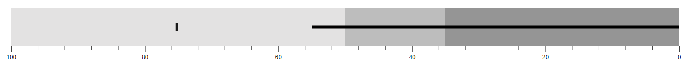
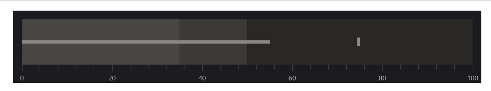
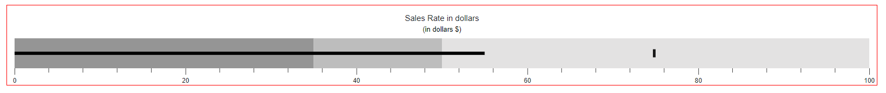

# Customization in Blazor Bullet Chart Component

## Orientation

The [Blazor Bullet Chart](https://www.syncfusion.com/blazor-components/blazor-bullet-chart) can be displayed in either [Horizontal](https://help.syncfusion.com/cr/blazor/Syncfusion.Blazor.Charts.OrientationType.html#Syncfusion_Blazor_Charts_OrientationType_Horizontal) or [Vertical](https://help.syncfusion.com/cr/blazor/Syncfusion.Blazor.Charts.OrientationType.html#Syncfusion_Blazor_Charts_OrientationType_Vertical) orientation using the [Orientation](https://help.syncfusion.com/cr/blazor/Syncfusion.Blazor.Charts.SfBulletChart-1.html#Syncfusion_Blazor_Charts_SfBulletChart_1_Orientation) property. The default orientation is horizontal.

```cshtml

@using Syncfusion.Blazor.Charts

<SfBulletChart DataSource="@BulletChartData" Orientation="OrientationType.Vertical" Width="20%" Title="Sales Rate in dollars" Subtitle="(in dollars $)" ValueField="FieldValue" TargetField="TargetValue" Minimum="0" Maximum="100" Interval="20">
    <BulletChartRangeCollection>
        <BulletChartRange End=35></BulletChartRange>
        <BulletChartRange End=50></BulletChartRange>
        <BulletChartRange End=100></BulletChartRange>
    </BulletChartRangeCollection>
</SfBulletChart>

@code {
    public class ChartData
    {
        public double FieldValue { get; set; }
        public double TargetValue { get; set; }
    }

    public List<ChartData> BulletChartData = new List<ChartData>
    {
        new ChartData { FieldValue = 55, TargetValue = 75 }
    };
}

```


## Right-to-Left (RTL)

Enable right-to-left rendering by setting the [EnableRtl](https://help.syncfusion.com/cr/blazor/Syncfusion.Blazor.Charts.SfBulletChart-1.html#Syncfusion_Blazor_Charts_SfBulletChart_1_EnableRtl) property to **true**.

```cshtml

<SfBulletChart DataSource="@BulletChartData" EnableRtl="true" ValueField="FieldValue" TargetField="TargetValue" Minimum="0" Maximum="100" Interval="20">
    <BulletChartRangeCollection>
        <BulletChartRange End=35></BulletChartRange>
        <BulletChartRange End=50></BulletChartRange>
        <BulletChartRange End=100></BulletChartRange>
    </BulletChartRangeCollection>
</SfBulletChart>

```

N> Refer to the [code block](#orientation) to know about the property value of **BulletChartData**.



## Animation

The actual and target bars support linear animation using the [BulletChartAnimation](https://help.syncfusion.com/cr/blazor/Syncfusion.Blazor.Charts.BulletChartAnimation.html) property. Control animation speed and delay with the [Duration](https://help.syncfusion.com/cr/blazor/Syncfusion.Blazor.Charts.BulletChartAnimation.html#Syncfusion_Blazor_Charts_BulletChartAnimation_Duration) and [Delay](https://help.syncfusion.com/cr/blazor/Syncfusion.Blazor.Charts.BulletChartAnimation.html#Syncfusion_Blazor_Charts_BulletChartAnimation_Delay) properties.

```cshtml

@using Syncfusion.Blazor.Charts

<SfBulletChart DataSource="@BulletChartData" ValueField="FieldValue" TargetField="TargetValue" Minimum="0" Maximum="100" Interval="20">
    <BulletChartAnimation Delay="0" Duration="2000"></BulletChartAnimation>
    <BulletChartRangeCollection>
        <BulletChartRange End=35></BulletChartRange>
        <BulletChartRange End=50></BulletChartRange>
        <BulletChartRange End=100></BulletChartRange>
    </BulletChartRangeCollection>
</SfBulletChart>

```

N> Refer to the [code block](#orientation) to know about the property value of **BulletChartData**.

## Theme

Apply different visual styles to the Bullet Chart using the [Theme](https://help.syncfusion.com/cr/blazor/Syncfusion.Blazor.Charts.SfBulletChart-1.html#Syncfusion_Blazor_Charts_SfBulletChart_1_Theme) property.

```cshtml

@using Syncfusion.Blazor.Charts
@using Syncfusion.Blazor

<SfBulletChart DataSource="@BulletChartData" Theme="Theme.Fluent2Dark" ValueField="FieldValue" TargetField="TargetValue" Minimum="0" Maximum="100" Interval="20">
    <BulletChartRangeCollection>
        <BulletChartRange End=35></BulletChartRange>
        <BulletChartRange End=50></BulletChartRange>
        <BulletChartRange End=100></BulletChartRange>
    </BulletChartRangeCollection>
</SfBulletChart>

```

N> Refer to the [code block](#orientation) to know about the property value of **BulletChartData**.



## Border

Customize the Bullet Chart border color using the [Color](https://help.syncfusion.com/cr/blazor/Syncfusion.Blazor.Charts.BulletChartCommonBorder.html#Syncfusion_Blazor_Charts_BulletChartCommonBorder_Color) property in [BulletChartBorder](https://help.syncfusion.com/cr/blazor/Syncfusion.Blazor.Charts.SfBulletChart-1.html#Syncfusion_Blazor_Charts_SfBulletChart_1_Theme), and adjust the border width with the [Width](https://help.syncfusion.com/cr/blazor/Syncfusion.Blazor.Charts.BulletChartCommonBorder.html#Syncfusion_Blazor_Charts_BulletChartCommonBorder_Width) property.

```cshtml

@using Syncfusion.Blazor.Charts

<SfBulletChart DataSource="@BulletChartData" Height="150px" Title="Sales Rate in dollars" Subtitle="(in dollars $)" ValueField="FieldValue" TargetField="TargetValue" Minimum="0" Maximum="100" Interval="20">
    <BulletChartBorder Color="red" Width="2"></BulletChartBorder>
    <BulletChartRangeCollection>
        <BulletChartRange End=35></BulletChartRange>
        <BulletChartRange End=50></BulletChartRange>
        <BulletChartRange End=100></BulletChartRange>
    </BulletChartRangeCollection>
</SfBulletChart>

```

N> Refer to the [code block](#orientation) to know about the property value of **BulletChartData**.


