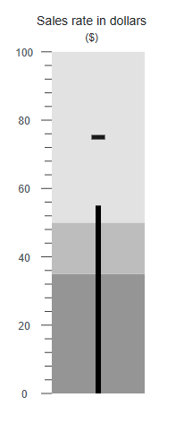
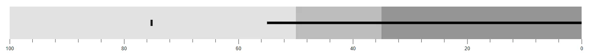
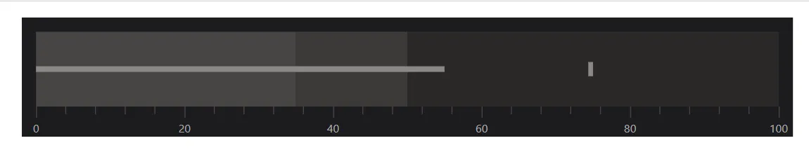
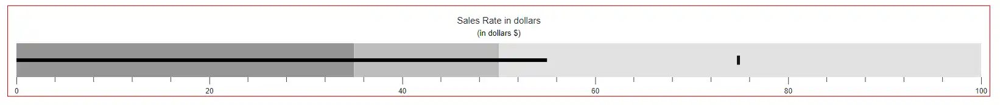

# Blazor Bullet Chart Customization

## Orientation

The [Blazor Bullet Chart](https://www.syncfusion.com/blazor-components/blazor-bullet-chart) can be rendered in different orientations such as [Horizontal](https://help.syncfusion.com/cr/blazor/Syncfusion.Blazor.Charts.OrientationType.html#Syncfusion_Blazor_Charts_OrientationType_Horizontal) or [Vertical](https://help.syncfusion.com/cr/blazor/Syncfusion.Blazor.Charts.OrientationType.html#Syncfusion_Blazor_Charts_OrientationType_Vertical) via the [Orientation](https://help.syncfusion.com/cr/blazor/Syncfusion.Blazor.Charts.SfBulletChart-1.html#Syncfusion_Blazor_Charts_SfBulletChart_1_Orientation) property. By default, the Bullet Chart is rendered in the [Horizontal](https://help.syncfusion.com/cr/blazor/Syncfusion.Blazor.Charts.OrientationType.html#Syncfusion_Blazor_Charts_OrientationType_Horizontal) orientation.

```cshtml
@using Syncfusion.Blazor.Charts

<SfBulletChart DataSource="@BulletChartData" Orientation="OrientationType.Vertical" Width="20%" Title="Sales rate in dollars" Subtitle="($)" ValueField="FieldValue" TargetField="TargetValue" Minimum="0" Maximum="100" Interval="20">
    <BulletChartRangeCollection>
        <BulletChartRange End=35></BulletChartRange>
        <BulletChartRange End=50></BulletChartRange>
        <BulletChartRange End=100></BulletChartRange>
    </BulletChartRangeCollection>
</SfBulletChart>

@code{
    public class ChartData
    {
        public double FieldValue { get; set; }
        public double TargetValue { get; set; }
    }
    public List<ChartData> BulletChartData = new List<ChartData>
    {
        new ChartData { FieldValue = 55, TargetValue = 75 }
    };
}
```



The following examples use the `BulletChartData` definition shown in the Orientation example.

## Right-to-left (RTL)

The Bullet Chart supports rendering in the right-to-left direction, which can be enabled by setting the [EnableRtl](https://help.syncfusion.com/cr/blazor/Syncfusion.Blazor.Charts.SfBulletChart-1.html#Syncfusion_Blazor_Charts_SfBulletChart_1_EnableRtl) property to **true**.

```cshtml
@using Syncfusion.Blazor.Charts

<SfBulletChart DataSource="@BulletChartData" EnableRtl="true" ValueField="FieldValue" TargetField="TargetValue" Minimum="0" Maximum="100" Interval="20">
    <BulletChartRangeCollection>
        <BulletChartRange End=35></BulletChartRange>
        <BulletChartRange End=50></BulletChartRange>
        <BulletChartRange End=100></BulletChartRange>
    </BulletChartRangeCollection>
</SfBulletChart>
```



## Animation

The actual and target bars support linear animation through the [BulletChartAnimation](https://help.syncfusion.com/cr/blazor/Syncfusion.Blazor.Charts.BulletChartAnimation.html) setting. The animation duration and delay are specified in milliseconds using the [Duration](https://help.syncfusion.com/cr/blazor/Syncfusion.Blazor.Charts.BulletChartAnimation.html#Syncfusion_Blazor_Charts_BulletChartAnimation_Duration) and [Delay](https://help.syncfusion.com/cr/blazor/Syncfusion.Blazor.Charts.BulletChartAnimation.html#Syncfusion_Blazor_Charts_BulletChartAnimation_Delay) properties.

```cshtml
@using Syncfusion.Blazor.Charts

<SfBulletChart DataSource="@BulletChartData" ValueField="FieldValue" TargetField="TargetValue" Minimum="0" Maximum="100" Interval="20">
    <BulletChartAnimation Delay="0" Duration="2000"></BulletChartAnimation>
    <BulletChartRangeCollection>
        <BulletChartRange End=35></BulletChartRange>
        <BulletChartRange End=50></BulletChartRange>
        <BulletChartRange End=100></BulletChartRange>
    </BulletChartRangeCollection>
</SfBulletChart>
```

## Theme

The Bullet Chart supports different themes through the [Theme](https://help.syncfusion.com/cr/blazor/Syncfusion.Blazor.Charts.SfBulletChart-1.html#Syncfusion_Blazor_Charts_SfBulletChart_1_Theme) property. Refer to the [Theme enum](https://help.syncfusion.com/cr/blazor/Syncfusion.Blazor.Charts.Theme.html) for the available values.

```cshtml
@using Syncfusion.Blazor.Charts
@using Syncfusion.Blazor

<SfBulletChart DataSource="@BulletChartData" Theme="Theme.Fluent2Dark" ValueField="FieldValue" TargetField="TargetValue" Minimum="0" Maximum="100" Interval="20">
    <BulletChartRangeCollection>
        <BulletChartRange End=35></BulletChartRange>
        <BulletChartRange End=50></BulletChartRange>
        <BulletChartRange End=100></BulletChartRange>
    </BulletChartRangeCollection>
</SfBulletChart>
```



## Border

The Bullet Chart border color can be enabled by setting the [Color](https://help.syncfusion.com/cr/blazor/Syncfusion.Blazor.Charts.BulletChartCommonBorder.html#Syncfusion_Blazor_Charts_BulletChartCommonBorder_Color) property in the [BulletChartBorder](https://help.syncfusion.com/cr/blazor/Syncfusion.Blazor.Charts.BulletChartBorder.html), and the width of the border can be customized using the [Width](https://help.syncfusion.com/cr/blazor/Syncfusion.Blazor.Charts.BulletChartCommonBorder.html#Syncfusion_Blazor_Charts_BulletChartCommonBorder_Width) property.

```cshtml
@using Syncfusion.Blazor.Charts

<SfBulletChart DataSource="@BulletChartData" Height="150px" Title="Sales rate in dollars" Subtitle="($)" ValueField="FieldValue" TargetField="TargetValue" Minimum="0" Maximum="100" Interval="20">
    <BulletChartBorder Color="red" Width="2"></BulletChartBorder>
    <BulletChartRangeCollection>
        <BulletChartRange End=35> </BulletChartRange>
        <BulletChartRange End=50></BulletChartRange>
        <BulletChartRange End=100></BulletChartRange>
    </BulletChartRangeCollection>
</SfBulletChart>
```

