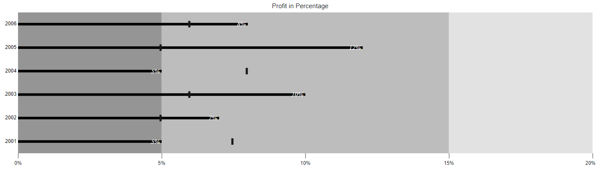

---
title: "Data Labels in the Blazor Bullet Chart component | Syncfusion"

component: "Bullet Chart"

description: "Learn here all about the Data Labels of Syncfusion Bullet Chart (SfBulletChart) component and more."
---

# Data Labels in Blazor Bullet Chart (SfBulletChart)

The Data Labels are used to identify the value of the actual bar in the Bullet Chart component. The Data Labels will be shown by specifying the [`BulletChartDataLabel`](https://help.syncfusion.com/cr/blazor/Syncfusion.Blazor.Charts.BulletChartDataLabel.html) setting.

```csharp
@using Syncfusion.Blazor.Charts

<SfBulletChart DataSource="@BulletChartData" ValueField="ValueField" TargetField="ComparativeMeasureValue" CategoryField="Category" Height="400" Minimum="0" Maximum="20" Interval="5" LabelFormat="{value}%" Title="Profit in Percentage">
    <BulletChartDataLabel></BulletChartDataLabel>
    <BulletChartMinorTickLines Width="0"></BulletChartMinorTickLines>
    <BulletChartRangeCollection>
        <BulletChartRange End=5> </BulletChartRange>
        <BulletChartRange End=15></BulletChartRange>
        <BulletChartRange End=20></BulletChartRange>
    </BulletChartRangeCollection>
</SfBulletChart>

@code{
    public class ChartData
    {
        public double ValueField { get; set; }
        public double ComparativeMeasureValue { get; set; }
        public string Category { get; set; }
    }
    public List<ChartData> BulletChartData = new List<ChartData>
    {
        new ChartData { ValueField = 5, ComparativeMeasureValue = 7.5, Category = "2001" },
        new ChartData { ValueField = 7, ComparativeMeasureValue = 5, Category = "2002" },
        new ChartData { ValueField = 10, ComparativeMeasureValue = 6, Category = "2003" },
        new ChartData { ValueField = 5, ComparativeMeasureValue = 8, Category = "2004" },
        new ChartData { ValueField = 12, ComparativeMeasureValue = 5, Category = "2005" },
        new ChartData { ValueField = 8, ComparativeMeasureValue = 6, Category = "2006" }
    };
}
```

## Data Labels Customization

The Data Labels color, opacity, font size, font family, font weight, and font style can be customized using the [`BulletChartDataLabelStyle`](https://help.syncfusion.com/cr/blazor/Syncfusion.Blazor.Charts.BulletChartDataLabelStyle.html).

```csharp
@using Syncfusion.Blazor.Charts

<SfBulletChart DataSource="@BulletChartData" ValueField="ValueField" TargetField="ComparativeMeasureValue" CategoryField="Category" Height="400" Minimum="0" Maximum="20" Interval="5" LabelFormat="{value}%" Title="Profit in Percentage">
    <BulletChartDataLabel>
        <BulletChartDataLabelStyle Color="#FFFFFF" Opacity="1" Size="15px" FontStyle="italic"></BulletChartDataLabelStyle>
    </BulletChartDataLabel>
    <BulletChartMinorTickLines Width="0"></BulletChartMinorTickLines>
    <BulletChartRangeCollection>
        <BulletChartRange End=5> </BulletChartRange>
        <BulletChartRange End=15></BulletChartRange>
        <BulletChartRange End=20></BulletChartRange>
    </BulletChartRangeCollection>
</SfBulletChart>
```

> Refer to the [code block](#data-label) to know about the property value of the **BulletChartData**.


