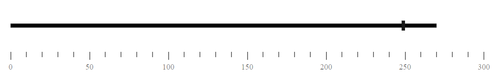
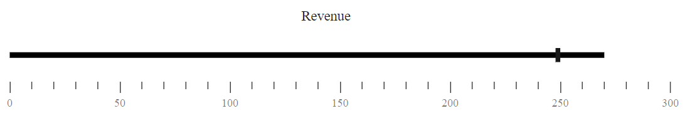

# Getting Started with Blazor BulletChart in Blazor Web App

This section briefly explains about how to include [Blazor Bullet Chart](https://www.syncfusion.com/blazor-components/blazor-bullet-chart) component in your Blazor Web App using [Visual Studio](https://visualstudio.microsoft.com/vs/).

## Prerequisites

* [System requirements for Blazor components](https://blazor.syncfusion.com/documentation/system-requirements)

## Create a new Blazor Web App

You can create a **Blazor Web App** using Visual Studio 2022 via [Microsoft Templates](https://learn.microsoft.com/en-us/aspnet/core/blazor/tooling?view=aspnetcore-8.0) or the [Syncfusion Blazor Extension](https://blazor.syncfusion.com/documentation/visual-studio-integration/template-studio).

You need to configure the corresponding [Interactive render mode](https://learn.microsoft.com/en-us/aspnet/core/blazor/components/render-modes?view=aspnetcore-8.0#render-modes) and [Interactivity location](https://learn.microsoft.com/en-us/aspnet/core/blazor/tooling?view=aspnetcore-8.0&pivots=windows) while creating a Blazor Web Application.

## Install Syncfusion Blazor Bullet Chart NuGet in the App

To add **Blazor Bullet Chart** component in the app, open the NuGet package manager in Visual Studio (*Tools → NuGet Package Manager → Manage NuGet Packages for Solution*), search and install [Syncfusion.Blazor.BulletChart](https://www.nuget.org/packages/Syncfusion.Blazor.BulletChart).

If you utilize `WebAssembly or Auto` render modes in the Blazor Web App need to be install Syncfusion Blazor components NuGet packages within the client project.

Alternatively, you can utilize the following package manager command to achieve the same.




Install-Package Syncfusion.Blazor.BulletChart -Version {{ site.releaseversion }}




N> Syncfusion Blazor components are available in [nuget.org](https://www.nuget.org/packages?q=syncfusion.blazor). Refer to [NuGet packages](https://blazor.syncfusion.com/documentation/nuget-packages) topic for available NuGet packages list with component details.

## Register Syncfusion Blazor Service

Open **~/_Imports.razor** file and import the `Syncfusion.Blazor` and `Syncfusion.Blazor.Charts` namespace .

```cshtml

@using Syncfusion.Blazor
@using Syncfusion.Blazor.Charts

```

Now, register the Syncfusion Blazor Service in the **~/Program.cs** file of your Blazor Web App.

If you select an **Interactive render mode** as `WebAssembly` or `Auto`, you need to register the Syncfusion Blazor service in both **~/Program.cs** files of your Blazor Web App.

```cshtml

....
using Syncfusion.Blazor;
....
builder.Services.AddSyncfusionBlazor();
....

```

## Add script resources

The script can be accessed from NuGet through [Static Web Assets](https://blazor.syncfusion.com/documentation/appearance/themes#static-web-assets). Include the script reference at the end of the `<body>` in the ~/Components/App.razor file as shown below:

```html
<body>
    ....
    <script src="_content/Syncfusion.Blazor.Core/scripts/syncfusion-blazor.min.js" type="text/javascript"></script>
</body>
```

N> Check out the [Adding Script Reference](https://blazor.syncfusion.com/documentation/common/adding-script-references) topic to learn different approaches for adding script references in your Blazor application.

## Add Syncfusion Blazor Bullet Chart component

Add the Syncfusion Blazor Bullet Chart component in the **~Pages/.razor** file. If an interactivity location as `Per page/component` in the web app, define a render mode at the top of the `~Pages/.razor` component, as follows:




@* desired render mode define here *@
@rendermode InteractiveAuto







<SfBulletChart DataSource="@BulletChartData" ValueField="FieldValue" TargetField="TargetValue" Minimum="0" Maximum="300" Interval="50">
</SfBulletChart>

@code{
    public class ChartData
    {
        public double FieldValue { get; set; }
        public double TargetValue { get; set; }
    }
    public List<ChartData> BulletChartData = new List<ChartData>
    {
        new ChartData { FieldValue = 270, TargetValue = 250 }
    };
}




* Press <kbd>Ctrl</kbd>+<kbd>F5</kbd> (Windows) or <kbd>⌘</kbd>+<kbd>F5</kbd> (macOS) to launch the application. This will render the Syncfusion Blazor Bullet Chart component in your default web browser.



N> [View Sample in GitHub](https://github.com/SyncfusionExamples/Blazor-Getting-Started-Examples/tree/main/BulletChart/BlazorWebApp).

## Adding title

Add a title by using the [Title](https://help.syncfusion.com/cr/blazor/Syncfusion.Blazor.Charts.SfBulletChart-1.html#Syncfusion_Blazor_Charts_SfBulletChart_1_Title) property in the Bullet Chart to provide quick information to the user about the data plotted in the component.




<SfBulletChart DataSource="@BulletChartData" ValueField="FieldValue" TargetField="TargetValue" Minimum="0" Maximum="300" Interval="50" Title="Revenue">
</SfBulletChart>






## Adding ranges

Add ranges by using the [BulletChartRangeCollection](https://help.syncfusion.com/cr/blazor/Syncfusion.Blazor.Charts.BulletChartRangeCollection.html) to measure the qualitative state by observing the distance between each range.




<SfBulletChart DataSource="@BulletChartData" ValueField="FieldValue" TargetField="TargetValue" Minimum="0" Maximum="300" Interval="50" Title="Revenue">
    <BulletChartRangeCollection>
        <BulletChartRange End=150> </BulletChartRange>
        <BulletChartRange End=250></BulletChartRange>
        <BulletChartRange End=300></BulletChartRange>
    </BulletChartRangeCollection>
</SfBulletChart>





## Adding tooltip

Use the tooltip to show the measured values by setting the [Enable](https://help.syncfusion.com/cr/blazor/Syncfusion.Blazor.Charts.BulletChartTooltip-1.html#Syncfusion_Blazor_Charts_BulletChartTooltip_1_Enable) property to **true** in the [BulletChartTooltip](https://help.syncfusion.com/cr/blazor/Syncfusion.Blazor.Charts.BulletChartTooltip-1.html).




<SfBulletChart DataSource="@BulletChartData" ValueField="FieldValue" TargetField="TargetValue" Minimum="0" Maximum="300" Interval="50" Title="Revenue">
    <BulletChartTooltip TValue="ChartData" Enable="true"></BulletChartTooltip>
    <BulletChartRangeCollection>
        <BulletChartRange End=150> </BulletChartRange>
        <BulletChartRange End=250></BulletChartRange>
        <BulletChartRange End=300></BulletChartRange>
    </BulletChartRangeCollection>
</SfBulletChart>





N> You can also explore our [Blazor Bullet Chart example](https://blazor.syncfusion.com/demos/bullet-chart/default-functionalities?theme=bootstrap5) that shows you how to render and configure the bullet chart.

## See also

1. [Getting Started with Syncfusion Blazor for client-side in .NET Core CLI](https://blazor.syncfusion.com/documentation/getting-started/blazor-webassembly-dotnet-cli)
2. [Getting Started with Syncfusion Blazor for client-side in Visual Studio](https://blazor.syncfusion.com/documentation/getting-started/blazor-webassembly-visual-studio)
3. [Getting Started with Syncfusion Blazor for server-side in .NET Core CLI](https://blazor.syncfusion.com/documentation/getting-started/blazor-server-side-dotnet-cli)

