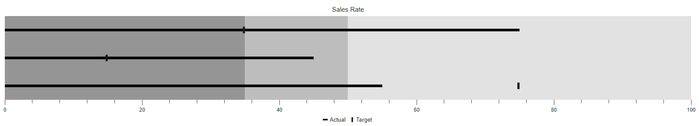
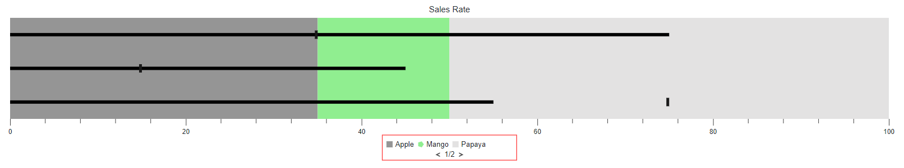
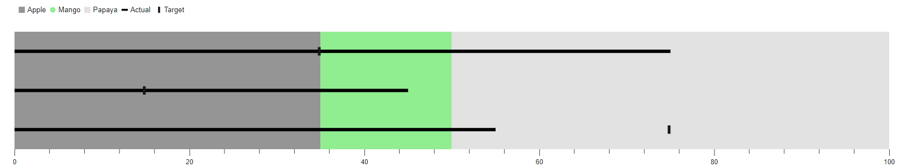
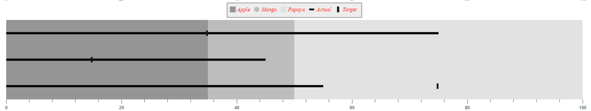

# Legend in Blazor Bullet Chart Component

Legend is used to provide valuable information for interpreting what the Bullet Chart displays. The legends can be represented in various colors, positions, shapes or other identifiers based on the data and it can be enabled by setting the [Visible](https://help.syncfusion.com/cr/blazor/Syncfusion.Blazor.Charts.BulletChartLegendSettings.html#Syncfusion_Blazor_Charts_BulletChartLegendSettings_Visible) property to **true** in the [BulletChartLegendSettings](https://help.syncfusion.com/cr/blazor/Syncfusion.Blazor.Charts.BulletChartLegendSettings.html).

```cshtml
@using Syncfusion.Blazor.Charts

<SfBulletChart DataSource="@BulletChartData" Height="300px" Title="Sales Rate" ValueField="FieldValue" TargetField="TargetValue" Minimum="0" Maximum="100" Interval="20">
    <BulletChartLegendSettings Visible="true"></BulletChartLegendSettings>
    <BulletChartRangeCollection>
        <BulletChartRange End=35> </BulletChartRange>
        <BulletChartRange End=50></BulletChartRange>
        <BulletChartRange End=100></BulletChartRange>
    </BulletChartRangeCollection>
</SfBulletChart>

@code{
    public class ChartData
    {
        public double FieldValue { get; set; }
        public double TargetValue { get; set; }
    }
    public List<ChartData> BulletChartData = new List<ChartData>
    {
        new ChartData { FieldValue = 55, TargetValue = 75 },
        new ChartData { FieldValue = 45, TargetValue = 15 },
        new ChartData { FieldValue = 75, TargetValue = 35 }
    };
}
```



## Legend items from color mapping

Legend items will be rendered based on the mapping ranges from the Bullet Chart. The legend item's name can be determined from the [Name](https://help.syncfusion.com/cr/blazor/Syncfusion.Blazor.Charts.BulletChartRange.html#Syncfusion_Blazor_Charts_BulletChartRange_Name) property and the shape of legend item can be customized using the [Shape](https://help.syncfusion.com/cr/blazor/Syncfusion.Blazor.Charts.BulletChartRange.html#Syncfusion_Blazor_Charts_BulletChartRange_Shape) property in the [BulletChartRange](https://help.syncfusion.com/cr/blazor/Syncfusion.Blazor.Charts.BulletChartRange.html). By default, the legend item is rendered on the [Rectangle](https://help.syncfusion.com/cr/blazor/Syncfusion.Blazor.Charts.LegendShape.html) shape.

Legend item to be customized by the following properties.

* [Padding](https://help.syncfusion.com/cr/blazor/Syncfusion.Blazor.Charts.BulletChartLegendSettings.html#Syncfusion_Blazor_Charts_BulletChartLegendSettings_Padding) - Specifies the padding between the legend items.
* [ShapeHeight](https://help.syncfusion.com/cr/blazor/Syncfusion.Blazor.Charts.BulletChartLegendSettings.html#Syncfusion_Blazor_Charts_BulletChartLegendSettings_ShapeHeight) - Specifies the shape height of the legend items.
* [ShapeWidth](https://help.syncfusion.com/cr/blazor/Syncfusion.Blazor.Charts.BulletChartLegendSettings.html#Syncfusion_Blazor_Charts_BulletChartLegendSettings_ShapeWidth) - Specifies the shape width of the legend items.
* [ShapePadding](https://help.syncfusion.com/cr/blazor/Syncfusion.Blazor.Charts.BulletChartLegendSettings.html#Syncfusion_Blazor_Charts_BulletChartLegendSettings_ShapePadding) - Specifies the padding between the shape and the text of the legend item.
* [BulletChartLegendTextStyle](https://help.syncfusion.com/cr/blazor/Syncfusion.Blazor.Charts.BulletChartLegendTextStyle.html) - Specifies the text style of the legend item.

```cshtml
@using Syncfusion.Blazor.Charts

<SfBulletChart DataSource="@BulletChartData" Height="300px" Title="Sales Rate" ValueField="FieldValue" TargetField="TargetValue" Minimum="0" Maximum="100" Interval="20">
    <BulletChartLegendSettings Visible="true"></BulletChartLegendSettings>
    <BulletChartRangeCollection>
        <BulletChartRange End=35 Name="Apple"></BulletChartRange>
        <BulletChartRange End=50 Name="Mango" Color="lightgreen" Shape="LegendShape.Pentagon"></BulletChartRange>
        <BulletChartRange End=100 Name="Papaya"></BulletChartRange>
    </BulletChartRangeCollection>
</SfBulletChart>
```

N> Refer to the [code block](#legend-in-blazor-bullet-chart-component) to know the property value of the **BulletChartData**.


## Legend size

Customize the legend size by modifying the [Height](https://help.syncfusion.com/cr/blazor/Syncfusion.Blazor.Charts.BulletChartLegendSettings.html#Syncfusion_Blazor_Charts_BulletChartLegendSettings_Height) and the [Width](https://help.syncfusion.com/cr/blazor/Syncfusion.Blazor.Charts.BulletChartLegendSettings.html#Syncfusion_Blazor_Charts_BulletChartLegendSettings_Width) properties in the [BulletChartLegendSettings](https://help.syncfusion.com/cr/blazor/Syncfusion.Blazor.Charts.BulletChartLegendSettings.html). It accepts values in both percentage and pixel.

```cshtml
@using Syncfusion.Blazor.Charts

<SfBulletChart DataSource="@BulletChartData" Height="300px" Title="Sales Rate" ValueField="FieldValue" TargetField="TargetValue" Minimum="0" Maximum="100" Interval="20">
    <BulletChartLegendSettings Visible="true" Width="15%"></BulletChartLegendSettings>
    <BulletChartRangeCollection>
        <BulletChartRange End=35 Name="Apple"></BulletChartRange>
        <BulletChartRange End=50 Name="Mango" Color="lightgreen" Shape="LegendShape.Pentagon"></BulletChartRange>
        <BulletChartRange End=100 Name="Papaya"></BulletChartRange>
    </BulletChartRangeCollection>
</SfBulletChart>
```

N> Refer to the [code block](#legend-in-blazor-bullet-chart-component) to know about the property value of the **BulletChartData**.


## Legend with paging support

Bullet Chart supports the legend paging if the legend items cannot be placed within the provided [Height](https://help.syncfusion.com/cr/blazor/Syncfusion.Blazor.Charts.BulletChartLegendSettings.html#Syncfusion_Blazor_Charts_BulletChartLegendSettings_Height) and [Width](https://help.syncfusion.com/cr/blazor/Syncfusion.Blazor.Charts.BulletChartLegendSettings.html#Syncfusion_Blazor_Charts_BulletChartLegendSettings_Width) of the legend.

```cshtml
@using Syncfusion.Blazor.Charts

<SfBulletChart DataSource="@BulletChartData" Height="300px" Title="Sales Rate" ValueField="FieldValue" TargetField="TargetValue" Minimum="0" Maximum="100" Interval="20">
    <BulletChartLegendSettings Visible="true" Width="15%" Height="15%">
        <BulletChartLegendBorder Color="red" Width="1"></BulletChartLegendBorder>
    </BulletChartLegendSettings>
    <BulletChartRangeCollection>
        <BulletChartRange End=35 Name="Apple"></BulletChartRange>
        <BulletChartRange End=50 Name="Mango" Color="lightgreen" Shape="LegendShape.Pentagon"></BulletChartRange>
        <BulletChartRange End=100 Name="Papaya"></BulletChartRange>
    </BulletChartRangeCollection>
</SfBulletChart>
```

N> Refer to the [code block](#legend-in-blazor-bullet-chart-component) to know about the property value of the **BulletChartData**.



## Position and alignment

The legend can be placed in various positions and the following options are available to customize the legend position using the [Position](https://help.syncfusion.com/cr/blazor/Syncfusion.Blazor.Charts.BulletChartLegendSettings.html#Syncfusion_Blazor_Charts_BulletChartLegendSettings_Position) property:

* [Auto](https://help.syncfusion.com/cr/blazor/Syncfusion.Blazor.Charts.LegendPosition.html#Syncfusion_Blazor_Charts_LegendPosition_Auto)
* [Bottom](https://help.syncfusion.com/cr/blazor/Syncfusion.Blazor.Charts.LegendPosition.html#Syncfusion_Blazor_Charts_LegendPosition_Bottom)
* [Top](https://help.syncfusion.com/cr/blazor/Syncfusion.Blazor.Charts.LegendPosition.html#Syncfusion_Blazor_Charts_LegendPosition_Top)
* [Left](https://help.syncfusion.com/cr/blazor/Syncfusion.Blazor.Charts.LegendPosition.html#Syncfusion_Blazor_Charts_LegendPosition_Left)
* [Right](https://help.syncfusion.com/cr/blazor/Syncfusion.Blazor.Charts.LegendPosition.html#Syncfusion_Blazor_Charts_LegendPosition_Right)
* [Custom](https://help.syncfusion.com/cr/blazor/Syncfusion.Blazor.Charts.LegendPosition.html#Syncfusion_Blazor_Charts_LegendPosition_Custom)

The following code example demonstrates the top legend position.

```cshtml
@using Syncfusion.Blazor.Charts

<SfBulletChart DataSource="@BulletChartData" Height="300px" ValueField="FieldValue" TargetField="TargetValue" Minimum="0" Maximum="100" Interval="20">
    <BulletChartLegendSettings Height="40px" Visible="true" Position="LegendPosition.Top"></BulletChartLegendSettings>
    <BulletChartRangeCollection>
        <BulletChartRange End=35 Name="Apple"></BulletChartRange>
        <BulletChartRange End=50 Name="Mango" Color="lightgreen" Shape="LegendShape.Pentagon"></BulletChartRange>
        <BulletChartRange End=100 Name="Papaya"></BulletChartRange>
    </BulletChartRangeCollection>
</SfBulletChart>
```

N> Refer to the [code block](#legend-in-blazor-bullet-chart-component) to know about the property value of the **BulletChartData**.


[Auto](https://help.syncfusion.com/cr/blazor/Syncfusion.Blazor.Charts.LegendPosition.html#Syncfusion_Blazor_Charts_LegendPosition_Auto) position will be rendered with the responsive legend height to the [Bottom](https://help.syncfusion.com/cr/blazor/Syncfusion.Blazor.Charts.LegendPosition.html#Syncfusion_Blazor_Charts_LegendPosition_Bottom) of the component and the [Custom](https://help.syncfusion.com/cr/blazor/Syncfusion.Blazor.Charts.LegendPosition.html#Syncfusion_Blazor_Charts_LegendPosition_Custom) position renders based on x and y coordinates by specified to [X](https://help.syncfusion.com/cr/blazor/Syncfusion.Blazor.Charts.BulletChartLegendLocation.html#Syncfusion_Blazor_Charts_BulletChartLegendLocation_X) and [Y](https://help.syncfusion.com/cr/blazor/Syncfusion.Blazor.Charts.BulletChartLegendLocation.html#Syncfusion_Blazor_Charts_BulletChartLegendLocation_Y) properties in the [BulletChartLegendLocation](https://help.syncfusion.com/cr/blazor/Syncfusion.Blazor.Charts.BulletChartLegendLocation.html).

The following code example demonstrates the [Custom](https://help.syncfusion.com/cr/blazor/Syncfusion.Blazor.Charts.LegendPosition.html#Syncfusion_Blazor_Charts_LegendPosition_Custom) legend position.

```cshtml
@using Syncfusion.Blazor.Charts

<SfBulletChart DataSource="@BulletChartData" Height="300px" ValueField="FieldValue" TargetField="TargetValue" Minimum="0" Maximum="100" Interval="20">
    <BulletChartMargin Top="30"></BulletChartMargin>
    <BulletChartLegendSettings Height="40px" Visible="true" Position="LegendPosition.Custom">
        <BulletChartLegendLocation X="5" Y="0"></BulletChartLegendLocation>
    </BulletChartLegendSettings>
    <BulletChartRangeCollection>
        <BulletChartRange End=35 Name="Apple"></BulletChartRange>
        <BulletChartRange End=50 Name="Mango" Color="lightgreen" Shape="LegendShape.Pentagon"></BulletChartRange>
        <BulletChartRange End=100 Name="Papaya"></BulletChartRange>
    </BulletChartRangeCollection>
</SfBulletChart>
```

N> Refer to the [code block](#legend-in-blazor-bullet-chart-component) to know about the property value of the **BulletChartData**.


The legend alignment is used to align the legend items to the specific location. The following options are available to customize using the [Alignment](https://help.syncfusion.com/cr/blazor/Syncfusion.Blazor.Charts.BulletChartLegendSettings.html#Syncfusion_Blazor_Charts_BulletChartLegendSettings_Alignment) property:

* [Near](https://help.syncfusion.com/cr/blazor/Syncfusion.Blazor.Charts.Alignment.html#Syncfusion_Blazor_Charts_Alignment_Near)
* [Center](https://help.syncfusion.com/cr/blazor/Syncfusion.Blazor.Charts.Alignment.html#Syncfusion_Blazor_Charts_Alignment_Center)
* [Far](https://help.syncfusion.com/cr/blazor/Syncfusion.Blazor.Charts.Alignment.html#Syncfusion_Blazor_Charts_Alignment_Far)

The following code example demonstrates legend item alignment.

```cshtml
@using Syncfusion.Blazor.Charts

<SfBulletChart DataSource="@BulletChartData" Height="300px" ValueField="FieldValue" TargetField="TargetValue" Minimum="0" Maximum="100" Interval="20">
    <BulletChartLegendSettings Height="40px" Visible="true" Position="LegendPosition.Top" Alignment="Alignment.Near"></BulletChartLegendSettings>
    <BulletChartRangeCollection>
        <BulletChartRange End=35 Name="Apple"></BulletChartRange>
        <BulletChartRange End=50 Name="Mango" Color="lightgreen" Shape="LegendShape.Pentagon"></BulletChartRange>
        <BulletChartRange End=100 Name="Papaya"></BulletChartRange>
    </BulletChartRangeCollection>
</SfBulletChart>
```

N> Refer to the [code block](#legend-in-blazor-bullet-chart-component) to know about the property value of the **BulletChartData**.



## Customization

Legend can be customized by the following properties:

* [Background](https://help.syncfusion.com/cr/blazor/Syncfusion.Blazor.Charts.BulletChartLegendSettings.html#Syncfusion_Blazor_Charts_BulletChartLegendSettings_Background) - Specifies the fill color of the legend.
* [Opacity](https://help.syncfusion.com/cr/blazor/Syncfusion.Blazor.Charts.BulletChartLegendSettings.html#Syncfusion_Blazor_Charts_BulletChartLegendSettings_Opacity) - Specifies the opacity of the legend background.
* [BulletChartLegendMargin](https://help.syncfusion.com/cr/blazor/Syncfusion.Blazor.Charts.BulletChartLegendMargin.html) - Specifies the bottom, left, right, and top margin of the legend.
* [BulletChartLegendBorder](https://help.syncfusion.com/cr/blazor/Syncfusion.Blazor.Charts.BulletChartLegendBorder.html) - Specifies the color and the width of the legend border.

```cshtml
@using Syncfusion.Blazor.Charts

<SfBulletChart DataSource="@BulletChartData" Height="300px" ValueField="FieldValue" TargetField="TargetValue" Minimum="0" Maximum="100" Interval="20">
    <BulletChartLegendSettings Height="40px" Visible="true" Position="LegendPosition.Top" Background="lightgray" Opacity="0.4" ShapeHeight="15" ShapeWidth="15">
        <BulletChartMargin Top="5"></BulletChartMargin>
        <BulletChartLegendTextStyle Size="15px" Color="red" Opacity="1" FontStyle="italic"></BulletChartLegendTextStyle>
        <BulletChartLegendBorder Color="#000000" Width="2"></BulletChartLegendBorder>
    </BulletChartLegendSettings>
    <BulletChartRangeCollection>
        <BulletChartRange End=35 Name="Apple"></BulletChartRange>
        <BulletChartRange End=50 Name="Mango" Shape="LegendShape.Pentagon"></BulletChartRange>
        <BulletChartRange End=100 Name="Papaya"></BulletChartRange>
    </BulletChartRangeCollection>
</SfBulletChart>
```

N> Refer to the [code block](#legend-in-blazor-bullet-chart-component) to know about the property value of the **BulletChartData**.

