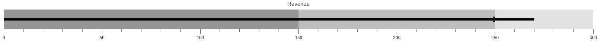
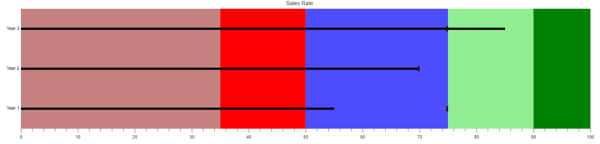

# Ranges in Blazor Bullet Chart Component

Ranges in the Bullet Chart visually represent qualitative categories such as **Good**, **Bad**, and **Satisfactory** on the chart scale. The [End](https://help.syncfusion.com/cr/blazor/Syncfusion.Blazor.Charts.BulletChartRange.html#Syncfusion_Blazor_Charts_BulletChartRange_End) property specifies the endpoint of each range. The minimum value of the quantitative scale is used as the starting point for the first range, or the previous range's endpoint for subsequent ranges.

```cshtml

@using Syncfusion.Blazor.Charts

<SfBulletChart DataSource="@BulletChartData" ValueField="FieldValue" TargetField="TargetValue" Minimum="0" Maximum="300" Interval="50" Title="Revenue">
    <BulletChartRangeCollection>
        <BulletChartRange End=150></BulletChartRange>
        <BulletChartRange End=250></BulletChartRange>
        <BulletChartRange End=300></BulletChartRange>
    </BulletChartRangeCollection>
</SfBulletChart>

@code {
    public class ChartData
    {
        public double FieldValue { get; set; }
        public double TargetValue { get; set; }
    }

    public List<ChartData> BulletChartData = new List<ChartData>
    {
        new ChartData { FieldValue = 270, TargetValue = 250 }
    };
}

```




## Color Customization

Enhance the readability and interpretation of ranges by customizing their color and opacity. Use the [Color](https://help.syncfusion.com/cr/blazor/Syncfusion.Blazor.Charts.BulletChartRange.html#Syncfusion_Blazor_Charts_BulletChartRange_Color) and [Opacity](https://help.syncfusion.com/cr/blazor/Syncfusion.Blazor.Charts.BulletChartRange.html#Syncfusion_Blazor_Charts_BulletChartRange_Opacity) properties to visually distinguish each range.

```cshtml

@using Syncfusion.Blazor.Charts

<SfBulletChart DataSource="@BulletChartData" CategoryField="CategoryValue" ValueField="FieldValue" TargetField="TargetValue" Minimum="0" Maximum="100" Interval="10" Title="Sales Rate" Height="400">
    <BulletChartRangeCollection>
        <BulletChartRange End=35 Color="darkred" Opacity="0.5"></BulletChartRange>
        <BulletChartRange End=50 Color="red" Opacity="1"></BulletChartRange>
        <BulletChartRange End=75 Color="blue" Opacity="0.7"></BulletChartRange>
        <BulletChartRange End=90 Color="lightgreen" Opacity="1"></BulletChartRange>
        <BulletChartRange End=100 Color="green" Opacity="1"></BulletChartRange>
    </BulletChartRangeCollection>
</SfBulletChart>

@code {
    public class ChartData
    {
        public double FieldValue { get; set; }
        public double TargetValue { get; set; }
        public string CategoryValue { get; set; }
    }

    public List<ChartData> BulletChartData = new List<ChartData>
    {
        new ChartData { FieldValue = 55, TargetValue = 75, CategoryValue = "Year 1" },
        new ChartData { FieldValue = 70, TargetValue = 70, CategoryValue = "Year 2" },
        new ChartData { FieldValue = 85, TargetValue = 75, CategoryValue = "Year 3" }
    };
}

```



