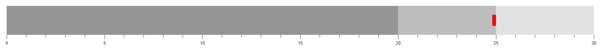

# Target Bar in Blazor Bullet Chart Component

The **Target Bar** (also known as the **Comparative Measure**) is a line marker that runs perpendicular to the chart's orientation, serving as a target marker for comparison against the feature measure value. To display the target bar, map the [TargetField](https://help.syncfusion.com/cr/blazor/Syncfusion.Blazor.Charts.SfBulletChart-1.html#Syncfusion_Blazor_Charts_SfBulletChart_1_TargetField) property to the appropriate field in your data source.

```cshtml

@using Syncfusion.Blazor.Charts

<SfBulletChart DataSource="@BulletChartData" TargetField="Target" Minimum="0" Maximum="30" Interval="5">
    <BulletChartRangeCollection>
        <BulletChartRange End=20> </BulletChartRange>
        <BulletChartRange End=25></BulletChartRange>
        <BulletChartRange End=30></BulletChartRange>
    </BulletChartRangeCollection>
</SfBulletChart>

@code {
    public class ChartData
    {
        public double Target { get; set; }
    }

    public List<ChartData> BulletChartData = new List<ChartData>
    {
        new ChartData { Target = 25 }
    };
}

```


## Types of Target Bar

The shape of the target bar can be customized using the [TargetTypes](https://help.syncfusion.com/cr/blazor/Syncfusion.Blazor.Charts.SfBulletChart-1.html#Syncfusion_Blazor_Charts_SfBulletChart_1_TargetTypes) property. Supported shapes include [Circle](https://help.syncfusion.com/cr/blazor/Syncfusion.Blazor.Charts.TargetType.html#Syncfusion_Blazor_Charts_TargetType_Circle), [Cross](https://help.syncfusion.com/cr/blazor/Syncfusion.Blazor.Charts.TargetType.html#Syncfusion_Blazor_Charts_TargetType_Cross), and [Rect](https://help.syncfusion.com/cr/blazor/Syncfusion.Blazor.Charts.TargetType.html#Syncfusion_Blazor_Charts_TargetType_Rect) (default).

```cshtml

@using Syncfusion.Blazor.Charts

<SfBulletChart DataSource="@BulletChartData" TargetField="Target" Minimum="0" Maximum="30" Interval="5" TargetTypes="new List<TargetType>() { TargetType.Cross }">
    <BulletChartRangeCollection>
        <BulletChartRange End=20> </BulletChartRange>
        <BulletChartRange End=25></BulletChartRange>
        <BulletChartRange End=30></BulletChartRange>
    </BulletChartRangeCollection>
</SfBulletChart>

```

N> Refer to the [code block](#target-bar-in-blazor-bullet-chart-component) to know about the property value of the **BulletChartData**.


## Target Bar Customization

The following properties are available to customize the appearance of the target bar:

* [TargetColor](https://help.syncfusion.com/cr/blazor/Syncfusion.Blazor.Charts.SfBulletChart-1.html#Syncfusion_Blazor_Charts_SfBulletChart_1_TargetColor) – Sets the fill color of the target bar.
* [TargetWidth](https://help.syncfusion.com/cr/blazor/Syncfusion.Blazor.Charts.SfBulletChart-1.html#Syncfusion_Blazor_Charts_SfBulletChart_1_TargetWidth) – Sets the width of the target bar.

```cshtml

@using Syncfusion.Blazor.Charts

<SfBulletChart DataSource="@BulletChartData" TargetField="Target" Minimum="0" Maximum="30" Interval="5" TargetColor="red" TargetWidth="10">
    <BulletChartRangeCollection>
        <BulletChartRange End=20> </BulletChartRange>
        <BulletChartRange End=25></BulletChartRange>
        <BulletChartRange End=30></BulletChartRange>
    </BulletChartRangeCollection>
</SfBulletChart>

```

N> Refer to the [code block](#target-bar-in-blazor-bullet-chart-component) to know about the property value of the **BulletChartData**.


