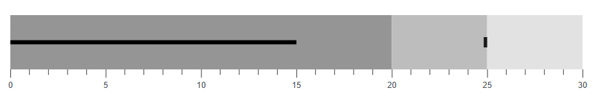
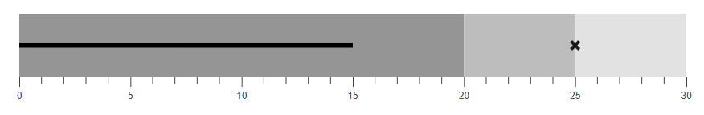
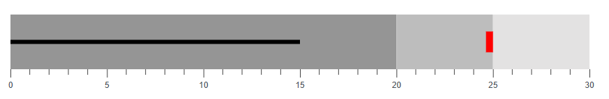

# Blazor Bullet Chart Target Bar

The line marker that runs perpendicular to the feature measure is known as the **Comparative Measure** and is used as a target marker to compare against the feature measure value. This is also called the **Target Bar** in the Bullet Chart. To display the target bar, the [TargetField](https://help.syncfusion.com/cr/blazor/Syncfusion.Blazor.Charts.SfBulletChart-1.html#Syncfusion_Blazor_Charts_SfBulletChart_1_TargetField) should be mapped to the appropriate field from the data source.

```cshtml
@using Syncfusion.Blazor.Charts

<SfBulletChart DataSource="@BulletChartData" ValueField="Value" TargetField="Target" Minimum="0" Maximum="30" Interval="5">
    <BulletChartRangeCollection>
        <BulletChartRange End=20> </BulletChartRange>
        <BulletChartRange End=25></BulletChartRange>
        <BulletChartRange End=30></BulletChartRange>
    </BulletChartRangeCollection>
</SfBulletChart>

@code{
    public class ChartData
    {
        public double Value { get; set; }
        public double Target { get; set; }
    }
    public List<ChartData> BulletChartData = new List<ChartData>
    {
        new ChartData { Value = 15, Target = 25 }
    };
}
```



## Types of target bar

The shape of the target bar can be customized using the [TargetTypes](https://help.syncfusion.com/cr/blazor/Syncfusion.Blazor.Charts.SfBulletChart-1.html#Syncfusion_Blazor_Charts_SfBulletChart_1_TargetTypes) property, which supports the [Circle](https://help.syncfusion.com/cr/blazor/Syncfusion.Blazor.Charts.TargetType.html#Syncfusion_Blazor_Charts_TargetType_Circle), [Cross](https://help.syncfusion.com/cr/blazor/Syncfusion.Blazor.Charts.TargetType.html#Syncfusion_Blazor_Charts_TargetType_Cross), and [Rect](https://help.syncfusion.com/cr/blazor/Syncfusion.Blazor.Charts.TargetType.html#Syncfusion_Blazor_Charts_TargetType_Rect) shapes. The default type of the target bar is [Rect](https://help.syncfusion.com/cr/blazor/Syncfusion.Blazor.Charts.TargetType.html#Syncfusion_Blazor_Charts_TargetType_Rect).

```cshtml
@using Syncfusion.Blazor.Charts

<SfBulletChart DataSource="@BulletChartData" ValueField="Value" TargetField="Target" Minimum="0" Maximum="30" Interval="5" TargetTypes="new List<TargetType>() { TargetType.Rect }">
    <BulletChartRangeCollection>
        <BulletChartRange End=20> </BulletChartRange>
        <BulletChartRange End=25></BulletChartRange>
        <BulletChartRange End=30></BulletChartRange>
    </BulletChartRangeCollection>
</SfBulletChart>
```



## Target bar customization

The following properties can be used to customize the target bar.

* [TargetColor](https://help.syncfusion.com/cr/blazor/Syncfusion.Blazor.Charts.SfBulletChart-1.html#Syncfusion_Blazor_Charts_SfBulletChart_1_TargetColor) - Specifies the fill color of the target bar.
* [TargetWidth](https://help.syncfusion.com/cr/blazor/Syncfusion.Blazor.Charts.SfBulletChart-1.html#Syncfusion_Blazor_Charts_SfBulletChart_1_TargetWidth) - Specifies the width of the target bar.

```cshtml
@using Syncfusion.Blazor.Charts

<SfBulletChart DataSource="@BulletChartData" ValueField="Value" TargetField="Target" Minimum="0" Maximum="30" Interval="5" TargetColor="red" TargetWidth="10">
    <BulletChartRangeCollection>
        <BulletChartRange End=20> </BulletChartRange>
        <BulletChartRange End=25></BulletChartRange>
        <BulletChartRange End=30></BulletChartRange>
    </BulletChartRangeCollection>
</SfBulletChart>
```

