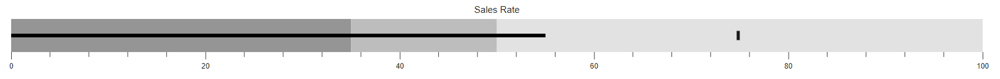
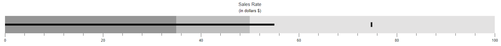
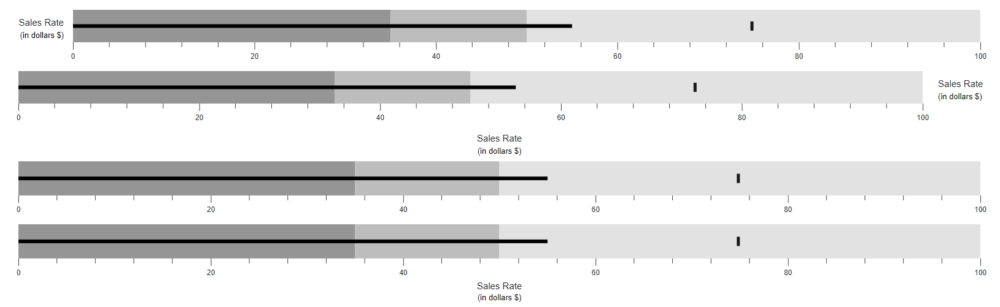
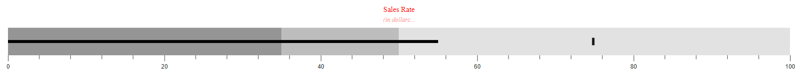

# Title and Subtitle in Blazor Bullet Chart Component

## Title

The title of the [Blazor Bullet Chart](https://www.syncfusion.com/blazor-components/blazor-bullet-chart) provides context about the data being visualized. Set the [Title](https://help.syncfusion.com/cr/blazor/Syncfusion.Blazor.Charts.SfBulletChart-1.html#Syncfusion_Blazor_Charts_SfBulletChart_1_Title) property to display a chart title.

```cshtml

@using Syncfusion.Blazor.Charts

<SfBulletChart DataSource="@BulletChartData" Title="Sales Rate" ValueField="FieldValue" TargetField="TargetValue" Minimum="0" Maximum="100" Interval="20">
    <BulletChartRangeCollection>
        <BulletChartRange End=35></BulletChartRange>
        <BulletChartRange End=50></BulletChartRange>
        <BulletChartRange End=100></BulletChartRange>
    </BulletChartRangeCollection>
</SfBulletChart>

@code {
    public class ChartData
    {
        public double FieldValue { get; set; }
        public double TargetValue { get; set; }
    }

    public List<ChartData> BulletChartData = new List<ChartData>
    {
        new ChartData { FieldValue = 55, TargetValue = 75 }
    };
}

```



## Subtitle

To provide additional context, use the [Subtitle](https://help.syncfusion.com/cr/blazor/Syncfusion.Blazor.Charts.SfBulletChart-1.html#Syncfusion_Blazor_Charts_SfBulletChart_1_Subtitle) property to display a subtitle below the main title.

```cshtml

@using Syncfusion.Blazor.Charts

<SfBulletChart DataSource="@BulletChartData" Height="150px" Subtitle="(in dollars $)" Title="Sales Rate" ValueField="FieldValue" TargetField="TargetValue" Minimum="0" Maximum="100" Interval="20">
    <BulletChartRangeCollection>
        <BulletChartRange End=35></BulletChartRange>
        <BulletChartRange End=50></BulletChartRange>
        <BulletChartRange End=100></BulletChartRange>
    </BulletChartRangeCollection>
</SfBulletChart>

```

N> Refer to the [code block](#title) to know about the property value of the **BulletChartData**.



## Title and Subtitle Position

Customize the position of the title and subtitle using the [TitlePosition](https://help.syncfusion.com/cr/blazor/Syncfusion.Blazor.Charts.SfBulletChart-1.html#Syncfusion_Blazor_Charts_SfBulletChart_1_TitlePosition) property. Possible positions include [Left](https://help.syncfusion.com/cr/blazor/Syncfusion.Blazor.Charts.TextPosition.html#Syncfusion_Blazor_Charts_TextPosition_Left), [Right](https://help.syncfusion.com/cr/blazor/Syncfusion.Blazor.Charts.TextPosition.html#Syncfusion_Blazor_Charts_TextPosition_Right), [Top](https://help.syncfusion.com/cr/blazor/Syncfusion.Blazor.Charts.TextPosition.html#Syncfusion_Blazor_Charts_TextPosition_Top), and [Bottom](https://help.syncfusion.com/cr/blazor/Syncfusion.Blazor.Charts.TextPosition.html#Syncfusion_Blazor_Charts_TextPosition_Bottom).

```cshtml

@using Syncfusion.Blazor.Charts

<SfBulletChart DataSource="@BulletChartData" TitlePosition="TextPosition.Left" Height="100px" Subtitle="(in dollars $)" Title="Sales Rate" ValueField="FieldValue" TargetField="TargetValue" Minimum="0" Maximum="100" Interval="20">
    <BulletChartRangeCollection>
        <BulletChartRange End=35></BulletChartRange>
        <BulletChartRange End=50></BulletChartRange>
        <BulletChartRange End=100></BulletChartRange>
    </BulletChartRangeCollection>
</SfBulletChart>

<SfBulletChart DataSource="@BulletChartData" TitlePosition="TextPosition.Right" Height="100px" Subtitle="(in dollars $)" Title="Sales Rate" ValueField="FieldValue" TargetField="TargetValue" Minimum="0" Maximum="100" Interval="20">
    <BulletChartRangeCollection>
        <BulletChartRange End=35></BulletChartRange>
        <BulletChartRange End=50></BulletChartRange>
        <BulletChartRange End=100></BulletChartRange>
    </BulletChartRangeCollection>
</SfBulletChart>

<SfBulletChart DataSource="@BulletChartData" TitlePosition="TextPosition.Top" Height="150px" Subtitle="(in dollars $)" Title="Sales Rate" ValueField="FieldValue" TargetField="TargetValue" Minimum="0" Maximum="100" Interval="20">
    <BulletChartRangeCollection>
        <BulletChartRange End=35></BulletChartRange>
        <BulletChartRange End=50></BulletChartRange>
        <BulletChartRange End=100></BulletChartRange>
    </BulletChartRangeCollection>
</SfBulletChart>

<SfBulletChart DataSource="@BulletChartData" TitlePosition="TextPosition.Bottom" Height="150px" Subtitle="(in dollars $)" Title="Sales Rate" ValueField="FieldValue" TargetField="TargetValue" Minimum="0" Maximum="100" Interval="20">
    <BulletChartRangeCollection>
        <BulletChartRange End=35></BulletChartRange>
        <BulletChartRange End=50></BulletChartRange>
        <BulletChartRange End=100></BulletChartRange>
    </BulletChartRangeCollection>
</SfBulletChart>

```

N> Refer to the [code block](#title) to know about the property value of the **BulletChartData**.



## Title and Subtitle Customization

Customize the color, opacity, font size, font family, font weight, and font style of the title and subtitle using the [BulletChartTitleStyle](https://help.syncfusion.com/cr/blazor/Syncfusion.Blazor.Charts.BulletChartTitleStyle.html) and [BulletChartSubTitleStyle](https://help.syncfusion.com/cr/blazor/Syncfusion.Blazor.Charts.BulletChartSubTitleStyle.html) properties. The [MaximumTitleWidth](https://help.syncfusion.com/cr/blazor/Syncfusion.Blazor.Charts.BulletChartCommonFont.html#Syncfusion_Blazor_Charts_BulletChartCommonFont_MaximumTitleWidth) property sets the maximum width of the text, and the [TextOverflow](https://help.syncfusion.com/cr/blazor/Syncfusion.Blazor.Charts.BulletChartCommonFont.html#Syncfusion_Blazor_Charts_BulletChartCommonFont_TextOverflow) property controls whether the title and subtitle are [Wrapped](https://help.syncfusion.com/cr/blazor/Syncfusion.Blazor.Charts.TextOverflow.html#Syncfusion_Blazor_Charts_TextOverflow_Wrap) or [Trimmed](https://help.syncfusion.com/cr/blazor/Syncfusion.Blazor.Charts.TextOverflow.html#Syncfusion_Blazor_Charts_TextOverflow_Trim) when the text exceeds the maximum width. The default value for [TextOverflow](https://help.syncfusion.com/cr/blazor/Syncfusion.Blazor.Charts.BulletChartCommonFont.html#Syncfusion_Blazor_Charts_BulletChartCommonFont_TextOverflow) is [None](https://help.syncfusion.com/cr/blazor/Syncfusion.Blazor.Charts.TextOverflow.html#Syncfusion_Blazor_Charts_TextOverflow_None).

```cshtml

@using Syncfusion.Blazor.Charts

<SfBulletChart DataSource="@BulletChartData" Height="150px" Title="Sales Rate" Subtitle="(in dollars $)" ValueField="FieldValue" TargetField="TargetValue" Minimum="0" Maximum="100" Interval="20">
    <BulletChartTitleStyle Color="red" Opacity="1" Size="15px"></BulletChartTitleStyle>
    <BulletChartSubTitleStyle Color="red" Opacity="0.5" Size="13px" FontStyle="italic" MaximumTitleWidth="70" TextOverflow="TextOverflow.Trim"></BulletChartSubTitleStyle>
    <BulletChartRangeCollection>
        <BulletChartRange End=35></BulletChartRange>
        <BulletChartRange End=50></BulletChartRange>
        <BulletChartRange End=100></BulletChartRange>
    </BulletChartRangeCollection>
</SfBulletChart>

```

N> Refer to the [code block](#title) to know about the property value of the **BulletChartData**.


