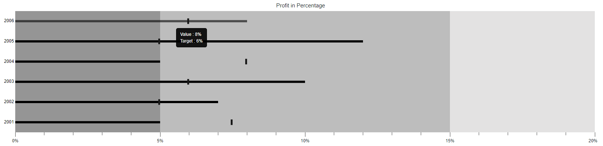
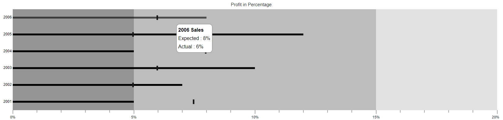

# Tooltip in the Blazor Bullet Chart (SfBulletChart)

When the mouse is hovered over a bar in the Bullet Chart, the tooltip displays important summary about the actual and the target bar values.

## Default Tooltip

The tooltip is not visible by default. To make it visible, set the [`Enable`](https://help.syncfusion.com/cr/blazor/Syncfusion.Blazor.Charts.BulletChartTooltip-1.html#Syncfusion_Blazor_Charts_BulletChartTooltip_1_Enable) property in the [`BulletChartTooltip`](https://help.syncfusion.com/cr/blazor/Syncfusion.Blazor.Charts.BulletChartTooltip-1.html) to **true**.

```csharp
@using Syncfusion.Blazor.Charts

<SfBulletChart DataSource="@BulletChartData" ValueField="ValueField" TargetField="TargetValue" CategoryField="Category" Height="400" Minimum="0" Maximum="20" Interval="5" LabelFormat="{value}%" Title="Profit in Percentage">
    <BulletChartTooltip TValue="ChartData" Enable="true"></BulletChartTooltip>
    <BulletChartRangeCollection>
        <BulletChartRange End=5> </BulletChartRange>
        <BulletChartRange End=15></BulletChartRange>
        <BulletChartRange End=20></BulletChartRange>
    </BulletChartRangeCollection>
</SfBulletChart>

@code{
    public class ChartData
    {
        public double ValueField { get; set; }
        public double TargetValue { get; set; }
        public string Category { get; set; }
    }
    public List<ChartData> BulletChartData = new List<ChartData>
    {
        new ChartData { ValueField = 5, TargetValue = 7.5, Category = "2001" },
        new ChartData { ValueField = 7, TargetValue = 5, Category = "2002" },
        new ChartData { ValueField = 10, TargetValue = 6, Category = "2003" },
        new ChartData { ValueField = 5, TargetValue = 8, Category = "2004" },
        new ChartData { ValueField = 12, TargetValue = 5, Category = "2005" },
        new ChartData { ValueField = 8, TargetValue = 6, Category = "2006" }
    };
}
```



## Tooltip Customization

The following properties can be used to customize the Bullet Chart tooltip.

* [`Fill`](https://help.syncfusion.com/cr/blazor/Syncfusion.Blazor.Charts.BulletChartTooltip-1.html#Syncfusion_Blazor_Charts_BulletChartTooltip_1_Fill) - Specifies the color of the tooltip.
* [`BulletChartTooltipBorder`](https://help.syncfusion.com/cr/blazor/Syncfusion.Blazor.Charts.BulletChartTooltipBorder.html) - Specifies the tooltip border color and the width.
* [`BulletChartTooltipTextStyle`](https://help.syncfusion.com/cr/blazor/Syncfusion.Blazor.Charts.BulletChartTooltipTextStyle.html) - Specifies the tooltip font family, font style, font weight, color and size.

```csharp
@using Syncfusion.Blazor.Charts

<SfBulletChart DataSource="@BulletChartData" ValueField="ValueField" TargetField="TargetValue" CategoryField="Category" Height="400" Minimum="0" Maximum="20" Interval="5" LabelFormat="{value}%" Title="Profit in Percentage">
    <BulletChartTooltip TValue="ChartData" Enable="true" Fill="lightgray">
        <BulletChartTooltipTextStyle Color="#000000" Opacity="1" Size="15px" FontStyle="italic"></BulletChartTooltipTextStyle>
        <BulletChartTooltipBorder Color="red" Width="2"></BulletChartTooltipBorder>
    </BulletChartTooltip>
    <BulletChartRangeCollection>
        <BulletChartRange End=5> </BulletChartRange>
        <BulletChartRange End=15></BulletChartRange>
        <BulletChartRange End=20></BulletChartRange>
    </BulletChartRangeCollection>
</SfBulletChart>
```

> Refer to the [code block](#default-tooltip) to know about the property value of the **BulletChartData**.


## Tooltip Template

The tooltip can be rendered as a custom component using the [`Template`](https://help.syncfusion.com/cr/blazor/Syncfusion.Blazor.Charts.BulletChartTooltip-1.html#Syncfusion_Blazor_Charts_BulletChartTooltip_1_Template) property in the [`BulletChartTooltip`](https://help.syncfusion.com/cr/blazor/Syncfusion.Blazor.Charts.BulletChartTooltip-1.html) which accepts one or more UI elements as an input, that can be rendered as a part of the tooltip rendering.

```csharp
@using Syncfusion.Blazor.Charts

<SfBulletChart DataSource="@BulletChartData" ValueField="ValueField" TargetField="TargetValue" CategoryField="Category" Height="400" Minimum="0" Maximum="20" Interval="5" LabelFormat="{value}%" Title="Profit in Percentage">
    <BulletChartTooltip TValue="ChartData" Enable="true" Fill="lightgray">
        <Template>
            @{
                <table style="width:100%; background-color: #ffffff; border-spacing: 0px; border-collapse:separate; border: 1px solid grey; border-radius:10px; padding-top: 5px; padding-bottom:5px">
                    <tr>
                        <td style="font-weight:bold; color:black; padding-left: 5px;padding-top: 2px;padding-bottom: 2px;">@context.Category Sales</td>
                    </tr>
                    <tr>
                        <td style="padding-left: 5px; color:black; padding-right: 5px; padding-bottom: 2px;">Expected : @context.ValueField%  </td>
                    </tr>
                    <tr>
                        <td style="padding-left: 5px; color:black; padding-right: 5px">Actual : @context.TargetValue% </td>
                    </tr>
                </table>
            }
        </Template>
    </BulletChartTooltip>
    <BulletChartRangeCollection>
        <BulletChartRange End=5> </BulletChartRange>
        <BulletChartRange End=15></BulletChartRange>
        <BulletChartRange End=20></BulletChartRange>
    </BulletChartRangeCollection>
</SfBulletChart>
```

> Refer to the [code block](#default-tooltip) to know about the property value of the **BulletChartData**.


