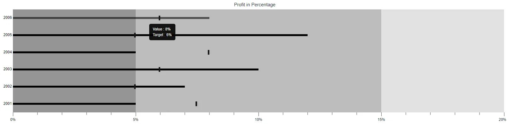
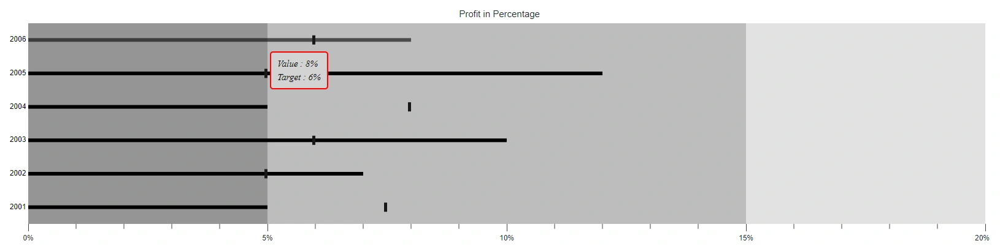
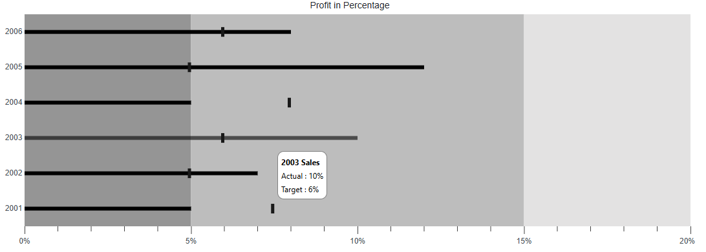

# Blazor Bullet Chart Tooltip

When hovering over a bar in the Bullet Chart, the tooltip displays a summary of the actual and target bar values.

## Default tooltip

The tooltip is not visible by default. To make it visible, set the [Enable](https://help.syncfusion.com/cr/blazor/Syncfusion.Blazor.Charts.BulletChartTooltip-1.html#Syncfusion_Blazor_Charts_BulletChartTooltip_1_Enable) property in the [BulletChartTooltip](https://help.syncfusion.com/cr/blazor/Syncfusion.Blazor.Charts.BulletChartTooltip-1.html) to **true**.

```cshtml
@using Syncfusion.Blazor.Charts

<SfBulletChart DataSource="@BulletChartData" ValueField="ValueField" TargetField="TargetValue" CategoryField="Category" Height="400" Minimum="0" Maximum="20" Interval="5" LabelFormat="{value}%" Title="Profit in Percentage">
    <BulletChartTooltip TValue="ChartData" Enable="true"></BulletChartTooltip>
    <BulletChartRangeCollection>
        <BulletChartRange End=5> </BulletChartRange>
        <BulletChartRange End=15></BulletChartRange>
        <BulletChartRange End=20></BulletChartRange>
    </BulletChartRangeCollection>
</SfBulletChart>

@code{
    public class ChartData
    {
        public double ValueField { get; set; }
        public double TargetValue { get; set; }
        public string Category { get; set; }
    }
    public List<ChartData> BulletChartData = new List<ChartData>
    {
        new ChartData { ValueField = 5, TargetValue = 7.5, Category = "2001" },
        new ChartData { ValueField = 7, TargetValue = 5, Category = "2002" },
        new ChartData { ValueField = 10, TargetValue = 6, Category = "2003" },
        new ChartData { ValueField = 5, TargetValue = 8, Category = "2004" },
        new ChartData { ValueField = 12, TargetValue = 5, Category = "2005" },
        new ChartData { ValueField = 8, TargetValue = 6, Category = "2006" }
    };
}
```



## Tooltip customization

The following properties and nested components can be used to customize the Bullet Chart tooltip.

* [Fill](https://help.syncfusion.com/cr/blazor/Syncfusion.Blazor.Charts.BulletChartTooltip-1.html#Syncfusion_Blazor_Charts_BulletChartTooltip_1_Fill) - Specifies the color of the tooltip.
* [BulletChartTooltipBorder](https://help.syncfusion.com/cr/blazor/Syncfusion.Blazor.Charts.BulletChartTooltipBorder.html) - Specifies the tooltip border color and width.
* [BulletChartTooltipTextStyle](https://help.syncfusion.com/cr/blazor/Syncfusion.Blazor.Charts.BulletChartTooltipTextStyle.html) - Specifies the tooltip font family, style, weight, color, and size.

```cshtml
@using Syncfusion.Blazor.Charts

<SfBulletChart DataSource="@BulletChartData" ValueField="ValueField" TargetField="TargetValue" CategoryField="Category" Height="400" Minimum="0" Maximum="20" Interval="5" LabelFormat="{value}%" Title="Profit in Percentage">
    <BulletChartTooltip TValue="ChartData" Enable="true" Fill="lightgray">
        <BulletChartTooltipTextStyle Color="#000000" Opacity="1" Size="15px" FontStyle="italic"></BulletChartTooltipTextStyle>
        <BulletChartTooltipBorder Color="red" Width="2"></BulletChartTooltipBorder>
    </BulletChartTooltip>
    <BulletChartRangeCollection>
        <BulletChartRange End=5> </BulletChartRange>
        <BulletChartRange End=15></BulletChartRange>
        <BulletChartRange End=20></BulletChartRange>
    </BulletChartRangeCollection>
</SfBulletChart>
```



## Tooltip template

The tooltip can be customized using the [Template](https://help.syncfusion.com/cr/blazor/Syncfusion.Blazor.Charts.BulletChartTooltip-1.html#Syncfusion_Blazor_Charts_BulletChartTooltip_1_Template) property in the [BulletChartTooltip](https://help.syncfusion.com/cr/blazor/Syncfusion.Blazor.Charts.BulletChartTooltip-1.html), which accepts UI content rendered as part of the tooltip.

```cshtml
@using Syncfusion.Blazor.Charts

<SfBulletChart DataSource="@BulletChartData" ValueField="ValueField" TargetField="TargetValue" CategoryField="Category" Height="400" Minimum="0" Maximum="20" Interval="5" LabelFormat="{value}%" Title="Profit in Percentage">
    <BulletChartTooltip TValue="ChartData" Enable="true" Fill="lightgray">
        <Template>
            @{
                <table style="width:100%; background-color: #ffffff; border-spacing: 0px; border-collapse:separate; border: 1px solid grey; border-radius:10px; padding-top: 5px; padding-bottom:5px">
                    <tr>
                        <td style="font-weight:bold; color:black; padding-left: 5px;padding-top: 2px;padding-bottom: 2px;">@context.Category Sales</td>
                    </tr>
                    <tr>
                        <td style="padding-left: 5px; color:black; padding-right: 5px; padding-bottom: 2px;">Actual : @context.ValueField%  </td>
                    </tr>
                    <tr>
                        <td style="padding-left: 5px; color:black; padding-right: 5px">Target : @context.TargetValue% </td>
                    </tr>
                </table>
            }
        </Template>
    </BulletChartTooltip>
    <BulletChartRangeCollection>
        <BulletChartRange End=5> </BulletChartRange>
        <BulletChartRange End=15></BulletChartRange>
        <BulletChartRange End=20></BulletChartRange>
    </BulletChartRangeCollection>
</SfBulletChart>
```



## Troubleshooting

If the tooltip does not appear, verify that `Enable="true"` is set, the `ValueField` and `TargetField` properties match the data source fields, and the required Syncfusion styles and scripts are configured.