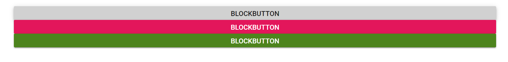

# Create a Block Button in Blazor Button Component

Create a block button that spans the full width of its parent by setting the [CssClass](https://help.syncfusion.com/cr/blazor/Syncfusion.Blazor.Buttons.SfButton.html#Syncfusion_Blazor_Buttons_SfButton_CssClass) property to `e-block`. The `e-block` class applies a 100% width and block-level layout. It can be combined with visual variants such as `IsPrimary` and `e-success`, as shown below.

```cshtml
@using Syncfusion.Blazor.Buttons

<SfButton CssClass="e-block">BLOCKBUTTON</SfButton>
<SfButton CssClass="e-block" IsPrimary="true">BLOCKBUTTON</SfButton>
<SfButton CssClass="e-block e-success">BLOCKBUTTON</SfButton>

```



