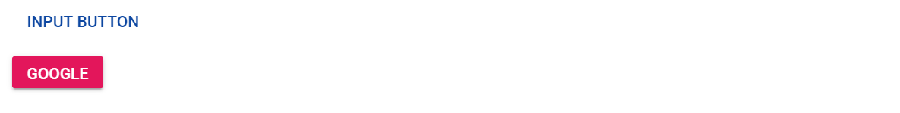

# Customize input and anchor elements

You can customize the appearance of the input and anchor elements using predefined styles through the class property. In the following code snippet, the input element is customized as a link Button by setting the `e-btn e-link` class, and the anchor element is customized as a primary Button by setting the `e-btn e-primary` class.

```csharp

<div>
    <input type="button" value="Input Button" class="e-btn e-link">
</div>

<div>
    <a class="e-btn e-primary" href="#">Google</a>
</div>

```

Output be like

