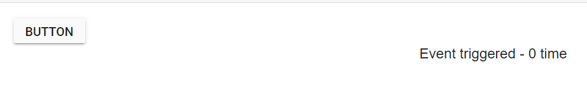

# Repeat Button in Blazor Button Component

The Repeat button is a type of Button in that the click event is triggered at regular time interval from the pressed state till the released state.

The following example explains about how to achieve Repeat Button in mouse and touch events.

```csharp

@using Syncfusion.Blazor.Buttons
@using System.Timers

<div id="button">
    <SfButton Content="Button" oncontextmenu="return false;" @onmousedown='mousedown' @ontouchstart='mousedown' @onmouseup='mouseup' @ontouchend='mouseup'></SfButton>
</div>
<div id="preview">@EventName Event triggered - @Count times</div>

@code{
    public string EventName = "";
    public int Count = 0;
    private static Timer aTimer;
    public void Click(Object source, System.Timers.ElapsedEventArgs e)
    {
        EventName = "Click";
        Count++;
        InvokeAsync(StateHasChanged);
    }
    public void mousedown()
    {
        aTimer = new System.Timers.Timer();
        aTimer.Interval = 200;
        aTimer.Elapsed += Click;
        aTimer.AutoReset = true;
        aTimer.Start();
    }
    public void mouseup()
    {
        aTimer.Stop();
        aTimer.Dispose();
    }
}

<style>
    #preview {
        float: right;
        padding: 0 350px 0 0;
    }
</style>

```



