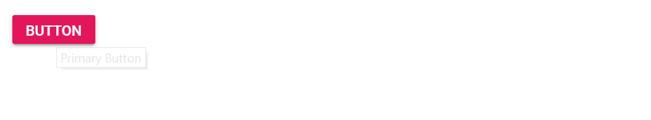

# Tooltip For Button

Tooltip can be shown on Button hover and it can be achieved by [`HtmlAttributes`](https://help.syncfusion.com/cr/blazor/Syncfusion.Blazor.Buttons.SfButton.html) property.

```csharp

@using Syncfusion.Blazor.Buttons

<SfButton Content="@Content" HtmlAttributes="@primButton" IsPrimary="true"></SfButton>

@code {
    public string Content = "Button";
    private Dictionary<string, object> primButton = new Dictionary<string, object>()
    {
        { "title", "Primary Button"}
    };
}

```

  Output be like

