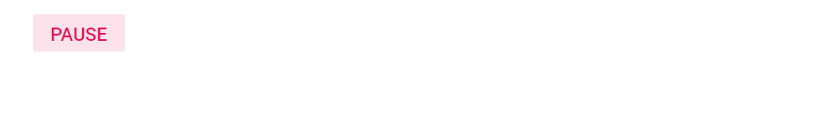

# Native Events in Blazor Button Component

Define native events on components using Blazor’s `@on...` event attributes. The attribute value is treated as an event handler, and event-specific data is provided through event argument types from the `Microsoft.AspNetCore.Components.Web` namespace.

Common event argument types include:

* Focus events – `FocusEventArgs`
* Mouse events – `MouseEventArgs`
* Keyboard events – `KeyboardEventArgs`
* Touch events – `TouchEventArgs`

## List of native events supported

The following native events are supported by the Button component:

| List of native events |  |  | |
| --- | --- | --- | --- |
| onclick | onblur | onfocus | onfocusout |
| onmousemove | onmouseover | onmouseout | onmousedown |
| onmouseup | ondblclick | onkeydown | onkeyup |
| onkeypress | ontouchend | onfocusin | ontouchstart |

## How to bind click event to Button

Use the `onclick` attribute to bind the click event for a button. The following example shows a toggle button that switches content when clicked.

```csharp

@using Syncfusion.Blazor.Buttons

<SfButton @ref="ToggleBtn" @onclick="onToggleClick" CssClass="e-flat" IsToggle="true" IsPrimary="true" Content="@Content"></SfButton>

@code {
    SfButton ToggleBtn;
    public string Content = "Play";
    private void onToggleClick(Microsoft.AspNetCore.Components.Web.MouseEventArgs args)
    {
        if (ToggleBtn.Content == "Play")
        {
            this.Content = "Pause";
        }
        else
        {
            this.Content = "Play";
        }
    }
}
```



