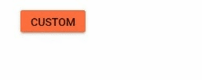

# Styles and Appearances in Blazor Button Component

To modify the Button appearance, override the default CSS of the Button component. The following table lists common CSS classes and their purposes in the Button component. A custom theme can also be created using the Syncfusion [Theme Studio](https://blazor.syncfusion.com/themestudio/?theme=material).

| CSS class | Purpose of class |
|-----|----- |
| .e-btn | Customize the button. |
| .e-btn:hover | Customize the button on hover. |
| .e-btn:focus | Customize the button on focus. |
| .e-btn:active | Customize the button in the active (pressed) state. |

## Customizing the appearance of button

Use the following CSS to customize the button’s background color when clicking, hovering, and focusing.

```cshtml

@using Syncfusion.Blazor.Buttons

<SfButton CssClass="e-btn">CUSTOM</SfButton>

<style>
    .e-btn {
        background-color: #ff6e40;
    }

    .e-btn:hover {
        background-color: #0b6a0b;
    }

    .e-btn:focus, .e-btn:active {
       background-color: #0078d4;
    }   
</style>

```



