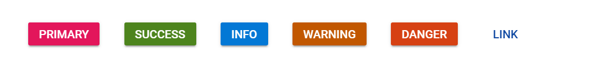
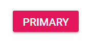
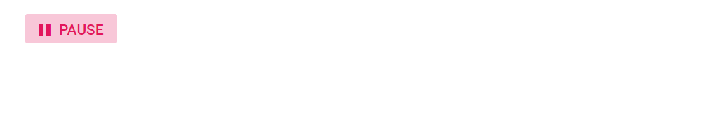
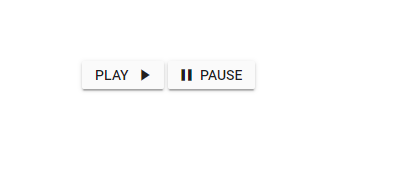

# Types and Styles in Blazor Button Component

This section explains the different styles and types of buttons.

## Button styles

The Blazor Button provides the following predefined styles, which can be applied using the [CssClass](https://help.syncfusion.com/cr/blazor/Syncfusion.Blazor.Buttons.SfButton.html#Syncfusion_Blazor_Buttons_SfButton_CssClass) property.

| Class | Description |
| -------- | -------- |
| e-primary | Represents a primary action. |
| e-success | Represents a positive action. |
| e-info | Represents an informative action. |
| e-warning | Represents an action that requires caution. |
| e-danger | Represents a negative or destructive action. |
| e-link | Changes the appearance of the button to resemble a hyperlink. |

```csharp

@using Syncfusion.Blazor.Buttons

<SfButton CssClass="e-primary">Primary</SfButton>
<SfButton CssClass="e-success">Success</SfButton>
<SfButton CssClass="e-info">Info</SfButton>
<SfButton CssClass="e-warning">Warning</SfButton>
<SfButton CssClass="e-danger">Danger</SfButton>
<SfButton CssClass="e-link">Link</SfButton>

```





N> Predefined Button styles provide only visual indication. Ensure that the Button content conveys meaning for users of assistive technologies such as screen readers.

## Button types

The types of Blazor Button are as follows:

* Flat Button
* Outline Button
* Round Button
* Primary Button
* Toggle Button

### Flat Button

The Flat Button is styled without a background color. To create a flat button, set the [CssClass](https://help.syncfusion.com/cr/blazor/Syncfusion.Blazor.Buttons.SfButton.html#Syncfusion_Blazor_Buttons_SfButton_CssClass) property to `e-flat`.

### Outline Button

An Outline Button has a border with a transparent background. To create an outline button, set the [CssClass](https://help.syncfusion.com/cr/blazor/Syncfusion.Blazor.Buttons.SfButton.html#Syncfusion_Blazor_Buttons_SfButton_CssClass) property to `e-outline`.

### Round Button

A Round Button is circular in shape and typically contains an icon that represents its action. To create a round button, set the [CssClass](https://help.syncfusion.com/cr/blazor/Syncfusion.Blazor.Buttons.SfButton.html#Syncfusion_Blazor_Buttons_SfButton_CssClass) property to `e-round`.

```cshtml
@using Syncfusion.Blazor.Buttons

<SfButton CssClass="e-flat">Flat</SfButton>
<SfButton CssClass="e-outline">Outline</SfButton>
<SfButton CssClass="e-round" IconCss="e-icons e-plus-icon" IsPrimary="true"></SfButton>

<style>
    .e-plus-icon::before {
        content: '\e823';
    }
</style>
```




### Primary Button

The Primary Button is styled with a background color and represents a primary action. To create a primary button, set the [IsPrimary](https://help.syncfusion.com/cr/blazor/Syncfusion.Blazor.Buttons.SfButton.html#Syncfusion_Blazor_Buttons_SfButton_IsPrimary) property to `true`.

```cshtml
@using Syncfusion.Blazor.Buttons

<SfButton IsPrimary="true">Primary</SfButton>
```





### Toggle Button

A Toggle Button allows switching between two states. The button is active in the toggled state and can be identified by the `e-active` class. The toggle behavior can be handled using the [OnClick](https://help.syncfusion.com/cr/blazor/Syncfusion.Blazor.Buttons.SfButton.html#Syncfusion_Blazor_Buttons_SfButton_OnClick) event. To create a toggle button, set the [IsToggle](https://help.syncfusion.com/cr/blazor/Syncfusion.Blazor.Buttons.SfButton.html#Syncfusion_Blazor_Buttons_SfButton_IsToggle) property to `true`. In the following example, the button text changes between Play/Pause based on the state using the OnClick event.

```csharp

@using Syncfusion.Blazor.Buttons

<SfButton CssClass="e-flat" IsPrimary="true" IconCss="@IconCss" Content="@Content" IsToggle="true" @onclick="OnToggleClick" @ref="ToggleBtnObj"></SfButton>

@code {
    SfButton ToggleBtnObj;
    public string IconCss = "e-icons e-play";
    public string Content = "Play";
    public void OnToggleClick()
    {
        if(ToggleBtnObj.Content == "Play")
        {
            this.Content = "Pause";
            this.IconCss = "e-icons e-pause";
        }
        else
        {
            this.Content = "Play";
            this.IconCss = "e-icons e-play";
        }
    }
}

<style>

    .e-play::before {
        content: '\e324';
    }

    .e-pause::before {
        content: '\e326';
    }

</style>

```





## Icons

### Button with font icons

A button can include an icon to visually represent its action. To place an icon on a button, set the [IconCss](https://help.syncfusion.com/cr/blazor/Syncfusion.Blazor.Buttons.SfButton.html#Syncfusion_Blazor_Buttons_SfButton_IconCss) property to `e-icons` with the required icon CSS. By default, the icon is positioned to the left of the button text. Customize the icon position using the [IconPosition](https://help.syncfusion.com/cr/blazor/Syncfusion.Blazor.Buttons.SfButton.html#Syncfusion_Blazor_Buttons_SfButton_IconPosition) property.

```cshtml
@using Syncfusion.Blazor.Buttons

<SfButton IconCss="e-icons e-play-icon" IconPosition="IconPosition.Right">PLAY</SfButton>
<SfButton IconCss="e-icons e-pause-icon">PAUSE</SfButton>

<style>
    .e-play-icon::before {
        content: '\e324';
    }
    .e-pause-icon::before {
        content: '\e326';
    }
</style>

```






## Button size

The Button supports two sizes: default and small. To change the default size to small, set the [CssClass](https://help.syncfusion.com/cr/blazor/Syncfusion.Blazor.Buttons.SfButton.html#Syncfusion_Blazor_Buttons_SfButton_CssClass) property to `e-small`.

```cshtml
@using Syncfusion.Blazor.Buttons

<SfButton CssClass="e-small">SMALL</SfButton>
<SfButton>NORMAL</SfButton>

```




