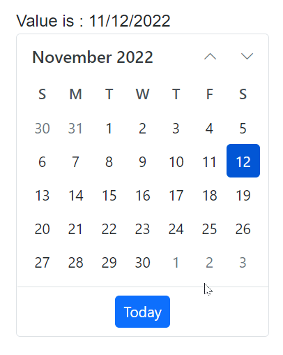

# DateOnly Support in Blazor Calendar Component

The [DateOnly](https://learn.microsoft.com/en-us/dotnet/api/system.dateonly?view=net-7.0) type represents a date without a time component. To use it with the Blazor Calendar component, set the generic type parameter (TValue) to `DateOnly` or `DateOnly?`. In this mode, selection and binding operate only on the date portion.

> The Blazor Calendar component supports `DateOnly` starting with .NET 7 and later. Although `DateOnly` was introduced in .NET 6, serialization and interoperability limitations in .NET 6 prevent reliable usage in Blazor scenarios.

The following example demonstrates configuring the Calendar with `TValue=DateOnly` and binding a date-only value.









