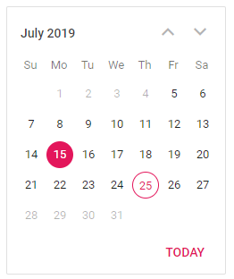

# Getting Started with Blazor Calendar Component

This section briefly explains about how to include a [Blazor Calendar](https://www.syncfusion.com/blazor-components/blazor-calendar) Component in your Blazor Server-Side and Client-Side application. You can refer to our Getting Started with [Blazor Server-Side Calendar](../getting-started/blazor-server-side-visual-studio-2019/) and [Blazor WebAssembly Calendar](../getting-started/blazor-webassembly-visual-studio-2019/) documentation pages for configuration specifications.

To get start quickly with Blazor Calendar component, you can check on this video.



## Importing Syncfusion Blazor component in the application

* Install `Syncfusion.Blazor.Calendars` NuGet package to the application by using the `NuGet Package Manager`.

> Please ensure to check the `Include prerelease` option for our Beta release.

* You can add the client-side resources through CDN or from NuGet package in the  **HEAD** element of the **~/wwwroot/index.html** page.

 ```html
<head>
    <link href="_content/Syncfusion.Blazor.Themes/bootstrap4.css" rel="stylesheet" />
    <!-- <link href="https://cdn.syncfusion.com/blazor/{{version}}/styles/{{theme}}.css" rel="stylesheet" /> -->
</head>
```

> For Internet Explorer 11 kindly refer the polyfills. Refer the [documentation](https://ej2.syncfusion.com/blazor/documentation/common/how-to/render-blazor-server-app-in-ie/) for more information.

 ```html
<head>
    <link href="_content/Syncfusion.Blazor.Themes/bootstrap4.css" rel="stylesheet" />
    <script src="https://github.com/Daddoon/Blazor.Polyfill/releases/download/3.0.1/blazor.polyfill.min.js"></script>
</head>
```

## Adding component package to the application

Open `~/_Imports.razor` file and import the `Syncfusion.Blazor.Calendars` package.

```cshtml
@using Syncfusion.Blazor.Calendars
```

## Add SyncfusionBlazor service in Program.cs

Open the **Program.cs** file and add services required by Syncfusion components using  **builder.Services.AddSyncfusionBlazor()** method

```csharp
using Syncfusion.Blazor;

namespace BlazorApplication
{
    public class Program
    {
        public static async Task Main(string[] args)
        {
            ....
            ....
            builder.Services.AddSyncfusionBlazor();
            await builder.Build().RunAsync();
        }
    }
}
```

> To enable custom client side resource loading from CRG or CDN. You need to disable resource loading by `AddSyncfusionBlazor(true)` and load the scripts in the **HEAD** element of the **~/wwwroot/index.html** page.

 ```html
<head>
    <script src="https://cdn.syncfusion.com/blazor/{{ site.blazorversion }}/syncfusion-blazor.min.js"></script>
</head>
```

## Adding Calendar component to the application

To initialize the Calendar component add the below code to your `Index.razor` view page which is present under `~/Pages` folder.

The following code shows a basic Calendar component.

```cshtml
<SfCalendar TValue="DateTime"></SfCalendar>
```

## Run the application

After successful compilation of your application, press `F5` to run the application.

The output will be as follows.


## Setting the Value, Min, and Max dates

Calendar component provides an option to select a date value within a specified range by defining the [Min](https://help.syncfusion.com/cr/blazor/Syncfusion.Blazor.Calendars.SfCalendar-1.html) and [Max](https://help.syncfusion.com/cr/blazor/Syncfusion.Blazor.Calendars.SfCalendar-1.html) properties. Also, you can set a date value within specific range using the [Value](https://help.syncfusion.com/cr/blazor/Syncfusion.Blazor.Calendars.SfCalendar-1.html) property. For more information, you can refer to the [Date Range](./date-range) section.

Here, the Calendar allows you to select a date within the range from 5th to 27th of this month. `TValue` specifies the type of the DatePicker component.

```cshtml
<SfCalendar TValue="DateTime" Min='@MinDate' Value='@DateValue' Max='@MaxDate'></SfCalendar>

@code{
    public DateTime MinDate {get;set;} = new DateTime(DateTime.Now.Year, DateTime.Now.Month, 05);
    public DateTime MaxDate {get;set;} = new DateTime(DateTime.Now.Year, DateTime.Now.Month, 27);
    public DateTime DateValue {get;set;} = new DateTime(DateTime.Now.Year, DateTime.Now.Month, 15);
}
```

The output will be as follows.



## See Also

* [Getting Started with Syncfusion Blazor for Client-Side in .NET Core CLI](../getting-started/blazor-webassembly-dotnet-cli/)
* [Getting Started with Syncfusion Blazor for Server-side in Visual Studio 2019](../getting-started/blazor-server-side-visual-studio-2019/)
* [Getting Started with Syncfusion Blazor for Server-Side in .NET Core CLI](../getting-started/blazor-server-side-dotnet-cli/)