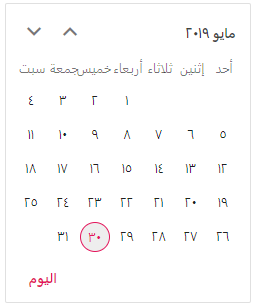

# Globalization in Blazor Calendar Component

[Blazor Calendar](https://www.syncfusion.com/blazor-components/blazor-calendar) component can be localized. Refer to [Blazor Localization](https://blazor.syncfusion.com/documentation/common/localization) topic to localize Syncfusion<sup style="font-size:70%">&reg;</sup> Blazor components.

## Right-To-Left

The Calendar supports right-to-left (RTL) layout for languages like Arabic and Hebrew. RTL is not implied by Locale; explicitly set the [EnableRtl](https://help.syncfusion.com/cr/blazor/Syncfusion.Blazor.Calendars.SfCalendar-1.html#Syncfusion_Blazor_Calendars_SfCalendar_1_EnableRtl) property to true to render the component in RTL.

The following code example initializes the Calendar component in `Arabic` culture.

```cshtml
@using Syncfusion.Blazor.Calendars
@inject HttpClient Http;

<SfCalendar TValue="DateTime?" Locale="ar" EnableRtl=true></SfCalendar>

@code {
    [Inject]
    protected IJSRuntime JsRuntime { get; set; }
    protected override async Task OnInitializedAsync()
    {
        this.JsRuntime.Sf().LoadLocaleData(await Http.GetJsonAsync<object>("blazor-locale/src/ar.json")).SetCulture("ar");
    }
}
```


