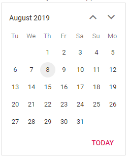

# Change the first day of the week

The Calendar provides an option to change the first day of the week by using the [FirstDayOfWeek](https://help.syncfusion.com/cr/blazor/Syncfusion.Blazor.Calendars.CalendarBase-1.html#Syncfusion_Blazor_Calendars_CalendarBase_1_FirstDayOfWeek)
property. Generally, the day of the week starts from 0 (Sunday) and ends with 6 (Saturday).

> By default, the first day of the week is culture specific.

The following code shows the Calendar with `Tuesday` as the first day of the week.

```csharp
@using Syncfusion.Blazor.Calendars

<SfCalendar TValue="DateTime?" FirstDayOfWeek=2></SfCalendar>
```

The output will be as follows.


