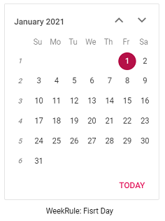
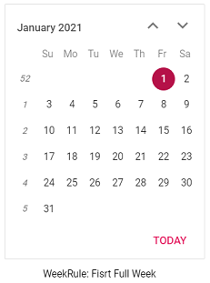
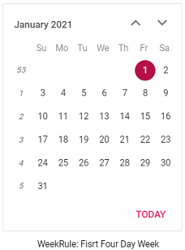

# Week Number in Blazor Calendar Component

Enable week numbers in the Blazor Calendar to display a leading column with the week number for each row. Week numbering behavior is influenced by the WeekRule setting and the first day of the week (culture-specific by default or overridden via FirstDayOfWeek).

You can enable `WeekNumber` in the Calendar by using the [WeekNumber](https://help.syncfusion.com/cr/blazor/Syncfusion.Blazor.Calendars.CalendarBase-1.html#Syncfusion_Blazor_Calendars_CalendarBase_1_WeekNumber) property.

```cshtml
@using Syncfusion.Blazor.Calendars

<SfCalendar TValue="DateTime?" WeekNumber=true></SfCalendar>
```
This example shows the Calendar displaying a week number column at the left.



## Week rule

Configure how the first week of the year is determined by using the [WeekRule](https://help.syncfusion.com/cr/blazor/Syncfusion.Blazor.Calendars.CalendarBase-1.html#Syncfusion_Blazor_Calendars_CalendarBase_1_WeekRule) property (aligned with .NET CalendarWeekRule semantics). The following values are supported:

Types  |Description  
-----|-----
FirstDay |Set the first week of the year's week number to be started from 1. Then it followed as 1, 2, 3 ...
FirstFullWeek |Set the first week of the year's week number to be started from 52 or 53 (i.e December last week's week Number). Then it followed as 53, 1, 2 ...
FirstFourDayWeek | Set the week number based on the majority of dates present in the week for the respected months. If January dates are presented in the week more than December, the first week of the year's week number will be started from 1. If December dates are presented in the week more than January, the first week of the year's week number will be started from 52 or 53.



Week numbers shown when the FirstDay rule is applied.


Week numbers shown when the FirstFullWeek rule is applied.


Week numbers shown when the FirstFourDayWeek rule is applied.