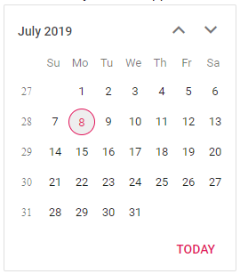

# Render the Calendar with WeekNumber

You can enable `WeekNumber` in the Calendar by using the [WeekNumber](https://help.syncfusion.com/cr/blazor/Syncfusion.Blazor.Calendars.CalendarBase-1.html#Syncfusion_Blazor_Calendars_CalendarBase_1_WeekNumber) property.

```csharp
@using Syncfusion.Blazor.Calendars

<SfCalendar TValue="DateTime?" WeekNumber=true></SfCalendar>
```

The output will be as follows.


