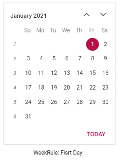
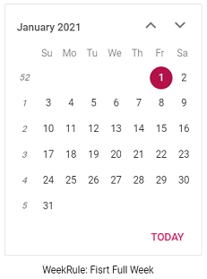
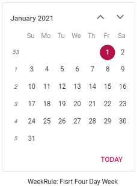

# Week Number in Blazor Calendar Component

Enable week numbers in the Blazor Calendar to display a leading column with the week number for each row. Week numbering behavior is influenced by the `WeekRule` setting and the first day of the week (culture-specific by default or overridden via `FirstDayOfWeek`).

You can enable `WeekNumber` in the Calendar by setting the [WeekNumber](https://help.syncfusion.com/cr/blazor/Syncfusion.Blazor.Calendars.CalendarBase-1.html#Syncfusion_Blazor_Calendars_CalendarBase_1_WeekNumber) property to `true`. The default value is `false`.

```cshtml
@using Syncfusion.Blazor.Calendars

<SfCalendar TValue="DateTime?" WeekNumber=true></SfCalendar>
```

This example shows the Calendar displaying a week number column on the left.



## Week rule

Configure how the first week of the year is determined by using the [WeekRule](https://help.syncfusion.com/cr/blazor/Syncfusion.Blazor.Calendars.CalendarBase-1.html#Syncfusion_Blazor_Calendars_CalendarBase_1_WeekRule) property. `WeekRule` accepts values from the `System.Globalization.CalendarWeekRule` enum, and the default is culture-dependent. The following example shows how to apply the `FirstDay` rule:

```cshtml
@using Syncfusion.Blazor.Calendars

<SfCalendar TValue="DateTime?" WeekNumber=true WeekRule="System.Globalization.CalendarWeekRule.FirstDay"></SfCalendar>
```

The following values are supported:

Types  |Description  
-----|-----
FirstDay |Set the first week of the year's week number to start from 1. Then it follows as 1, 2, 3 ...
FirstFullWeek |Set the first week of the year's week number to start from 52 or 53 (i.e., the last week of December). Then it follows as 53, 1, 2 ...
FirstFourDayWeek | Set the week number based on the majority of dates present in the week. If January dates are present in the week more than December, the first week of the year's week number starts from 1. If December dates are present in the week more than January, the first week of the year's week number starts from 52 or 53.



Week numbers shown when the FirstDay rule is applied.


Week numbers shown when the FirstFullWeek rule is applied.


Week numbers shown when the FirstFourDayWeek rule is applied.