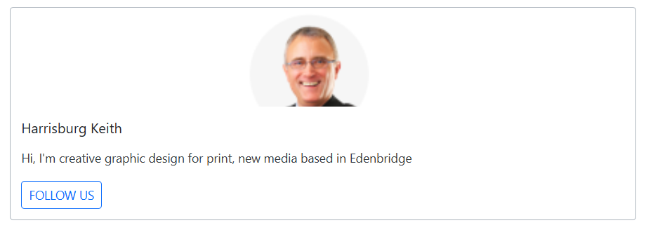

# Action Buttons in Blazor Card Component

The Blazor Card component provides support for adding and customizing action buttons within its structure. Action buttons are typically placed in the `CardFooter` section of the Card. This document explains how to add these buttons and control their alignment.

Action buttons are rendered within the `CardFooter` section. A single button or multiple buttons can be defined directly inside the `CardFooterContent` of the `CardFooter` component. The CardFooterContent is a `RenderFragment` property that accepts any Blazor UI elements.

```cshtml
@using Syncfusion.Blazor.Cards

<SfCard ID="HugeImage">
    <CardFooter>
        <CardFooterContent>
        </CardFooterContent>
    </CardFooter>
</SfCard>
```


## Vertical

By default, action buttons within the `CardFooter` are aligned horizontally. To align them vertically, set the `Orientation` property of the `SfCard` component to `CardOrientation.Vertical`.

```cshtml
@using Syncfusion.Blazor.Cards
@using Syncfusion.Blazor.Buttons
<div style="height:300px;">
<SfCard ID="HugeImage" Orientation="CardOrientation.Vertical">
    <CardImage Image="https://blazor.syncfusion.com/demos/_content/blazor_server_common_net9/images/cards/steven.png"/>
    <CardHeader Title="Harrisburg Keith"/>
    <CardContent Content="Hi, I'm creative graphic design for print, new media based in Edenbridge"/>
    <CardFooter>
        <CardFooterContent>
            <SfButton CssClass="e-btn e-outline e-primary">FOLLOW US</SfButton>
        </CardFooterContent>
    </CardFooter>
</SfCard>
</div>
<style>
   .e-card-image {
   width: 150px !important;
    margin-left: 35vw;
   }
    </style>
```

