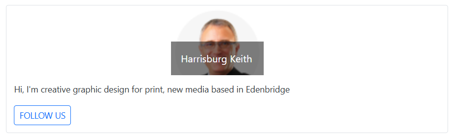

<!-- markdownlint-disable MD036 -->

# Image and Divider in Blazor Card Component

## Images

The Blazor Card component supports the inclusion of images using the [`CardImage`](https://help.syncfusion.com/cr/blazor/Syncfusion.Blazor.Cards.CardImage.html) component. The element can be added directly within the structure to display an image.

N> By default, card images occupies full width of its parent element.

The CardImage supports direct specification of the image source using its `Image` property. Additionally, it can include an `Alt` property for improved accessibility, providing alternative text for the image.

```cshtml
@using Syncfusion.Blazor.Cards

<SfCard>
    <CardImage Image="https://blazor.syncfusion.com/demos/_content/blazor_server_common_net9/images/cards/steven.png"/>
</SfCard>
```



### Title

Card image is supported to include a `Title` property for the image. By default, Title is placed over the image on left-bottom position with overlay.

```cshtml
@using Syncfusion.Blazor.Cards
@using Syncfusion.Blazor.Buttons
<div style="height:300px;">
<SfCard ID="HugeImage" Orientation="CardOrientation.Vertical">
    <CardImage Image="https://blazor.syncfusion.com/demos/_content/blazor_server_common_net9/images/cards/steven.png" Title="Harrisburg Keith"/>
    <CardContent Content="Hi, I'm creative graphic design for print, new media based in Edenbridge"/>
    <CardFooter>
        <CardFooterContent>
            <SfButton CssClass="e-btn e-outline e-primary">FOLLOW US</SfButton>
        </CardFooterContent>
    </CardFooter>
</SfCard>
</div>
<style>
   .e-card-image {
   width: 150px !important;
    margin-left: 35vw;
   }
    </style>
```



## Divider

Dividers are used to visually separate elements within the Card. To add a divider below a `CardContent` component, set its [`EnableSeparator`](https://help.syncfusion.com/cr/blazor/Syncfusion.Blazor.Cards.CardContent.html#Syncfusion_Blazor_Cards_CardContent_EnableSeparator) property to `true`.

```cshtml
@using Syncfusion.Blazor.Cards

<SfCard>
    <CardHeader Title="Explore Cities"></CardHeader>
    <CardContent EnableSeparator="true">
        Sydney is a city on the east coast of Australia. Sydney is the capital city of New South
        Wales. About four million people live in Sydney which makes it the biggest cityin Oceania.
    </CardContent>
    <CardContent EnableSeparator="true">
        New York City has been described as the cultural, financial, and media capital of the
        world, and exerts a significant impact upon commerce and etc.
    </CardContent>
    <CardContent EnableSeparator="true">
        Malaysia is one of the Southeast Asian countries, on a peninsula of the Asian continent,
        to a certain extent; it can be recognized  as part of the Asian continent.
    </CardContent>
</SfCard>

```

