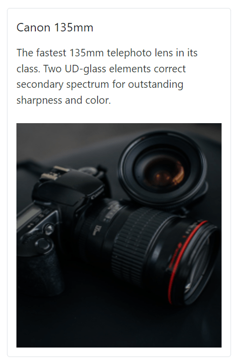

<!-- markdownlint-disable MD036 -->

# Header and Content in Blazor Card Component

## Header

The `CardHeader` component is used to define the header section of the Card. It supports a title, subtitle, and can include an image.

### Elements within CardHeader

Elements   | Description
------------ | -------------
Caption | It is the wrapper element to include title and sub-title.
Image | It supports to include header images with the specified dimensions.

Class   | Description
------------ | -------------
`Title` |  Main title text within the header.
`SubTitle` | A sub-title within the header.
`CardImage` | To include heading image within the header.

### Title and Subtitle

For adding header to the Card, Title Property.

* Add `Title` Property inside the header caption for adding main title.

* Add `SubTitle` Property inside the header caption element for adding Title.

### Image

Card header has an option for adding images in the header. It is aligned with either before or after the header based on the HTML element positioned in the header structure. The header image can be added by `ImageUrl` component  which can be placed before or after the header caption wrapper element.

```cshtml
@using Syncfusion.Blazor.Cards

<SfCard ID="HugeImage">
    <CardHeader Title="Laura Callahan" SubTitle="Sales Coordinator and Representative" ImageUrl="images/cards/football.png" />
</SfCard>
<SfCard ID="SecondCard">
    <CardHeader Title="Laura Callahan" SubTitle="Sales Coordinator and Representative" ImageUrl="images/cards/football.png" />
</SfCard>
```


## Content

The `CardContent` component is used to display the main textual or HTML content of the Card. It can hold various elements such as text, images, links, and other HTML structures.

*   Wrap your content within the `CardContent` component, placed directly inside the `SfCard` element or within another card sub-element.

```cshtml
@using Syncfusion.Blazor.Cards

<SfCard ID="HugeImage">
    <CardHeader Title="Laura Callahan" SubTitle="Sales Coordinator and Representative" ImageUrl="images/cards/football.png" />
</SfCard>

<SfCard ID="SecondCard">
    <CardContent Content="Laura received a BA in psychology from the University of Washington. She has also completed a course in business French. She reads and writes French."/>
</SfCard>

```


### Image

The `CardContent` area is designed to flexibly host various HTML elements, including  tags. Images can be embedded directly within the `CardContent` to create rich and visually engaging layouts. Custom CSS can be applied to style the image and content.

```cshtml
@using Syncfusion.Blazor.Cards
<SfCard ID="Card">
    <CardHeader Title="Canon 135mm"/>
    <CardContent>
        <div>
            The fastest 135mm telephoto lens in its class. Two UD-glass elements correct secondary spectrum for outstanding sharpness and color.
        </div><br>
        
    </CardContent>
</SfCard>

<style>
    #Card {
        width: 300px;
    }
</style>

```


