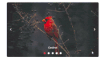

# Animations and Transitions in Blazor Carousel Component

The Blazor Carousel component offers a variety of animation effects and transition controls to enhance user experience. These include built-in animations, custom effects, adjustable slide intervals, autoplay functionality, and looping options, all configurable for both Blazor Server and WebAssembly applications.

## Animation Effects

The Carousel provides built-in animation effects for slide transitions. These effects are controlled using the [`AnimationEffect`](https://help.syncfusion.com/cr/blazor/Syncfusion.Blazor.Navigations.SfCarousel.html#Syncfusion_Blazor_Navigations_SfCarousel_AnimationEffect) property. By default, a `Slide` animation is applied.

### Fade Animation

The `Fade` animation provides a smooth cross-fade transition between slides. To apply this effect, set `AnimationEffect` to `CarouselAnimationEffect.Fade`.

The following demo depicts the example for `Fade` animation,

```cshtml
@using Syncfusion.Blazor.Navigations

<div class="control-container">
    <SfCarousel AnimationEffect="CarouselAnimationEffect.Fade">
        <CarouselItem>
            <figure class="img-container"><figcaption class="img-caption">Cardinal</figcaption></figure>
        </CarouselItem>
        <CarouselItem>
            <figure class="img-container"><figcaption class="img-caption">Kingfisher</figcaption></figure>
        </CarouselItem>
        <CarouselItem>
            <figure class="img-container"><figcaption class="img-caption">Keel-billed-toucan</figcaption></figure>
        </CarouselItem>
        <CarouselItem>
            <figure class="img-container"><figcaption class="img-caption">Yellow-warbler</figcaption></figure>
        </CarouselItem>
        <CarouselItem>
           <figure class="img-container"><figcaption class="img-caption">Bee-eater</figcaption></figure>
        </CarouselItem>
    </SfCarousel>
</div>

<style>
    .control-container {
        height: 300px;
        margin: 0 auto;
        width: 500px;
    }

    .img-container {
        height: 100%;
        margin: 0;
    }

    .img-caption {
        color: #fff;
        font-size: 1rem;
        position: absolute;
        bottom: 3rem;
        width: 100%;
        text-align: center;
    }

</style>
```



### Custom Animation

The Carousel supports customized animation effects for slide transitions. This is accomplished by setting the [`AnimationEffect`](https://help.syncfusion.com/cr/blazor/Syncfusion.Blazor.Navigations.SfCarousel.html#Syncfusion_Blazor_Navigations_SfCarousel_AnimationEffect) property to the [`Custom`](https://help.syncfusion.com/cr/blazor/Syncfusion.Blazor.Navigations.CarouselAnimationEffect.html) option and then applying custom animation CSS via the [`CssClass`](https://help.syncfusion.com/cr/blazor/Syncfusion.Blazor.Navigations.SfCarousel.html#Syncfusion_Blazor_Navigations_SfCarousel_CssClass) property.

The following example demonstrates a custom "parallax" animation Effekt which involves a scaling and translation effekt during transitions:

```cshtml
@using Syncfusion.Blazor.Navigations

<div class="control-container">
    <SfCarousel AnimationEffect="CarouselAnimationEffect.Custom" CssClass="parallax">
        <CarouselItem>
            <figure class="img-container"><figcaption class="img-caption">Cardinal</figcaption></figure>
        </CarouselItem>
        <CarouselItem>
            <figure class="img-container"><figcaption class="img-caption">Kingfisher</figcaption></figure>
        </CarouselItem>
        <CarouselItem>
            <figure class="img-container"><figcaption class="img-caption">Keel-billed-toucan</figcaption></figure>
        </CarouselItem>
        <CarouselItem>
            <figure class="img-container"><figcaption class="img-caption">Yellow-warbler</figcaption></figure>
        </CarouselItem>
        <CarouselItem>
           <figure class="img-container"><figcaption class="img-caption">Bee-eater</figcaption></figure>
        </CarouselItem>
    </SfCarousel>
</div>

<style>
    .control-container {
        height: 300px;
        margin: 0 auto;
        width: 500px;
    }

    .img-container {
        height: 100%;
        margin: 0;
    }

    .img-caption {
        color: #fff;
        font-size: 1rem;
        position: absolute;
        bottom: 3rem;
        width: 100%;
        text-align: center;
    }

    /* Parallax animation */
    .parallax .e-carousel-item {
        transition: transform 1s ease-in-out;
    }

    .parallax .e-carousel-item.e-next {
        animation: ParallaxIn 1s ease-in-out;
    }

    .parallax .e-carousel-item.e-prev {
        animation: ParallaxOut 1s ease-in-out;
    }

    @@keyframes ParallaxIn {
        from {
         opacity: 0;
        transform: scale(0) translateY(100%);
        }   

        to {
            opacity: 1;
            transform: scale(1) translateY(0);
        }
    }

    @@keyframes ParallaxOut {
        from {
            opacity: 1;
            transform: scale(1) translateY(0);
        }

        to {
            opacity: 0;
            transform: scale(0) translateY(-100%);
        }
    }

</style>
```



## Slide Interval Settings

Different intervals for slide transitions can be assigned to individual `CarouselItem` components using the [`Interval`](https://help.syncfusion.com/cr/blazor/Syncfusion.Blazor.Navigations.CarouselItem.html#Syncfusion_Blazor_Navigations_CarouselItem_Interval) property. The default transition interval is `5000 ms` (5 seconds).

The following example demonstrates setting varied intervals for each slide transition:

```cshtml
@using Syncfusion.Blazor.Navigations

<div class="control-container">
    <SfCarousel>
        <CarouselItem Interval="2000">
            <div class="slide-content">Slide 1</div>
        </CarouselItem>
        <CarouselItem Interval="4000">
            <div class="slide-content">Slide 2</div>
        </CarouselItem>
        <CarouselItem>
            <div class="slide-content">Slide 3</div>
        </CarouselItem>
        <CarouselItem Interval="6000">
            <div class="slide-content">Slide 4</div>
        </CarouselItem>
        <CarouselItem Interval="8000">
            <div class="slide-content">Slide 5</div>
        </CarouselItem>
    </SfCarousel>
</div>

<style>
    .control-container {
        background-color: #adb5bd;
        height: 300px;
        margin: 0 auto;
        width: 500px;
    }

    .e-carousel .slide-content {
        align-items: center;
        display: flex;
        font-size: 1.25rem;
        height: 100%;
        justify-content: center;
    }
</style>
```
 

N> The `Interval` property accepts values in milliseconds.

## Autoplay Slides

Autoplay functionality automatically advances slides after a specified or default interval. This behavior can be enabled or disabled using the [`AutoPlay`](https://help.syncfusion.com/cr/blazor/Syncfusion.Blazor.Navigations.SfCarousel.html#Syncfusion_Blazor_Navigations_SfCarousel_AutoPlay) property of the `SfCarousel` component.

The following example demonstrates disabling autoplay, requiring manual navigation:

```cshtml
@using Syncfusion.Blazor.Navigations

<div class="control-container">
    <SfCarousel AutoPlay="false">
        <CarouselItem>
            <div class="slide-content">Slide 1</div>
        </CarouselItem>
        <CarouselItem>
            <div class="slide-content">Slide 2</div>
        </CarouselItem>
        <CarouselItem>
            <div class="slide-content">Slide 3</div>
        </CarouselItem>
        <CarouselItem>
            <div class="slide-content">Slide 4</div>
        </CarouselItem>
        <CarouselItem>
            <div class="slide-content">Slide 5</div>
        </CarouselItem>
    </SfCarousel>
</div>

<style>
    .control-container {
        background-color: #adb5bd;
        height: 300px;
        margin: 0 auto;
        width: 500px;
    }

    .e-carousel .slide-content {
        align-items: center;
        display: flex;
        font-size: 1.25rem;
        height: 100%;
        justify-content: center;
    }
</style>
```


## Pause On Hover

By default, slide transitions pause when the mouse pointer hovers over the Carousel. This feature can be enabled or disabled using the [`PauseOnHover`](https://help.syncfusion.com/cr/blazor/Syncfusion.Blazor.Navigations.SfCarousel.html#Syncfusion_Blazor_Navigations_SfCarousel_PauseOnHover) property.

The following example demonstrates overriding the default behavior to continue playing slides even when hovered:

```cshtml
@using Syncfusion.Blazor.Navigations

<div class="control-container">
    <SfCarousel  PauseOnHover="false">
        <CarouselItem>
            <div class="slide-content">Slide 1</div>
        </CarouselItem>
        <CarouselItem>
            <div class="slide-content">Slide 2</div>
        </CarouselItem>
        <CarouselItem>
            <div class="slide-content">Slide 3</div>
        </CarouselItem>
        <CarouselItem>
            <div class="slide-content">Slide 4</div>
        </CarouselItem>
        <CarouselItem>
            <div class="slide-content">Slide 5</div>
        </CarouselItem>
    </SfCarousel>
</div>

<style>
    .control-container {
        background-color: #adb5bd;
        height: 300px;
        margin: 0 auto;
        width: 500px;
    }

    .e-carousel .slide-content {
        align-items: center;
        display: flex;
        font-size: 1.25rem;
        height: 100%;
        justify-content: center;
    }
</style>
```


## Looping Slides

By default, slide transitions repeat continuously, looping back to the first slide after reaching the last one. This infinite looping behavior can be enabled or disabled using the [`Loop`](https://help.syncfusion.com/cr/blazor/Syncfusion.Blazor.Navigations.SfCarousel.html#Syncfusion_Blazor_Navigations_SfCarousel_Loop) property.

The following example demonstrates disabling infinite looping, causing the carousel to stop after the last slide:

```cshtml
@using Syncfusion.Blazor.Navigations

<div class="control-container">
    <SfCarousel Loop="false">
        <CarouselItem>
            <div class="slide-content">Slide 1</div>
        </CarouselItem>
        <CarouselItem>
            <div class="slide-content">Slide 2</div>
        </CarouselItem>
        <CarouselItem>
            <div class="slide-content">Slide 3</div>
        </CarouselItem>
        <CarouselItem>
            <div class="slide-content">Slide 4</div>
        </CarouselItem>
        <CarouselItem>
            <div class="slide-content">Slide 5</div>
        </CarouselItem>
    </SfCarousel>
</div>

<style>
    .control-container {
        background-color: #adb5bd;
        height: 300px;
        margin: 0 auto;
        width: 500px;
    }

    .e-carousel .slide-content {
        align-items: center;
        display: flex;
        font-size: 1.25rem;
        height: 100%;
        justify-content: center;
    }
</style>
```



## Slide Changing Events

The Carousel component exposes the [`SelectedIndexChanged`](https://help.syncfusion.com/cr/blazor/Syncfusion.Blazor.Navigations.SfCarousel.html#Syncfusion_Blazor_Navigations_SfCarousel_SelectedIndexChanged) event, which triggers whenever the active slide changes. This allows for custom actions or updates based on the current slide's index.

The following example demonstrates handling the `SelectedIndexChanged` event to log the current slide index to the console:

```cshtml
@using Syncfusion.Blazor.Navigations

<div class="control-container">
    <SfCarousel SelectedIndexChanged="OnSelectedIndexChanged">
        <CarouselItem>
            <div class="slide-content">Slide 1</div>
        </CarouselItem>
        <CarouselItem>
            <div class="slide-content">Slide 2</div>
        </CarouselItem>
        <CarouselItem>
            <div class="slide-content">Slide 3</div>
        </CarouselItem>
        <CarouselItem>
            <div class="slide-content">Slide 4</div>
        </CarouselItem>
        <CarouselItem>
            <div class="slide-content">Slide 5</div>
        </CarouselItem>
    </SfCarousel>
</div>

@code {
    void OnSelectedIndexChanged(int index)
    {
        Console.WriteLine(index);
    }
}

<style>
    .control-container {
        background-color: #adb5bd;
        height: 300px;
        margin: 0 auto;
        width: 500px;
    }

    .e-carousel .slide-content {
        align-items: center;
        display: flex;
        font-size: 1.25rem;
        height: 100%;
        justify-content: center;
    }
</style>
```


## Disable Touch Swiping

By default, carousel slides can be navigated using touch swipe gestures. This functionality can be disabled by setting the [`EnableTouchSwipe`](https://help.syncfusion.com/cr/blazor/Syncfusion.Blazor.Navigations.SfCarousel.html#Syncfusion_Blazor_Navigations_SfCarousel_EnableTouchSwipe) property to `false`.

The following example demonstrates disabling touch swipe actions for the carousel:

```cshtml
@using Syncfusion.Blazor.Navigations

<div class="control-container">
    <SfCarousel EnableTouchSwipe="false">
        <CarouselItem>
            <div class="slide-content">Slide 1</div>
        </CarouselItem>
        <CarouselItem>
            <div class="slide-content">Slide 2</div>
        </CarouselItem>
        <CarouselItem>
            <div class="slide-content">Slide 3</div>
        </CarouselItem>
        <CarouselItem>
            <div class="slide-content">Slide 4</div>
        </CarouselItem>
        <CarouselItem>
            <div class="slide-content">Slide 5</div>
        </CarouselItem>
    </SfCarousel>
</div>

<style>
    .control-container {
        background-color: #adb5bd;
        height: 300px;
        margin: 0 auto;
        width: 500px;
    }

    .e-carousel .slide-content {
        align-items: center;
        display: flex;
        font-size: 1.25rem;
        height: 100%;
        justify-content: center;
    }
</style>
```


## Swipe Modes

The [`SwipeMode`](https://help.syncfusion.com/cr/blazor/Syncfusion.Blazor.Navigations.SfCarousel.html#Syncfusion_Blazor_Navigations_SfCarousel_SwipeMode) property allows for precise control over whether slide transitions occur via touch, mouse, or both. This is configured using bitwise operators with `CarouselSwipeMode` enumeration values.

The following `CarouselSwipeMode` options are available:

* [`CarouselSwipeMode.Touch`](https://help.syncfusion.com/cr/blazor/Syncfusion.Blazor.Navigations.CarouselSwipeMode.html) - Enables slide navigation using touch actions.
* [`CarouselSwipeMode.Mouse`](https://help.syncfusion.com/cr/blazor/Syncfusion.Blazor.Navigations.CarouselSwipeMode.html) - Enables slide navigation using mouse actions.
* [`CarouselSwipeMode.Touch & CarouselSwipeMode.Mouse`](https://help.syncfusion.com/cr/blazor/Syncfusion.Blazor.Navigations.CarouselSwipeMode.html) - Enables slide navigation using both touch and mouse actions.
* [`~CarouselSwipeMode.Touch & ~CarouselSwipeMode.Mouse`](https://help.syncfusion.com/cr/blazor/Syncfusion.Blazor.Navigations.CarouselSwipeMode.html) - Disables both touch and mouse actions.


```cshtml
@using Syncfusion.Blazor.Navigations

<div class="control-container">
    <SfCarousel SwipeMode="CarouselSwipeMode.Mouse & CarouselSwipeMode.Touch">
        <CarouselItem>
            <figure class="img-container"><figcaption class="img-caption">Cardinal</figcaption></figure>
        </CarouselItem>
        <CarouselItem>
            <figure class="img-container"><figcaption class="img-caption">Kingfisher</figcaption></figure>
        </CarouselItem>
        <CarouselItem>
            <figure class="img-container"><figcaption class="img-caption">Keel-billed-toucan</figcaption></figure>
        </CarouselItem>
        <CarouselItem>
            <figure class="img-container"><figcaption class="img-caption">Yellow-warbler</figcaption></figure>
        </CarouselItem>
        <CarouselItem>
           <figure class="img-container"><figcaption class="img-caption">Bee-eater</figcaption></figure>
        </CarouselItem>
    </SfCarousel>
</div>

<style>
    .control-container {
        height: 300px;
        margin: 0 auto;
        width: 500px;
    }

    .img-container {
        height: 100%;
        margin: 0;
    }

    .img-caption {
        color: #fff;
        font-size: 1rem;
        position: absolute;
        bottom: 3rem;
        width: 100%;
        text-align: center;
    }

</style>
```


