# Navigators and Indicators in Blazor Carousel Component

Navigators and indicators provide essential controls for users to manually transition between slides in the Carousel component.

To customize the appearance of indicators, and previous and next navigators, using a template with the Blazor Carousel component, you can refer to this video.



## Navigators

### Show or Hide Previous and Next Button

The previous and next slide transition buttons within navigators allow users to move between slides manually. The visibility of these navigators can be controlled using the [`ButtonsVisibility`](https://help.syncfusion.com/cr/blazor/Syncfusion.Blazor.Navigations.SfCarousel.html#Syncfusion_Blazor_Navigations_SfCarousel_ButtonsVisibility) property. The available property values are:

-   `Hidden` – The navigator buttons are not visible.
-   `Visible` – The navigator buttons are always visible.
-   `VisibleOnHover` – The navigator buttons are visible only when hovering over the carousel.

The following example demonstrates how to hide the navigators in the carousel.

```cshtml
@using Syncfusion.Blazor.Navigations

<div class="control-container">
    <SfCarousel ButtonsVisibility="CarouselButtonVisibility.Hidden">
        <CarouselItem>
            <div class="slide-content">Slide 1</div>
        </CarouselItem>
        <CarouselItem>
            <div class="slide-content">Slide 2</div>
        </CarouselItem>
        <CarouselItem>
            <div class="slide-content">Slide 3</div>
        </CarouselItem>
        <CarouselItem>
            <div class="slide-content">Slide 4</div>
        </CarouselItem>
        <CarouselItem>
            <div class="slide-content">Slide 5</div>
        </CarouselItem>
    </SfCarousel>
</div>

<style>
    .control-container {
        background-color: #adb5bd;
        height: 300px;
        margin: 0 auto;
        width: 500px;
    }

    .e-carousel .slide-content {
        align-items: center;
        display: flex;
        font-size: 1.25rem;
        height: 100%;
        justify-content: center;
    }
</style>
```


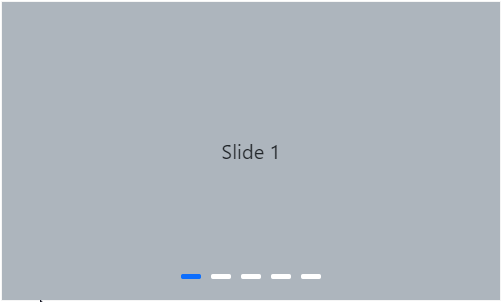

### Show Previous and Next Button on Hover

The previous and next buttons can be configured to appear only when the mouse cursor hovers over the carousel. This is achieved by setting the [`ButtonsVisibility`](https://help.syncfusion.com/cr/blazor/Syncfusion.Blazor.Navigations.SfCarousel.html#Syncfusion_Blazor_Navigations_SfCarousel_ButtonsVisibility) property to `VisibleOnHover`. The following example illustrates how to show navigators on mouse hover.

```cshtml
@using Syncfusion.Blazor.Navigations

<div class="control-container">
    <SfCarousel ButtonsVisibility="CarouselButtonVisibility.VisibleOnHover">
        <CarouselItem>
            <div class="slide-content">Slide 1</div>
        </CarouselItem>
        <CarouselItem>
            <div class="slide-content">Slide 2</div>
        </CarouselItem>
        <CarouselItem>
            <div class="slide-content">Slide 3</div>
        </CarouselItem>
        <CarouselItem>
            <div class="slide-content">Slide 4</div>
        </CarouselItem>
        <CarouselItem>
            <div class="slide-content">Slide 5</div>
        </CarouselItem>
    </SfCarousel>
</div>

<style>
    .control-container {
        background-color: #adb5bd;
        height: 300px;
        margin: 0 auto;
        width: 500px;
    }

    .e-carousel .slide-content {
        align-items: center;
        display: flex;
        font-size: 1.25rem;
        height: 100%;
        justify-content: center;
    }
</style>
```


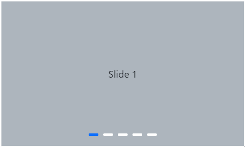

### Previous and Next Button Template

Template options are available to customize the previous button using [`PreviousButtonTemplate`](https://help.syncfusion.com/cr/blazor/Syncfusion.Blazor.Navigations.SfCarousel.html#Syncfusion_Blazor_Navigations_SfCarousel_PreviousButtonTemplate) and the next button using [`NextButtonTemplate`](https://help.syncfusion.com/cr/blazor/Syncfusion.Blazor.Navigations.SfCarousel.html#Syncfusion_Blazor_Navigations_SfCarousel_NextButtonTemplate). The following example demonstrates applying a custom template to the previous and next buttons in the carousel.

```cshtml
@using Syncfusion.Blazor.Buttons
@using Syncfusion.Blazor.Navigations

<div class="control-container">
    <SfCarousel>
        <ChildContent>
            <CarouselItem>
                <div class="slide-content">Slide 1</div>
            </CarouselItem>
            <CarouselItem>
                <div class="slide-content">Slide 2</div>
            </CarouselItem>
            <CarouselItem>
                <div class="slide-content">Slide 3</div>
            </CarouselItem>
            <CarouselItem>
                <div class="slide-content">Slide 4</div>
            </CarouselItem>
            <CarouselItem>
                <div class="slide-content">Slide 5</div>
            </CarouselItem>
        </ChildContent>
        <PreviousButtonTemplate>
            <SfButton CssClass="e-flat e-outline nav-btn" title="Previous">
                <svg xmlns="http://www.w3.org/2000/svg" viewBox="0 0 40 40" width="40" height="40">
                    <path d="m13.5 7.01 13 13m-13 13 13-13"></path>
                </svg>
            </SfButton>
        </PreviousButtonTemplate>
        <NextButtonTemplate>
            <SfButton CssClass="e-flat e-outline nav-btn" title="Next">
                <svg xmlns="http://www.w3.org/2000/svg" viewBox="0 0 40 40" width="40" height="40">
                    <path d="m13.5 7.01 13 13m-13 13 13-13"></path>
                </svg>
            </SfButton>
        </NextButtonTemplate>
    </SfCarousel>
</div>

<style>
    .control-container {
        background-color: #adb5bd;
        height: 300px;
        margin: 0 auto;
        width: 500px;
    }

    .e-carousel .slide-content {
        align-items: center;
        display: flex;
        font-size: 1.25rem;
        height: 100%;
        justify-content: center;
    }

    .e-carousel .e-carousel-navigators .e-btn:active,
    .e-carousel .e-carousel-navigators .e-btn:hover {
        background-color: transparent !important;
    }

    .e-carousel .e-carousel-navigators .e-btn svg {
        fill: none;
        stroke: currentColor;
        stroke-linecap: square;
        stroke-width: 8px;
        height: 2rem;
        vertical-align: middle;
        width: 2rem;
    }

    .e-carousel .e-carousel-navigators .e-previous .e-btn svg {
        transform: rotate(180deg);
    }
</style>
```


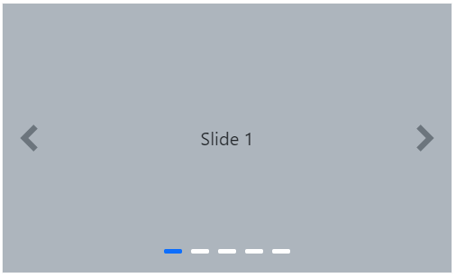

## Indicators

### Show or Hide Indicators

Indicators provide visual cues about the total number of slides and the current slide's position. The visibility of these indicators can be controlled using the [`ShowIndicators`](https://help.syncfusion.com/cr/blazor/Syncfusion.Blazor.Navigations.SfCarousel.html#Syncfusion_Blazor_Navigations_SfCarousel_ShowIndicators) property. The following example demonstrates how to hide the indicators in the carousel.

```cshtml
@using Syncfusion.Blazor.Navigations

<div class="control-container">
    <SfCarousel ShowIndicators="false">
        <CarouselItem>
            <div class="slide-content">Slide 1</div>
        </CarouselItem>
        <CarouselItem>
            <div class="slide-content">Slide 2</div>
        </CarouselItem>
        <CarouselItem>
            <div class="slide-content">Slide 3</div>
        </CarouselItem>
        <CarouselItem>
            <div class="slide-content">Slide 4</div>
        </CarouselItem>
        <CarouselItem>
            <div class="slide-content">Slide 5</div>
        </CarouselItem>
    </SfCarousel>
</div>

<style>
    .control-container {
        background-color: #adb5bd;
        height: 300px;
        margin: 0 auto;
        width: 500px;
    }

    .e-carousel .slide-content {
        align-items: center;
        display: flex;
        font-size: 1.25rem;
        height: 100%;
        justify-content: center;
    }
</style>
```


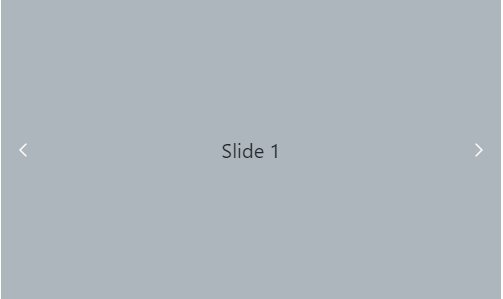

### Indicators Template

A template option is available to customize the indicators using the [`IndicatorsTemplate`](https://help.syncfusion.com/cr/blazor/Syncfusion.Blazor.Navigations.SfCarousel.html#Syncfusion_Blazor_Navigations_SfCarousel_IndicatorsTemplate) property. The following example demonstrates applying a custom template to indicators in the carousel.

```cshtml
@using Syncfusion.Blazor.Navigations

<div class="control-container">
    <SfCarousel ShowIndicators="true">
        <ChildContent>
            <CarouselItem>
                <div class="slide-content">Slide 1</div>
            </CarouselItem>
            <CarouselItem>
                <div class="slide-content">Slide 2</div>
            </CarouselItem>
            <CarouselItem>
                <div class="slide-content">Slide 3</div>
            </CarouselItem>
            <CarouselItem>
                <div class="slide-content">Slide 4</div>
            </CarouselItem>
            <CarouselItem>
                <div class="slide-content">Slide 5</div>
            </CarouselItem>
        </ChildContent>
        <IndicatorsTemplate>
            @{
                string slideName = (context.Index + 1).ToString();
                <div class="indicator">
                    <div class="fs-6">@slideName</div>
                </div>
            }
        </IndicatorsTemplate>
    </SfCarousel>
</div>

<style>
    .control-container {
        background-color: #adb5bd;
        height: 300px;
        margin: 0 auto;
        width: 500px;
    }

    .e-carousel .slide-content {
        align-items: center;
        display: flex;
        font-size: 1.25rem;
        height: 100%;
        justify-content: center;
    }

    .e-carousel .e-carousel-indicators .e-indicator-bars .e-indicator-bar .indicator {
        background-color: #ECECEC;
        border-radius: 0.25rem;
        cursor: pointer;
        display: flex;
        height: 2rem;
        justify-content: center;
        margin: 0.5rem;
        width: 3rem;
    }

        .e-carousel .e-carousel-indicators .e-indicator-bars .e-indicator-bar .indicator .fs-6 {
            margin: auto;
        }

    .e-carousel .e-carousel-indicators .e-indicator-bars .e-indicator-bar.e-active .indicator {
        background-color: #3C78EF;
        color: #fff;
    }
</style>
```


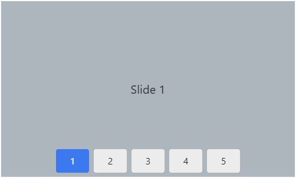

### Showing Preview of Slide in Indicator

Indicators can be customized to display a preview image of each slide using the [`IndicatorsTemplate`](https://help.syncfusion.com/cr/blazor/Syncfusion.Blazor.Navigations.SfCarousel.html#Syncfusion_Blazor_Navigations_SfCarousel_IndicatorsTemplate) property. The following example demonstrates using a template to show preview images for indicators in the carousel.

```cshtml
@using Syncfusion.Blazor.Navigations

<div class="control-container">
    <SfCarousel CssClass="template-carousel">
        <ChildContent>
            @foreach (Bird bird in birds)
            {
                <CarouselItem>
                    <figure class="img-container">
                        
                    </figure>
                </CarouselItem>
            }
        </ChildContent>
        <IndicatorsTemplate>
            <div class="indicator">
                
            </div>
        </IndicatorsTemplate>
    </SfCarousel>
</div>
@code{
    private List<string> previewImage = new List<string>() { "cardinal", "hunei", "costa-rica", "kaohsiung", "bee-eater" };
    public List<Bird> birds = new List<Bird> {
        new Bird { ID = 1, Name = "Cardinal", ImageName = "cardinal" },
        new Bird { ID = 2, Name = "Kingfisher", ImageName = "hunei" },
        new Bird { ID = 3, Name = "Keel-billed-toucan", ImageName = "costa-rica" },
        new Bird { ID = 4, Name = "Yellow-warbler", ImageName = "kaohsiung" },
        new Bird { ID = 5, Name = "Bee-eater", ImageName = "bee-eater" }
    };

    public class Bird
    {
        public int ID { get; set; }
        public string Name { get; set; }
        public string ImageName { get; set; }
    }
}
<style>
    .control-container {
        margin: 0 auto 2em;
        max-width: 500px;
        height: 350px;
    }

    .template-carousel .e-carousel-items,
    .template-carousel .e-carousel-navigators {
        height: calc(100% - 3rem);
    }

    .template-carousel .e-carousel-indicators .e-indicator-bars .e-indicator-bar .indicator {
        background-color: #ECECEC;
        border-radius: 0.25rem;
        cursor: pointer;
        height: 2rem;
        margin: 0.6rem;
        width: 3rem;
    }

        .template-carousel .e-carousel-indicators .e-indicator-bars .e-indicator-bar .indicator img {
            padding: 2px;
        }

    .template-carousel .e-carousel-indicators .e-indicator-bars .e-indicator-bar.e-active .indicator {
        background-color: #3C78EF;
    }
</style>
```


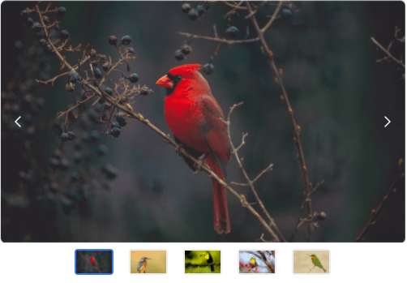

### Indicators Types

Different types of indicators are available via the [`IndicatorsType`](https://help.syncfusion.com/cr/blazor/Syncfusion.Blazor.Navigations.SfCarousel.html#Syncfusion_Blazor_Navigations_SfCarousel_IndicatorsType) property. The indicator types are categorized as follows:

* [Default Indicator](#default-indicator)
* [Dynamic Indicator](#dynamic-indicator)
* [Fraction Indicator](#fraction-indicator)
* [Progress Indicator](#progress-indicator)

#### Default Indicator

The default indicator in a carousel is a set of dots that visually represent the current slide's position. This indicator type is achieved by setting the [`IndicatorsType`](https://help.syncfusion.com/cr/blazor/Syncfusion.Blazor.Navigations.SfCarousel.html#Syncfusion_Blazor_Navigations_SfCarousel_IndicatorsType) to `Default`.

```cshtml
@using Syncfusion.Blazor.Navigations

<div class="control-container">
    <SfCarousel IndicatorsType="Default">
        <CarouselItem>
            <div class="slide-content">Slide 1</div>
        </CarouselItem>
        <CarouselItem>
            <div class="slide-content">Slide 2</div>
        </CarouselItem>
        <CarouselItem>
            <div class="slide-content">Slide 3</div>
        </CarouselItem>
        <CarouselItem>
            <div class="slide-content">Slide 4</div>
        </CarouselItem>
        <CarouselItem>
            <div class="slide-content">Slide 5</div>
        </CarouselItem>
    </SfCarousel>
</div>

<style>
    .control-container {
        background-color: #adb5bd;
        height: 300px;
        margin: 0 auto;
        width: 500px;
    }

    .e-carousel .slide-content {
        align-items: center;
        display: flex;
        font-size: 1.25rem;
        height: 100%;
        justify-content: center;
    }
</style>
```


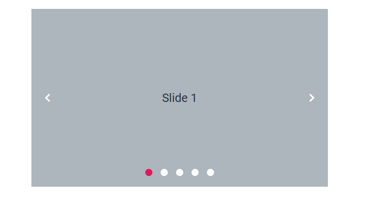

#### Dynamic Indicator

A dynamic indicator in a carousel provides visual cues or markers that change or update to reflect the current position. This indicator type is achieved by setting the [`IndicatorsType`](https://help.syncfusion.com/cr/blazor/Syncfusion.Blazor.Navigations.SfCarousel.html#Syncfusion_Blazor_Navigations_SfCarousel_IndicatorsType) to `Dynamic`.

```cshtml
@using Syncfusion.Blazor.Navigations

<div class="control-container">
    <SfCarousel IndicatorsType="Dynamic">
        <CarouselItem>
            <div class="slide-content">Slide 1</div>
        </CarouselItem>
        <CarouselItem>
            <div class="slide-content">Slide 2</div>
        </CarouselItem>
        <CarouselItem>
            <div class="slide-content">Slide 3</div>
        </CarouselItem>
        <CarouselItem>
            <div class="slide-content">Slide 4</div>
        </CarouselItem>
        <CarouselItem>
            <div class="slide-content">Slide 5</div>
        </CarouselItem>
    </SfCarousel>
</div>

<style>
    .control-container {
        background-color: #adb5bd;
        height: 300px;
        margin: 0 auto;
        width: 500px;
    }

    .e-carousel .slide-content {
        align-items: center;
        display: flex;
        font-size: 1.25rem;
        height: 100%;
        justify-content: center;
    }
</style>
```


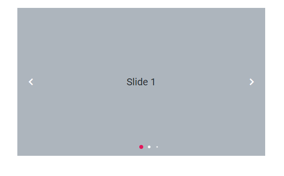

#### Fraction Indicator

The fraction indicator displays the current slide index and total slide count, typically in a "current/total" format. This indicator type is achieved by setting the [`IndicatorsType`](https://help.syncfusion.com/cr/blazor/Syncfusion.Blazor.Navigations.SfCarousel.html#Syncfusion_Blazor_Navigations_SfCarousel_IndicatorsType) to `Fraction`.

```cshtml
@using Syncfusion.Blazor.Navigations

<div class="control-container">
    <SfCarousel IndicatorsType="Fraction">
        <CarouselItem>
            <div class="slide-content">Slide 1</div>
        </CarouselItem>
        <CarouselItem>
            <div class="slide-content">Slide 2</div>
        </CarouselItem>
        <CarouselItem>
            <div class="slide-content">Slide 3</div>
        </CarouselItem>
        <CarouselItem>
            <div class="slide-content">Slide 4</div>
        </CarouselItem>
        <CarouselItem>
            <div class="slide-content">Slide 5</div>
        </CarouselItem>
    </SfCarousel>
</div>

<style>
    .control-container {
        background-color: #adb5bd;
        height: 300px;
        margin: 0 auto;
        width: 500px;
    }

    .e-carousel .slide-content {
        align-items: center;
        display: flex;
        font-size: 1.25rem;
        height: 100%;
        justify-content: center;
    }
</style>
```


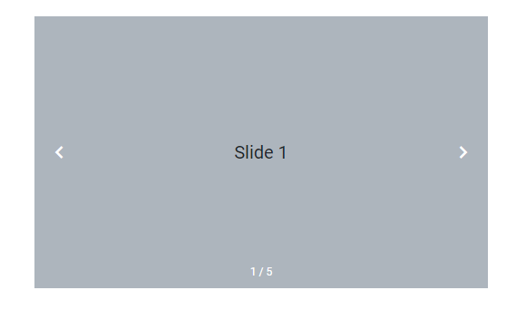

#### Progress Indicator

The Progress Indicator displays the current slide's progression, often as a bar or other visual filling animation. This indicator type is achieved by setting the [`IndicatorsType`](https://help.syncfusion.com/cr/blazor/Syncfusion.Blazor.Navigations.SfCarousel.html#Syncfusion_Blazor_Navigations_SfCarousel_IndicatorsType) to `Progress`.

```cshtml
@using Syncfusion.Blazor.Navigations

<div class="control-container">
    <SfCarousel IndicatorsType="Progress">
        <CarouselItem>
            <div class="slide-content">Slide 1</div>
        </CarouselItem>
        <CarouselItem>
            <div class="slide-content">Slide 2</div>
        </CarouselItem>
        <CarouselItem>
            <div class="slide-content">Slide 3</div>
        </CarouselItem>
        <CarouselItem>
            <div class="slide-content">Slide 4</div>
        </CarouselItem>
        <CarouselItem>
            <div class="slide-content">Slide 5</div>
        </CarouselItem>
    </SfCarousel>
</div>

<style>
    .control-container {
        background-color: #adb5bd;
        height: 300px;
        margin: 0 auto;
        width: 500px;
    }

    .e-carousel .slide-content {
        align-items: center;
        display: flex;
        font-size: 1.25rem;
        height: 100%;
        justify-content: center;
    }
</style>
```


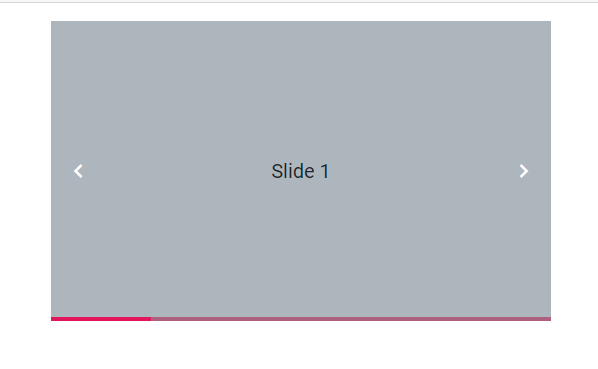

## Play button

### Show or Hide the Play Button

The [`ShowPlayButton`](https://help.syncfusion.com/cr/blazor/Syncfusion.Blazor.Navigations.SfCarousel.html#Syncfusion_Blazor_Navigations_SfCarousel_ShowPlayButton) property controls the visibility of a play/pause button, which allows users to manage the Carousel's [`AutoPlay`](https://help.syncfusion.com/cr/blazor/Syncfusion.Blazor.Navigations.SfCarousel.html#Syncfusion_Blazor_Navigations_SfCarousel_AutoPlay) functionality directly from the user interface. Enabling this property provides a button to start or stop automatic slide transitions. This property's behavior is dependent on the [`ButtonsVisibility`](https://help.syncfusion.com/cr/blazor/Syncfusion.Blazor.Navigations.SfCarousel.html#Syncfusion_Blazor_Navigations_SfCarousel_ButtonsVisibility) property. The following example demonstrates how to show the play button in the carousel.

```cshtml
@using Syncfusion.Blazor.Navigations

<div class="control-container">
    <SfCarousel ShowPlayButton="true">
        <CarouselItem>
            <div class="slide-content">Slide 1</div>
        </CarouselItem>
        <CarouselItem>
            <div class="slide-content">Slide 2</div>
        </CarouselItem>
        <CarouselItem>
            <div class="slide-content">Slide 3</div>
        </CarouselItem>
        <CarouselItem>
            <div class="slide-content">Slide 4</div>
        </CarouselItem>
        <CarouselItem>
            <div class="slide-content">Slide 5</div>
        </CarouselItem>
    </SfCarousel>
</div>

<style>
    .control-container {
        background-color: #adb5bd;
        height: 300px;
        margin: 0 auto;
        width: 500px;
    }

    .e-carousel .slide-content {
        align-items: center;
        display: flex;
        font-size: 1.25rem;
        height: 100%;
        justify-content: center;
    }
</style>
```


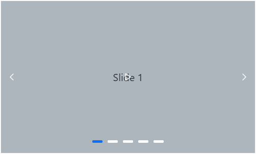

### Play Button Template

A template option is available to customize the play button using the [`PlayButtonTemplate`](https://help.syncfusion.com/cr/blazor/Syncfusion.Blazor.Navigations.SfCarousel.html#Syncfusion_Blazor_Navigations_SfCarousel_PlayButtonTemplate) property. The following example demonstrates applying a custom template to the play button in the carousel. Note that `IsSlidePlay` is initialized to `true`, indicating that autoplay is active, and the initial button `title` should reflect "Pause".

```cshtml
@using Syncfusion.Blazor.Buttons
@using Syncfusion.Blazor.Navigations

<div class="control-container">
    <SfCarousel AutoPlay="@IsSlidePlay" ShowPlayButton="true">
        <ChildContent>
            <CarouselItem>
                <div class="slide-content">Slide 1</div>
            </CarouselItem>
            <CarouselItem>
                <div class="slide-content">Slide 2</div>
            </CarouselItem>
            <CarouselItem>
                <div class="slide-content">Slide 3</div>
            </CarouselItem>
            <CarouselItem>
                <div class="slide-content">Slide 4</div>
            </CarouselItem>
            <CarouselItem>
                <div class="slide-content">Slide 5</div>
            </CarouselItem>
        </ChildContent>
        <PlayButtonTemplate>
            <SfButton title="@(IsSlidePlay ? "Pause" : "Play")" IsToggle="true" @onclick="(()=> IsSlidePlay = !IsSlidePlay)">
                @if (IsSlidePlay)
                {
                    <svg version="1.1" xmlns="http://www.w3.org/2000/svg" width="32" height="32" viewBox="0 0 32 32">
                        <path d="M16 0c-8.837 0-16 7.163-16 16s7.163 16 16 16 16-7.163 16-16-7.163-16-16-16zM16 29c-7.18 0-13-5.82-13-13s5.82-13 13-13 13 5.82 13 13-5.82 13-13 13zM10 10h4v12h-4zM18 10h4v12h-4z"></path>
                    </svg>
                }
                else
                {
                    <svg version="1.1" xmlns="http://www.w3.org/2000/svg" width="32" height="32" viewBox="0 0 32 32">
                        <path d="M16 0c-8.837 0-16 7.163-16 16s7.163 16 16 16 16-7.163 16-16-7.163-16-16-16zM16 29c-7.18 0-13-5.82-13-13s5.82-13 13-13 13 5.82 13 13-5.82 13-13 13zM12 9l12 7-12 7z"></path>
                    </svg>
                }
            </SfButton>
        </PlayButtonTemplate>
    </SfCarousel>
</div>

@code {
    bool IsSlidePlay = true;
}

<style>
    .control-container {
        background-color: #adb5bd;
        height: 300px;
        margin: 0 auto;
        width: 500px;
    }

    .e-carousel .slide-content {
        align-items: center;
        display: flex;
        font-size: 1.25rem;
        height: 100%;
        justify-content: center;
    }

    .e-carousel .e-carousel-navigators .e-btn:active,
    .e-carousel .e-carousel-navigators .e-btn:hover {
        background-color: transparent !important;
    }

    .e-carousel .e-carousel-navigators .e-btn svg {
        fill: #fff;
        stroke: transparent;
    }
</style>
```



