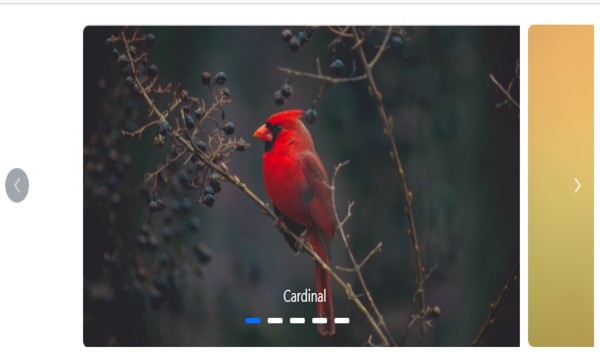

# Populating Items in Blazor Carousel Component

## Populating items using Carousel Item

The Carousel component can be rendered by binding individual `CarouselItem` elements. Within this approach, you can either assign unique templates to each item or apply a common template across all items. Additionally, the slide transition interval can be customized for each item separately.

The following example demonstrates item property binding:

```cshtml
@using Syncfusion.Blazor.Navigations

<div class="control-container">
    <SfCarousel>
        <CarouselItem>
            <div class="slide-content">Slide 1</div>
        </CarouselItem>
        <CarouselItem>
            <div class="slide-content">Slide 2</div>
        </CarouselItem>
        <CarouselItem>
            <div class="slide-content">Slide 3</div>
        </CarouselItem>
        <CarouselItem>
            <div class="slide-content">Slide 4</div>
        </CarouselItem>
        <CarouselItem>
            <div class="slide-content">Slide 5</div>
        </CarouselItem>
    </SfCarousel>
</div>

<style>
    .control-container {
        background-color: #adb5bd;
        height: 300px;
        margin: 0 auto;
        width: 500px;
    }

    .e-carousel .slide-content {
        align-items: center;
        display: flex;
        font-size: 1.25rem;
        height: 100%;
        justify-content: center;
    }
</style>
```


## Selection

By default, the Carousel component displays the item at the first index when initially rendered. This selection behavior can be customized in two primary ways:

*   Selecting an item using a property.
*   Selecting an item using a method.

### Select an Item Using a Property

The [`SelectedIndex`](https://help.syncfusion.com/cr/blazor/Syncfusion.Blazor.Navigations.SfCarousel.html#Syncfusion_Blazor_Navigations_SfCarousel_SelectedIndex) property of the Carousel component allows you to specify which slide is initially displayed upon rendering, or to programmatically switch to a different slide item during runtime.

```cshtml
@using Syncfusion.Blazor.Navigations

<div class="control-container">
    <SfCarousel @bind-SelectedIndex="@CurrentIndex">
        <CarouselItem>
            <div class="slide-content">Slide 1</div>
        </CarouselItem>
        <CarouselItem>
            <div class="slide-content">Slide 2</div>
        </CarouselItem>
        <CarouselItem>
            <div class="slide-content">Slide 3</div>
        </CarouselItem>
        <CarouselItem>
            <div class="slide-content">Slide 4</div>
        </CarouselItem>
        <CarouselItem>
            <div class="slide-content">Slide 5</div>
        </CarouselItem>
    </SfCarousel>
</div>

@code {
    int CurrentIndex = 2;
}

<style>
    .control-container {
        background-color: #adb5bd;
        height: 300px;
        margin: 0 auto;
        width: 500px;
    }

    .e-carousel .slide-content {
        align-items: center;
        display: flex;
        font-size: 1.25rem;
        height: 100%;
        justify-content: center;
    }
</style>
```



### Select an Item Using a Method

The [`PreviousAsync`](https://help.syncfusion.com/cr/blazor/Syncfusion.Blazor.Navigations.SfCarousel.html#Syncfusion_Blazor_Navigations_SfCarousel_PreviousAsync) and [`NextAsync`](https://help.syncfusion.com/cr/blazor/Syncfusion.Blazor.Navigations.SfCarousel.html#Syncfusion_Blazor_Navigations_SfCarousel_NextAsync) public methods of the Carousel component allow programmatic navigation to the previous or next slide.

```cshtml
@using Syncfusion.Blazor.Buttons
@using Syncfusion.Blazor.Navigations

<div class="container">
    <div class="row control-container">
        <SfCarousel @ref="@CarouselRef" @bind-SelectedIndex="@CurrentIndex" ButtonsVisibility="CarouselButtonVisibility.Hidden">
            <CarouselItem>
                <div class="slide-content">Slide 1</div>
            </CarouselItem>
            <CarouselItem>
                <div class="slide-content">Slide 2</div>
            </CarouselItem>
            <CarouselItem>
                <div class="slide-content">Slide 3</div>
            </CarouselItem>
            <CarouselItem>
                <div class="slide-content">Slide 4</div>
            </CarouselItem>
            <CarouselItem>
                <div class="slide-content">Slide 5</div>
            </CarouselItem>
        </SfCarousel>
    </div>
    <div class="row justify-content-center">
        <SfButton CssClass="w-auto" @onclick="@(()=>OnNavigationClick(CarouselSlideDirection.Previous))">Previous</SfButton>
        <SfButton CssClass="w-auto" @onclick="@(()=>OnNavigationClick(CarouselSlideDirection.Next))">Next</SfButton>
    </div>
</div>

@code {
    SfCarousel CarouselRef;
    int CurrentIndex = 2;

    async Task OnNavigationClick(CarouselSlideDirection slideDirection)
    {
        if (slideDirection == CarouselSlideDirection.Previous)
        {
            await CarouselRef.PreviousAsync();
        }
        else
        {
            await CarouselRef.NextAsync();
        }
    }
}

<style>
    .control-container {
        background-color: #adb5bd;
        height: 300px;
        margin: 0 auto;
        width: 500px;
    }

    .e-carousel .slide-content {
        align-items: center;
        display: flex;
        font-size: 1.25rem;
        height: 100%;
        justify-content: center;
    }
</style>
```


## Partial Visible Slides

The Carousel component can display one complete slide along with a partial view of its adjacent (previous and next) slides simultaneously. This feature can be enabled or disabled using the [`PartialVisible`](https://help.syncfusion.com/cr/blazor/Syncfusion.Blazor.Navigations.SfCarousel.html#Syncfusion_Blazor_Navigations_SfCarousel_PartialVisible) property.

```cshtml
@using Syncfusion.Blazor.Navigations

<div class="control-container">
    <SfCarousel PartialVisible=true>
        <CarouselItem>
            <figure class="img-container"><figcaption class="img-caption">Cardinal</figcaption></figure>
        </CarouselItem>
        <CarouselItem>
            <figure class="img-container"><figcaption class="img-caption">Kingfisher</figcaption></figure>
        </CarouselItem>
        <CarouselItem>
            <figure class="img-container"><figcaption class="img-caption">Keel-billed-toucan</figcaption></figure>
        </CarouselItem>
        <CarouselItem>
            <figure class="img-container"><figcaption class="img-caption">Yellow-warbler</figcaption></figure>
        </CarouselItem>
        <CarouselItem>
           <figure class="img-container"><figcaption class="img-caption">Bee-eater</figcaption></figure>
        </CarouselItem>
    </SfCarousel>
</div>

<style>
    .control-container {
        margin: 0 auto 2em;
        max-width: 800px;
        height: 300px;
    }

    .img-container {
        margin: 0 10px;
        width: 100%;
        height: 100%;
    }

    .img-caption {
        bottom: 4em;
        color: #fff;
        font-size: 12pt;
        height: 2em;
        position: relative;
        padding: 0.3em 1em;
        text-align: center;
        width: 100%;
    }

</style>
```



N> Slide animation is only applicable if `PartialVisible` is enabled beyond a single slide. Note that it will apply only for transition animation.

When both the [`Loop`](https://help.syncfusion.com/cr/blazor/Syncfusion.Blazor.Navigations.SfCarousel.html#Syncfusion_Blazor_Navigations_SfCarousel_Loop) and `PartialVisible` properties are enabled, the last slide will be displayed as a partial slide during the initial rendering. This occurs because the `Loop` property allows the carousel to cycle, making the "next" item (which is the first slide when looping) visible, and consequently exposing the "previous" item (the last slide) when `PartialVisible` is active.

Conversely, if `Loop` is disabled and `PartialVisible` is enabled, the previous slide will not be displayed during the initial rendering.

The following example demonstrates the functionality of `PartialVisible` when the `Loop` property is set to `false`.

```cshtml
@using Syncfusion.Blazor.Navigations

<div class="control-container">
    <SfCarousel PartialVisible="true" Loop="false">
        <CarouselItem>
            <figure class="img-container"><figcaption class="img-caption">Cardinal</figcaption></figure>
        </CarouselItem>
        <CarouselItem>
            <figure class="img-container"><figcaption class="img-caption">Kingfisher</figcaption></figure>
        </CarouselItem>
        <CarouselItem>
            <figure class="img-container"><figcaption class="img-caption">Keel-billed-toucan</figcaption></figure>
        </CarouselItem>
        <CarouselItem>
            <figure class="img-container"><figcaption class="img-caption">Yellow-warbler</figcaption></figure>
        </CarouselItem>
        <CarouselItem>
           <figure class="img-container"><figcaption class="img-caption">Bee-eater</figcaption></figure>
        </CarouselItem>
    </SfCarousel>
</div>

<style>
    .control-container {
        margin: 0 auto 2em;
        max-width: 800px;
        height: 300px;
    }

    .img-container {
        margin: 0 10px;
        width: 100%;
        height: 100%;
    }

    .img-caption {
        bottom: 4em;
        color: #fff;
        font-size: 12pt;
        height: 2em;
        position: relative;
        padding: 0.3em 1em;
        text-align: center;
        width: 100%;
    }

</style>
```




## See also

* [Customizing partial slides area size](https://blazor.syncfusion.com/documentation/carousel/styles-and-appearance#customizing-partial-slides-size)