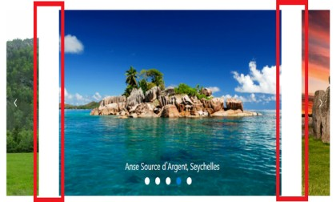

# CSS Structure in Blazor Carousel Component

The following content provides the exact CSS structure that can be used to modify the control’s appearance based on user preference.

## Customizing partial slides size

You can customize the partial slide size by overriding the `e-carousel-item` CSS class.

```CSS

.e-carousel.e-partial .e-carousel-item {
    margin: 0 20px;
}

```

