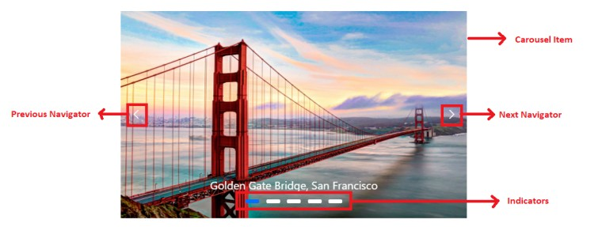
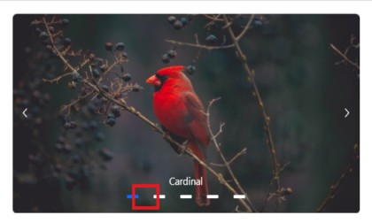
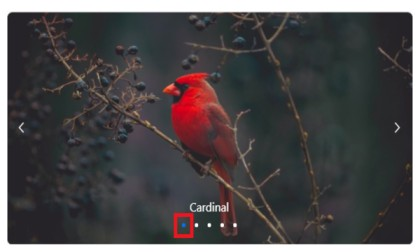
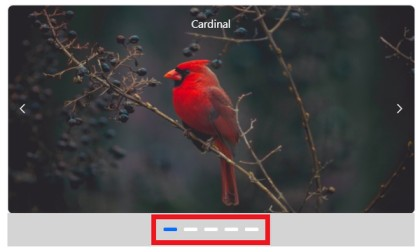
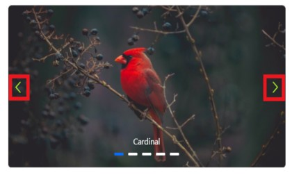
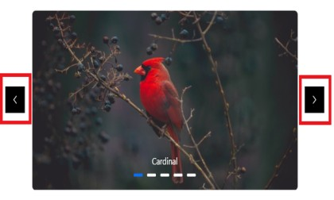
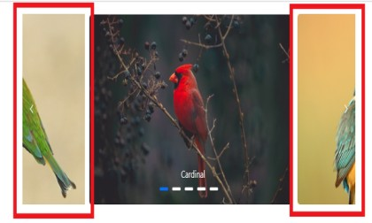

# Styles and Appearance in Blazor Carousel Component

To visually customize the Blazor Carousel component, it is necessary to override its default CSS styles. This document provides a list of key CSS classes and demonstrations on how to apply custom styles to various parts of the Carousel. Additionally, for comprehensive theme generation across Syncfusion controls, developers can utilize the online [`Theme Studio`](https://ej2.syncfusion.com/themestudio/?theme=material).

## CSS Structure in Blazor Carousel Component

The following table lists the core CSS classes within the Carousel component, along with their respective purposes, which can be targeted for custom styling.

| CSS Class | Purpose of Class |
| ----- | ----- |
|.e-carousel .e-carousel-item|To customize the carousel item
|.e-carousel-item.e-active| To customize the active carousel item
|.e-carousel .e-carousel-indicators|To customize the indicators
|.e-carousel .e-carousel-indicators .e-indicator-bars .e-indicator-bar|To customize the indicator bars
|.e-carousel .e-carousel-indicators .e-indicator-bars .e-indicator-bar .e-indicator|To customize the individual indicator appearance
|.e-carousel .e-carousel-navigators|To customize the navigators
|.e-carousel .e-carousel-navigators .e-previous|To customize the previous button
|.e-carousel .e-carousel-navigators .e-play-pause|To customize the play and pause button
|.e-carousel.e-partial .e-carousel-slide-container|To customize the partial visible slides



## Customizing the Indicators

### Spacing Between Indicators

Use the following CSS to customize the space between individual indicators by overriding the `.e-indicator-bar` CSS class.

```CSS

.e-carousel .e-carousel-indicators .e-indicator-bars .e-indicator-bar {
    padding: 8px;
}

```



### Indicator Appearance

Use the following CSS to customize the indicators appearance by overriding the `.e-indicator` CSS class.

```CSS

.e-carousel .e-carousel-indicators .e-indicator-bars .e-indicator-bar .e-indicator {
    width: 20px;
    border-radius: 100%;
}

```



### Positioning Indicators Outside

Use the following CSS to render the indicators outside the carousel items by overriding the `.e-carousel-indicators` CSS class.

```CSS

.e-carousel .e-carousel-indicators {
    bottom: auto;
}

```



## Customizing the Navigators

### Icon Size and Colors

Use the following CSS to customize the size and colors of the previous and next navigation icons.

```CSS

.e-carousel .e-carousel-navigators .e-next .e-btn:not(:disabled) .e-btn-icon,
.e-carousel .e-carousel-navigators .e-previous .e-btn:not(:disabled) .e-btn-icon
{
    color: greenyellow;
    font-size: 25px;
}

```



### Navigators Position

Use the following CSS to customize the navigators position to bottom by overriding the `.e-carousel-navigators` CSS class.

```CSS

.e-carousel .e-carousel-navigators {
   top: 120px;
}

```


### Positioning Navigators Outside

Use the following CSS to render the previous and next icons outside the main carousel bounds by overriding the `.e-previous` and `.e-next` CSS classes.

```CSS

.e-carousel .e-carousel-navigators .e-previous,
.e-carousel .e-carousel-navigators .e-next
{
    margin: -60px;
    background: black;
}

```



## Customizing partial slides size

You can customize the partial slide size by overriding the `.e-carousel-slide-container` CSS class.

```CSS

.e-carousel.e-partial .e-carousel-slide-container{
    padding: 0 150px;
}

```

