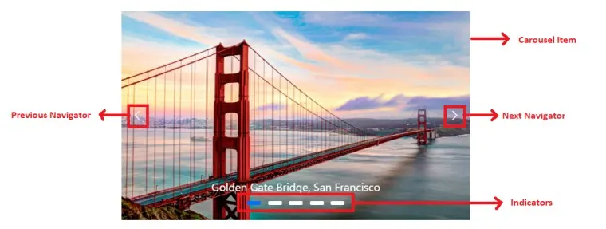
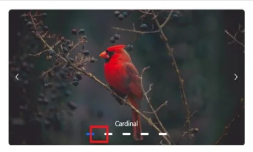
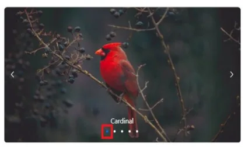
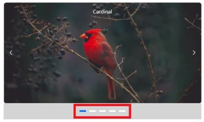
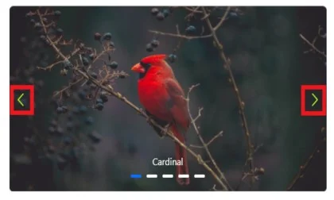
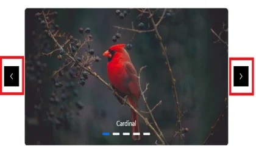
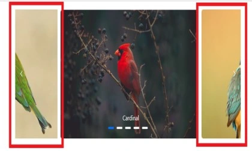

# Styles and appearance in Blazor Carousel component

To modify the Carousel appearance, override the default CSS of the Carousel component. The following list shows the CSS classes and their corresponding sections in the Carousel. You can also create a custom theme for the controls using the [`Theme Studio`](https://ej2.syncfusion.com/themestudio/?theme=material). For guidance on using a custom theme, see the [Theme Studio documentation](https://ej2.syncfusion.com/themestudio/?theme=material).

> Add the CSS overrides to your application's stylesheet (for example, `wwwroot/css/site.css` for Blazor Server, `wwwroot/css/app.css` for Blazor WebAssembly, or a scoped `.razor.css` file).

## CSS structure in Blazor Carousel component

The following content provides the exact CSS structure that can be used to modify the control's appearance based on your preference.

| CSS Class | Purpose of Class |
| ----- | ----- |
|.e-carousel .e-carousel-item|To customize the carousel item
|.e-carousel-item.e-active| To customize the active carousel item
|.e-carousel .e-carousel-indicators|To customize the indicators
|.e-carousel .e-carousel-indicators .e-indicator-bars .e-indicator-bar|To customize the indicator bars
|.e-carousel .e-carousel-indicators .e-indicator-bars .e-indicator-bar .e-indicator|To customize the individual indicator appearance
|.e-carousel .e-carousel-navigators|To customize the navigators
|.e-carousel .e-carousel-navigators .e-previous|To customize the previous button
|.e-carousel .e-carousel-navigators .e-play-pause|To customize the play and pause button
|.e-carousel.e-partial .e-carousel-slide-container|To customize the partial visible slides



## Customizing the indicators

### Indicator spacing

Use the following CSS to customize the space between indicators by overriding the `.e-indicator-bar` CSS class.

```css

.e-carousel .e-carousel-indicators .e-indicator-bars .e-indicator-bar {
    padding: 8px;
}

```



### Indicator appearance

Use the following CSS to customize the indicator appearance by overriding the `.e-indicator` CSS class.

```css

.e-carousel .e-carousel-indicators .e-indicator-bars .e-indicator-bar .e-indicator {
    width: 20px;
    border-radius: 100%;
}

```



### Indicator position

Use the following CSS to render the indicators outside the carousel items by overriding the `.e-carousel-indicators` CSS class.

```css

.e-carousel .e-carousel-indicators {
    bottom: auto;
}

```



## Customizing the navigators

### Navigator icon size and color

Use the following CSS to customize the previous and next button icon size and color.

> This applies to the default icon-font navigators. If you provide a custom template for the previous/next buttons, the icon is part of your template and these styles will not apply.

```css

.e-carousel .e-carousel-navigators .e-next .e-btn:not(:disabled) .e-btn-icon,
.e-carousel .e-carousel-navigators .e-previous .e-btn:not(:disabled) .e-btn-icon
{
    color: greenyellow;
    font-size: 25px;
}

```



### Navigator position

Use the following CSS to change the vertical position of the navigators by overriding the `.e-carousel-navigators` CSS class.

```css

.e-carousel .e-carousel-navigators {
   top: 120px;
}

```


### Navigator placement

Use the following CSS to render the previous and next icons outside the carousel items by overriding the `.e-previous` and `.e-next` CSS classes.

```css

.e-carousel .e-carousel-navigators .e-previous,
.e-carousel .e-carousel-navigators .e-next
{
    margin: -60px;
    background: black;
}

```



## Customizing partial slide size

You can customize the partial slide size by overriding the `.e-carousel-slide-container` CSS class. The `padding` value narrows the slide area so that the adjacent slides appear partially visible.

```css

.e-carousel.e-partial .e-carousel-slide-container{
    padding: 0 150px;
}

```



## See also

* [Getting started with Blazor Carousel](https://blazor.syncfusion.com/documentation/carousel/getting-started)
* [Accessibility in Blazor Carousel](https://blazor.syncfusion.com/documentation/carousel/accessibility)
* [Animations and transitions in Blazor Carousel](https://blazor.syncfusion.com/documentation/carousel/animations-and-transitions)
* [Populating items in Blazor Carousel](https://blazor.syncfusion.com/documentation/carousel/populating-items)