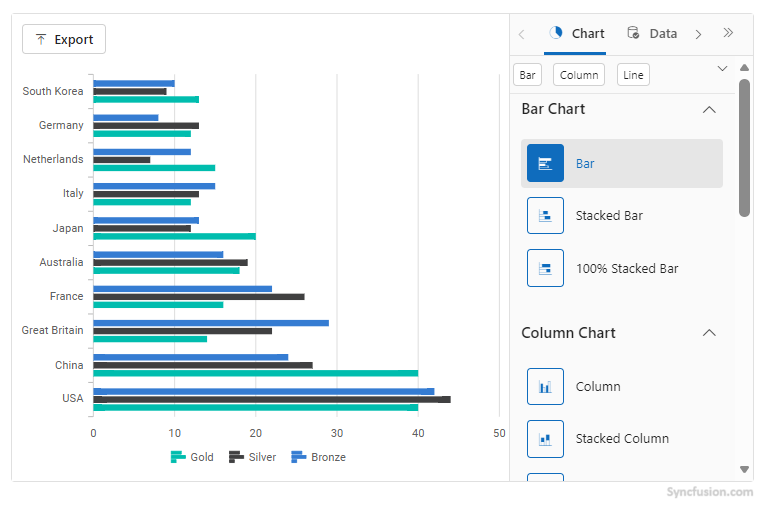
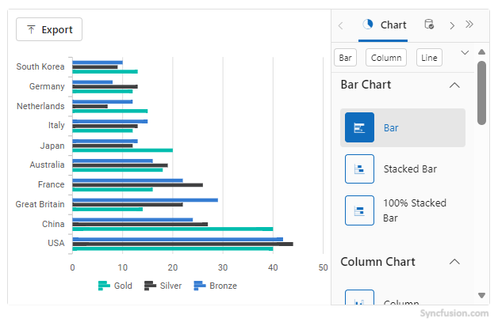
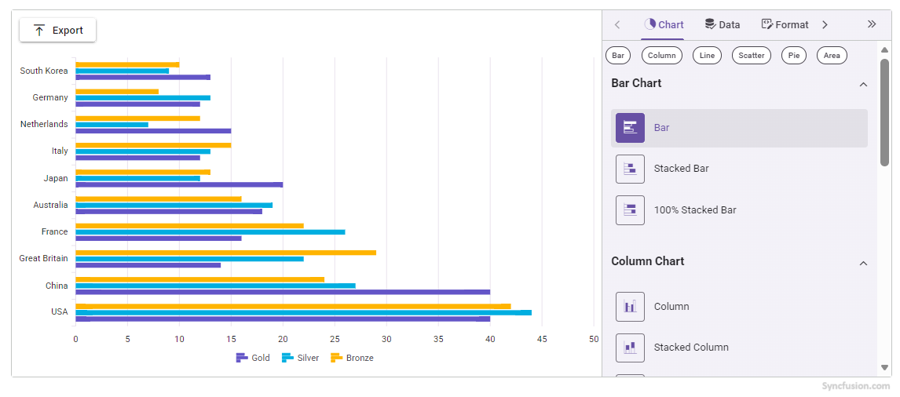
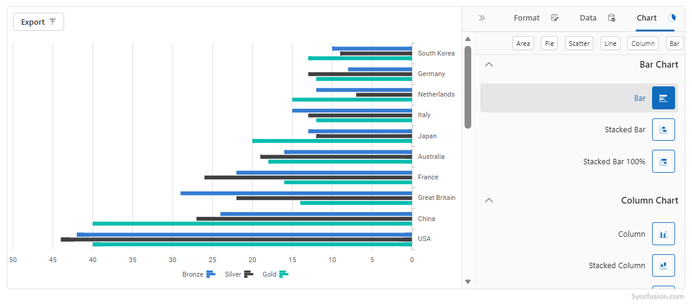
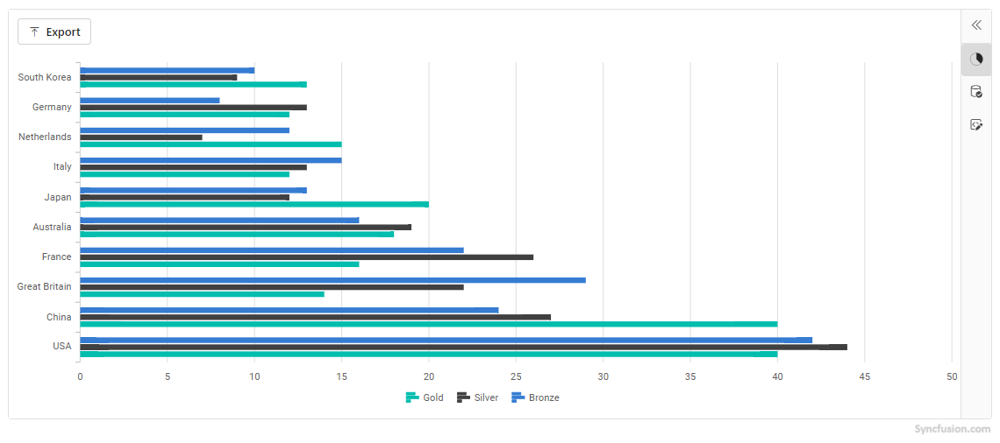

# Customizing Appearance in the Blazor Chart Wizard Component

This guide explains how to tailor the appearance of the `Chart Wizard` component in Blazor. Discover the available properties and see practical examples for each customization option.


## Appearance Properties Overview

| Property                | Type    | Default    | Description |
|-------------------------|---------|------------|-------------|
| `Width`                 | string  | "100%"     | Sets the width of the Chart Wizard (e.g., "800px", "50%"). |
| `Height`                | string  | "100%"     | Sets the height of the Chart Wizard (e.g., "600px", "75%"). |
| `Theme`                 | Theme   | Material   | Sets the visual theme for the component and its sub-components. |
| `EnableRtl`             | bool    | false      | Enables right-to-left layout for RTL languages. |
| `PropertyPanelExpanded` | bool    | true       | Shows or hides the property panel on initial render. |

### Width and Height

You can control the size of the `Chart Wizard` by specifying the `Width` and `Height` properties. Use pixel values for fixed sizing or percentages for responsive layouts.

### In percentage

```cshtml

<div class="control-section">
    <SfChartWizard Width="60%" Height="">
        <ChartSettings DataSource="@OlympicsDataSource"
                       CategoryFields="@categories"
                       SeriesType="ChartWizardSeriesType.Bar"
                       SeriesFields="@chartSeries">
        </ChartSettings>
    </SfChartWizard>
</div>

@code {
    private readonly List<string> chartSeries = new() { "Gold", "Silver", "Bronze" };
    private readonly List<string> categories = new() { "Country", "CountryCode" };

    public class OlympicsData
    {
        public string? Country { get; set; }
        public string? CountryCode { get; set; }
        public int Gold { get; set; }
        public int Silver { get; set; }
        public int Bronze { get; set; }
    }

    private readonly List<OlympicsData> OlympicsDataSource = new()
    {
        new OlympicsData { Country = "USA", CountryCode = "USA", Gold = 40, Silver = 44, Bronze = 42 },
        new OlympicsData { Country = "China", CountryCode = "CHN", Gold = 40, Silver = 27, Bronze = 24 },
        new OlympicsData { Country = "Great Britain", CountryCode = "GBR", Gold = 14, Silver = 22, Bronze = 29 },
        new OlympicsData { Country = "France", CountryCode = "FRA", Gold = 16, Silver = 26, Bronze = 22 },
        new OlympicsData { Country = "Australia", CountryCode = "AUS", Gold = 18, Silver = 19, Bronze = 16 },
        new OlympicsData { Country = "Japan", CountryCode = "JPN", Gold = 20, Silver = 12, Bronze = 13 },
        new OlympicsData { Country = "Italy", CountryCode = "ITA", Gold = 12, Silver = 13, Bronze = 15 },
        new OlympicsData { Country = "Netherlands", CountryCode = "NLD", Gold = 15, Silver = 7,  Bronze = 12 },
        new OlympicsData { Country = "Germany", CountryCode = "DEU", Gold = 12, Silver = 13, Bronze = 8  },
        new OlympicsData { Country = "South Korea", CountryCode = "KOR", Gold = 13, Silver = 9,  Bronze = 10 }
    };
}

```



### In pixel

```cshtml

<div class="control-section">
    <SfChartWizard Width="650px" Height="400px">
        <ChartSettings DataSource="@OlympicsDataSource"
                       CategoryFields="@categories"
                       SeriesType="ChartWizardSeriesType.Bar"
                       SeriesFields="@chartSeries">
        </ChartSettings>
    </SfChartWizard>
</div>

@code {
    private readonly List<string> chartSeries = new() { "Gold", "Silver", "Bronze" };
    private readonly List<string> categories = new() { "Country", "CountryCode" };

    public class OlympicsData
    {
        public string? Country { get; set; }
        public string? CountryCode { get; set; }
        public int Gold { get; set; }
        public int Silver { get; set; }
        public int Bronze { get; set; }
    }

    private readonly List<OlympicsData> OlympicsDataSource = new()
    {
        new OlympicsData { Country = "USA", CountryCode = "USA", Gold = 40, Silver = 44, Bronze = 42 },
        new OlympicsData { Country = "China", CountryCode = "CHN", Gold = 40, Silver = 27, Bronze = 24 },
        new OlympicsData { Country = "Great Britain", CountryCode = "GBR", Gold = 14, Silver = 22, Bronze = 29 },
        new OlympicsData { Country = "France", CountryCode = "FRA", Gold = 16, Silver = 26, Bronze = 22 },
        new OlympicsData { Country = "Australia", CountryCode = "AUS", Gold = 18, Silver = 19, Bronze = 16 },
        new OlympicsData { Country = "Japan", CountryCode = "JPN", Gold = 20, Silver = 12, Bronze = 13 },
        new OlympicsData { Country = "Italy", CountryCode = "ITA", Gold = 12, Silver = 13, Bronze = 15 },
        new OlympicsData { Country = "Netherlands", CountryCode = "NLD", Gold = 15, Silver = 7,  Bronze = 12 },
        new OlympicsData { Country = "Germany", CountryCode = "DEU", Gold = 12, Silver = 13, Bronze = 8  },
        new OlympicsData { Country = "South Korea", CountryCode = "KOR", Gold = 13, Silver = 9,  Bronze = 10 }
    };
}

```




### Theme

The `Theme` property applies a built-in visual style to the chart. Choose from available themes to match the application's look and feel.

```cshtml

<div class="control-section">
    <SfChartWizard Theme="Theme.Material3">
        <ChartSettings DataSource="@OlympicsDataSource"
                       CategoryFields="@categories"
                       SeriesType="ChartWizardSeriesType.Bar"
                       SeriesFields="@chartSeries">
        </ChartSettings>
    </SfChartWizard>
</div>

@code {
    private readonly List<string> chartSeries = new() { "Gold", "Silver", "Bronze" };
    private readonly List<string> categories = new() { "Country", "CountryCode" };

    public class OlympicsData
    {
        public string? Country { get; set; }
        public string? CountryCode { get; set; }
        public int Gold { get; set; }
        public int Silver { get; set; }
        public int Bronze { get; set; }
    }

    private readonly List<OlympicsData> OlympicsDataSource = new()
    {
        new OlympicsData { Country = "USA", CountryCode = "USA", Gold = 40, Silver = 44, Bronze = 42 },
        new OlympicsData { Country = "China", CountryCode = "CHN", Gold = 40, Silver = 27, Bronze = 24 },
        new OlympicsData { Country = "Great Britain", CountryCode = "GBR", Gold = 14, Silver = 22, Bronze = 29 },
        new OlympicsData { Country = "France", CountryCode = "FRA", Gold = 16, Silver = 26, Bronze = 22 },
        new OlympicsData { Country = "Australia", CountryCode = "AUS", Gold = 18, Silver = 19, Bronze = 16 },
        new OlympicsData { Country = "Japan", CountryCode = "JPN", Gold = 20, Silver = 12, Bronze = 13 },
        new OlympicsData { Country = "Italy", CountryCode = "ITA", Gold = 12, Silver = 13, Bronze = 15 },
        new OlympicsData { Country = "Netherlands", CountryCode = "NLD", Gold = 15, Silver = 7,  Bronze = 12 },
        new OlympicsData { Country = "Germany", CountryCode = "DEU", Gold = 12, Silver = 13, Bronze = 8  },
        new OlympicsData { Country = "South Korea", CountryCode = "KOR", Gold = 13, Silver = 9,  Bronze = 10 }
    };
}

```




N> The `Theme` property applies the selected theme to the chart area, not the entire Chart Wizard UI. For a consistent look across the whole component, refer to the theme section in [Getting started](./getting-started.md).


### EnableRtl

Set `EnableRtl` to `true` to support right-to-left languages such as Arabic or Hebrew. This option automatically adjusts the alignment of headers, panels, and controls for RTL layouts.

```cshtml

<div class="control-section">
    <SfChartWizard EnableRtl="true">
        <ChartSettings DataSource="@OlympicsDataSource"
                       CategoryFields="@categories"
                       SeriesType="ChartWizardSeriesType.Bar"
                       SeriesFields="@chartSeries">
        </ChartSettings>
    </SfChartWizard>
</div>

@code {
    private readonly List<string> chartSeries = new() { "Gold", "Silver", "Bronze" };
    private readonly List<string> categories = new() { "Country", "CountryCode" };

    public class OlympicsData
    {
        public string? Country { get; set; }
        public string? CountryCode { get; set; }
        public int Gold { get; set; }
        public int Silver { get; set; }
        public int Bronze { get; set; }
    }

    private readonly List<OlympicsData> OlympicsDataSource = new()
    {
        new OlympicsData { Country = "USA", CountryCode = "USA", Gold = 40, Silver = 44, Bronze = 42 },
        new OlympicsData { Country = "China", CountryCode = "CHN", Gold = 40, Silver = 27, Bronze = 24 },
        new OlympicsData { Country = "Great Britain", CountryCode = "GBR", Gold = 14, Silver = 22, Bronze = 29 },
        new OlympicsData { Country = "France", CountryCode = "FRA", Gold = 16, Silver = 26, Bronze = 22 },
        new OlympicsData { Country = "Australia", CountryCode = "AUS", Gold = 18, Silver = 19, Bronze = 16 },
        new OlympicsData { Country = "Japan", CountryCode = "JPN", Gold = 20, Silver = 12, Bronze = 13 },
        new OlympicsData { Country = "Italy", CountryCode = "ITA", Gold = 12, Silver = 13, Bronze = 15 },
        new OlympicsData { Country = "Netherlands", CountryCode = "NLD", Gold = 15, Silver = 7,  Bronze = 12 },
        new OlympicsData { Country = "Germany", CountryCode = "DEU", Gold = 12, Silver = 13, Bronze = 8  },
        new OlympicsData { Country = "South Korea", CountryCode = "KOR", Gold = 13, Silver = 9,  Bronze = 10 }
    };
}

```




### PropertyPanelExpanded

The `PropertyPanelExpanded` property controls whether the property panel is open when the Chart Wizard first loads. Set it to `false` to start with the panel collapsed, giving more space to the chart area.

```cshtml

<div class="control-section">
    <SfChartWizard PropertyPanelExpanded="false">
        <ChartSettings DataSource="@OlympicsDataSource"
                       CategoryFields="@categories"
                       SeriesType="ChartWizardSeriesType.Bar"
                       SeriesFields="@chartSeries">
        </ChartSettings>
    </SfChartWizard>
</div>

@code {
    private readonly List<string> chartSeries = new() { "Gold", "Silver", "Bronze" };
    private readonly List<string> categories = new() { "Country", "CountryCode" };

    public class OlympicsData
    {
        public string? Country { get; set; }
        public string? CountryCode { get; set; }
        public int Gold { get; set; }
        public int Silver { get; set; }
        public int Bronze { get; set; }
    }

    private readonly List<OlympicsData> OlympicsDataSource = new()
    {
        new OlympicsData { Country = "USA", CountryCode = "USA", Gold = 40, Silver = 44, Bronze = 42 },
        new OlympicsData { Country = "China", CountryCode = "CHN", Gold = 40, Silver = 27, Bronze = 24 },
        new OlympicsData { Country = "Great Britain", CountryCode = "GBR", Gold = 14, Silver = 22, Bronze = 29 },
        new OlympicsData { Country = "France", CountryCode = "FRA", Gold = 16, Silver = 26, Bronze = 22 },
        new OlympicsData { Country = "Australia", CountryCode = "AUS", Gold = 18, Silver = 19, Bronze = 16 },
        new OlympicsData { Country = "Japan", CountryCode = "JPN", Gold = 20, Silver = 12, Bronze = 13 },
        new OlympicsData { Country = "Italy", CountryCode = "ITA", Gold = 12, Silver = 13, Bronze = 15 },
        new OlympicsData { Country = "Netherlands", CountryCode = "NLD", Gold = 15, Silver = 7,  Bronze = 12 },
        new OlympicsData { Country = "Germany", CountryCode = "DEU", Gold = 12, Silver = 13, Bronze = 8  },
        new OlympicsData { Country = "South Korea", CountryCode = "KOR", Gold = 13, Silver = 9,  Bronze = 10 }
    };
}

```




## See Also

- Explore the [Chart Wizard Demo](#) for interactive samples.