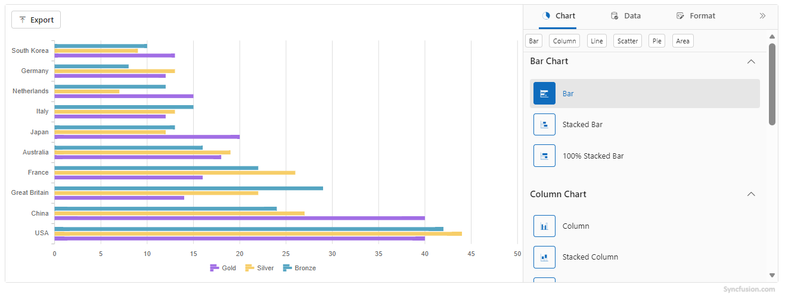

# Appearance in Blazor ChartWizard Component

This topic describes appearance-related properties for the `SfChartWizard` component and shows examples for applying them.

## ChartWizard Appearance Properties

| Property                | Type    | Default    | Description |
|-------------------------|---------|------------|-------------|
| `Width`                 | string  | "100%"     | Sets the width of the ChartWizard (e.g., "800px", "50%"). |
| `Height`                | string  | "100%"     | Sets the height of the ChartWizard (e.g., "600px", "75%"). |
| `Theme`                 | Theme   | Material   | Sets the visual theme for the component and its sub-components. |
| `EnableRtl`             | bool    | false      | Enables right-to-left layout for RTL languages. |
| `PropertyPanelExpanded` | bool    | true       | Shows or hides the property panel on initial render. |

### Width

Sets the horizontal size of the `SfChartWizard`. Accepts pixel values (for fixed width) or percentage values (for responsive layouts).

```
<SfChartWizard Width="800px"> ... </SfChartWizard>

<SfChartWizard Width="80%"> ... </SfChartWizard>
```

### Height

Sets the vertical size of the `SfChartWizard`. Use pixel or percentage values depending on desired layout.

```razor
<SfChartWizard Height="600px"> ... </SfChartWizard>

<SfChartWizard Height="100%"> ... </SfChartWizard>
```

### Theme

Set the `Theme` property to apply built-in themes. 

```
<SfChartWizard Theme="Theme.Fluent2"> ... </SfChartWizard>
```

N>
Check out all the available themes [`here`].

### EnableRtl

Description: When `true`, enables right-to-left layout for languages such as Arabic or Hebrew. Affects alignment of header, panel, and controls.

```
<SfChartWizard EnableRtl="true"> ... </SfChartWizard>
```

### PropertyPanelExpanded

Controls whether the property panel is expanded on initial render. Set to `false` to start with a collapsed panel.

```
<SfChartWizard PropertyPanelExpanded="false"> ... </SfChartWizard>
```

## Example:

```
@using Syncfusion.Blazor.ChartWizard

<div class="control-section">
    <SfChartWizard Width="90%" Theme="Theme.Bootstrap" PropertyPanelExpanded="true">
        <ChartSettings DataSource="@OlympicsDataSource"
                        CategoryFields="@(new[] { "Country" })"
                        SeriesFields="@(new[] { "Gold", "Silver", "Bronze" })"
                        SeriesType="ChartWizardSeriesType.Bar"
                        EnablePropertyPanel="true"
                        AllowExport="true">
        </ChartSettings>
    </SfChartWizard>
</div>

@code {
    private readonly List<string> chartSeries = new() { "Gold", "Silver", "Bronze" };
    private readonly List<string> categories = new() { "Country" };

    private readonly List<OlympicsData> OlympicsDataSource = new()
    {
        new OlympicsData { Country = "USA", CountryCode = "USA", Gold = 40, Silver = 44, Bronze = 42 },
        new OlympicsData { Country = "China", CountryCode = "CHN", Gold = 40, Silver = 27, Bronze = 24 },
        new OlympicsData { Country = "Great Britain", CountryCode = "GBR", Gold = 14, Silver = 22, Bronze = 29 },
        new OlympicsData { Country = "France", CountryCode = "FRA", Gold = 16, Silver = 26, Bronze = 22 },
        new OlympicsData { Country = "Australia", CountryCode = "AUS", Gold = 18, Silver = 19, Bronze = 16 },
        new OlympicsData { Country = "Japan", CountryCode = "JPN", Gold = 20, Silver = 12, Bronze = 13 },
        new OlympicsData { Country = "Italy", CountryCode = "ITA", Gold = 12, Silver = 13, Bronze = 15 },
        new OlympicsData { Country = "Netherlands", CountryCode = "NLD", Gold = 15, Silver = 7,  Bronze = 12 },
        new OlympicsData { Country = "Germany", CountryCode = "DEU", Gold = 12, Silver = 13, Bronze = 8  },
        new OlympicsData { Country = "South Korea", CountryCode = "KOR", Gold = 13, Silver = 9,  Bronze = 10 }
    };

    public class OlympicsData
    {
        public string Country { get; set; }
        public int Gold { get; set; }
        public int Silver { get; set; }
        public int Bronze { get; set; }
    }
}

```

> 

## See also

- Explore the [Chart Wizard Demo]("Demo_Link") for interactive samples.
