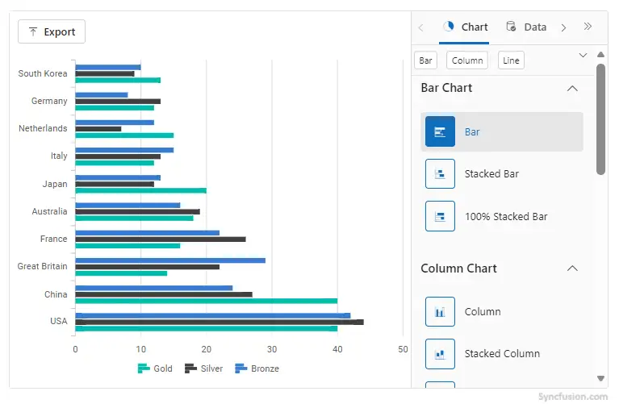
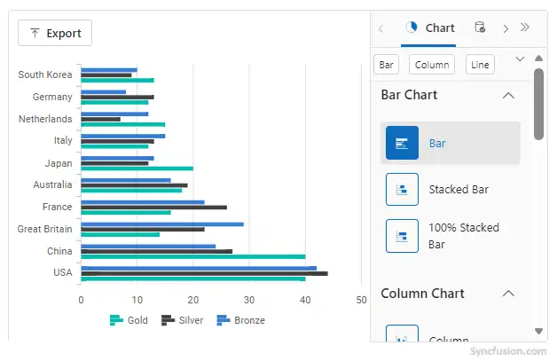
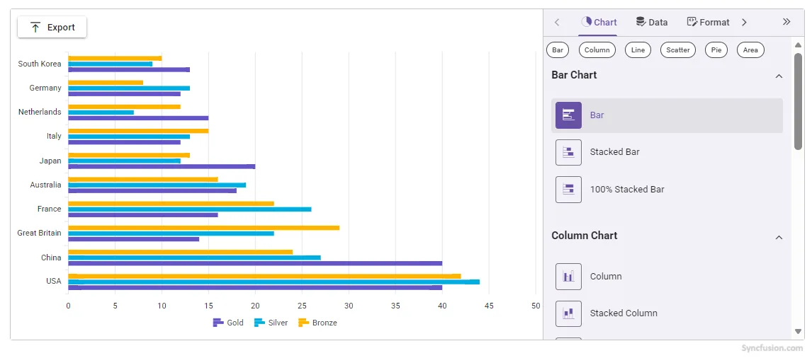
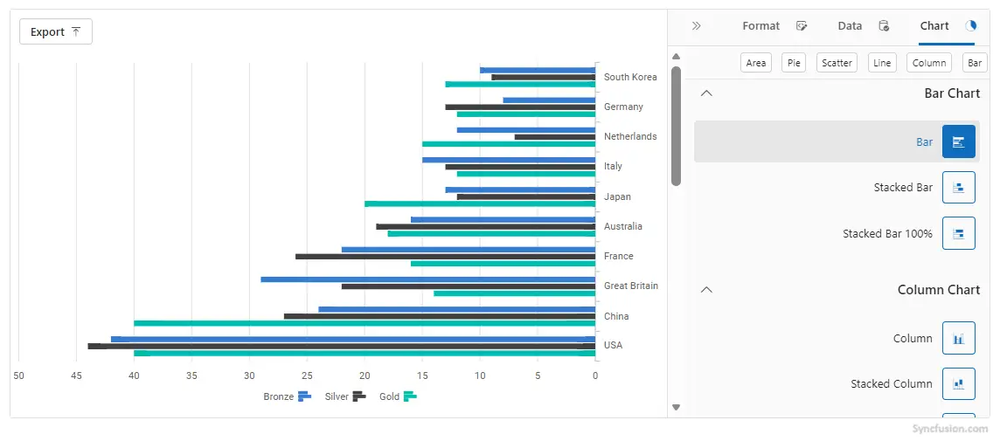
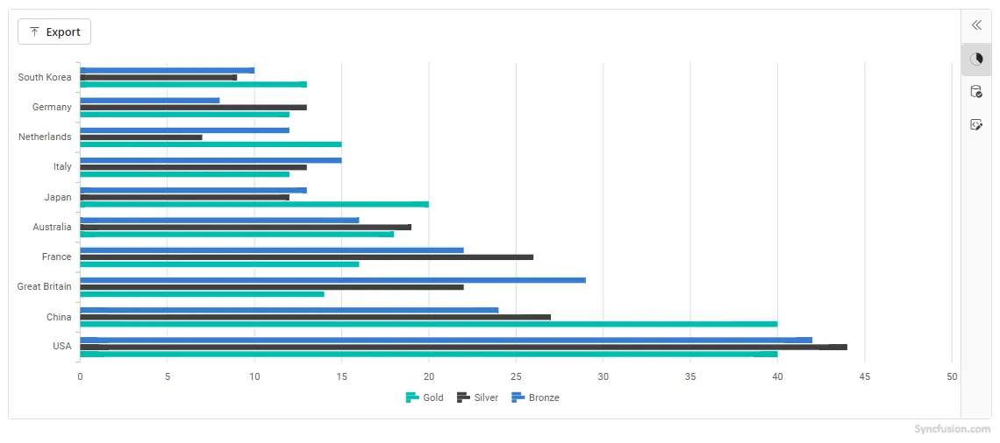

# Blazor Chart Wizard Appearance

This guide explains how to customize the appearance of the `Chart Wizard` component in Blazor. It describes the available customization properties and provides examples for each option.

## Appearance Properties Overview

| Property                | Type    | Default    | Description |
|-------------------------|---------|------------|-------------|
| `Width`                 | string  | "100%"     | Sets the width of the Chart Wizard (e.g., "800px", "50%"). |
| `Height`                | string  | "100%"     | Sets the height of the Chart Wizard (e.g., "600px", "75%"). |
| `Theme`                 | [`Theme`](https://help.syncfusion.com/cr/blazor/Syncfusion.Blazor.Theme.html) | `Material` | Sets the visual theme applied to the chart area. Common values include `Material3`, `Fluent2`, `Bootstrap5`, and `Tailwind3`. |
| `EnableRtl`             | bool    | false      | Enables right-to-left layout for RTL languages. |
| `PropertyPanelExpanded` | bool    | true       | Determines whether the property panel is expanded on initial render. |

### Width and Height

You can control the size of the Chart Wizard by specifying the [`Width`](https://help.syncfusion.com/cr/blazor/Syncfusion.Blazor.ChartWizard.SfChartWizard.html#Syncfusion_Blazor_ChartWizard_SfChartWizard_Width) and [`Height`](https://help.syncfusion.com/cr/blazor/Syncfusion.Blazor.ChartWizard.SfChartWizard.html#Syncfusion_Blazor_ChartWizard_SfChartWizard_Height) properties. Use pixel values for fixed sizing or percentages for responsive layouts.

### In Percentage

```cshtml

@using Syncfusion.Blazor.ChartWizard

<div class="control-section">
    <SfChartWizard Width="60%" Height="60%">
        <ChartSettings DataSource="@OlympicsDataSource"
                       CategoryFields="@categories"
                       SeriesType="ChartWizardSeriesType.Bar"
                       SeriesFields="@chartSeries">
        </ChartSettings>
    </SfChartWizard>
</div>

@code {
    private readonly List<string> chartSeries = new() { "Gold", "Silver", "Bronze" };
    private readonly List<string> categories = new() { "Country", "CountryCode" };

    public class OlympicsData
    {
        public string? Country { get; set; }
        public string? CountryCode { get; set; }
        public int Gold { get; set; }
        public int Silver { get; set; }
        public int Bronze { get; set; }
    }

    private readonly List<OlympicsData> OlympicsDataSource = new()
    {
        new OlympicsData { Country = "USA", CountryCode = "USA", Gold = 40, Silver = 44, Bronze = 42 },
        new OlympicsData { Country = "China", CountryCode = "CHN", Gold = 40, Silver = 27, Bronze = 24 },
        new OlympicsData { Country = "Great Britain", CountryCode = "GBR", Gold = 14, Silver = 22, Bronze = 29 },
        new OlympicsData { Country = "France", CountryCode = "FRA", Gold = 16, Silver = 26, Bronze = 22 },
        new OlympicsData { Country = "Australia", CountryCode = "AUS", Gold = 18, Silver = 19, Bronze = 16 },
        new OlympicsData { Country = "Japan", CountryCode = "JPN", Gold = 20, Silver = 12, Bronze = 13 },
        new OlympicsData { Country = "Italy", CountryCode = "ITA", Gold = 12, Silver = 13, Bronze = 15 },
        new OlympicsData { Country = "Netherlands", CountryCode = "NLD", Gold = 15, Silver = 7,  Bronze = 12 },
        new OlympicsData { Country = "Germany", CountryCode = "DEU", Gold = 12, Silver = 13, Bronze = 8  },
        new OlympicsData { Country = "South Korea", CountryCode = "KOR", Gold = 13, Silver = 9,  Bronze = 10 }
    };
}

```



### In Pixels

```cshtml

@using Syncfusion.Blazor.ChartWizard

<div class="control-section">
    <SfChartWizard Width="650px" Height="400px">
        <ChartSettings DataSource="@OlympicsDataSource"
                       CategoryFields="@categories"
                       SeriesType="ChartWizardSeriesType.Bar"
                       SeriesFields="@chartSeries">
        </ChartSettings>
    </SfChartWizard>
</div>

@code {
    private readonly List<string> chartSeries = new() { "Gold", "Silver", "Bronze" };
    private readonly List<string> categories = new() { "Country", "CountryCode" };

    public class OlympicsData
    {
        public string? Country { get; set; }
        public string? CountryCode { get; set; }
        public int Gold { get; set; }
        public int Silver { get; set; }
        public int Bronze { get; set; }
    }

    private readonly List<OlympicsData> OlympicsDataSource = new()
    {
        new OlympicsData { Country = "USA", CountryCode = "USA", Gold = 40, Silver = 44, Bronze = 42 },
        new OlympicsData { Country = "China", CountryCode = "CHN", Gold = 40, Silver = 27, Bronze = 24 },
        new OlympicsData { Country = "Great Britain", CountryCode = "GBR", Gold = 14, Silver = 22, Bronze = 29 },
        new OlympicsData { Country = "France", CountryCode = "FRA", Gold = 16, Silver = 26, Bronze = 22 },
        new OlympicsData { Country = "Australia", CountryCode = "AUS", Gold = 18, Silver = 19, Bronze = 16 },
        new OlympicsData { Country = "Japan", CountryCode = "JPN", Gold = 20, Silver = 12, Bronze = 13 },
        new OlympicsData { Country = "Italy", CountryCode = "ITA", Gold = 12, Silver = 13, Bronze = 15 },
        new OlympicsData { Country = "Netherlands", CountryCode = "NLD", Gold = 15, Silver = 7,  Bronze = 12 },
        new OlympicsData { Country = "Germany", CountryCode = "DEU", Gold = 12, Silver = 13, Bronze = 8  },
        new OlympicsData { Country = "South Korea", CountryCode = "KOR", Gold = 13, Silver = 9,  Bronze = 10 }
    };
}

```




### Theme

The [`Theme`](https://help.syncfusion.com/cr/blazor/Syncfusion.Blazor.ChartWizard.SfChartWizard.html#Syncfusion_Blazor_ChartWizard_SfChartWizard_Theme) property applies a built-in visual theme to the chart area. It accepts a value from the [`Theme`](https://help.syncfusion.com/cr/blazor/Syncfusion.Blazor.Theme.html) enumeration, such as `Theme.Material3`, `Theme.Fluent2`, `Theme.Bootstrap5`, or `Theme.Tailwind3`. Select a theme that matches the look and feel of your application. The `Theme` enum is defined in the `Syncfusion.Blazor` namespace.

```cshtml

@using Syncfusion.Blazor
@using Syncfusion.Blazor.ChartWizard

<div class="control-section">
    <SfChartWizard Theme="Theme.Material3">
        <ChartSettings DataSource="@OlympicsDataSource"
                       CategoryFields="@categories"
                       SeriesType="ChartWizardSeriesType.Bar"
                       SeriesFields="@chartSeries">
        </ChartSettings>
    </SfChartWizard>
</div>

@code {
    private readonly List<string> chartSeries = new() { "Gold", "Silver", "Bronze" };
    private readonly List<string> categories = new() { "Country", "CountryCode" };

    public class OlympicsData
    {
        public string? Country { get; set; }
        public string? CountryCode { get; set; }
        public int Gold { get; set; }
        public int Silver { get; set; }
        public int Bronze { get; set; }
    }

    private readonly List<OlympicsData> OlympicsDataSource = new()
    {
        new OlympicsData { Country = "USA", CountryCode = "USA", Gold = 40, Silver = 44, Bronze = 42 },
        new OlympicsData { Country = "China", CountryCode = "CHN", Gold = 40, Silver = 27, Bronze = 24 },
        new OlympicsData { Country = "Great Britain", CountryCode = "GBR", Gold = 14, Silver = 22, Bronze = 29 },
        new OlympicsData { Country = "France", CountryCode = "FRA", Gold = 16, Silver = 26, Bronze = 22 },
        new OlympicsData { Country = "Australia", CountryCode = "AUS", Gold = 18, Silver = 19, Bronze = 16 },
        new OlympicsData { Country = "Japan", CountryCode = "JPN", Gold = 20, Silver = 12, Bronze = 13 },
        new OlympicsData { Country = "Italy", CountryCode = "ITA", Gold = 12, Silver = 13, Bronze = 15 },
        new OlympicsData { Country = "Netherlands", CountryCode = "NLD", Gold = 15, Silver = 7,  Bronze = 12 },
        new OlympicsData { Country = "Germany", CountryCode = "DEU", Gold = 12, Silver = 13, Bronze = 8  },
        new OlympicsData { Country = "South Korea", CountryCode = "KOR", Gold = 13, Silver = 9,  Bronze = 10 }
    };
}

```




N> The `Theme` property applies the selected theme to the chart area, not the entire Chart Wizard UI. For a consistent look across the whole component, refer to the theme section in [Getting started](./getting-started.md).


### EnableRtl

Set the [`EnableRtl`](https://help.syncfusion.com/cr/blazor/Syncfusion.Blazor.ChartWizard.SfChartWizard.html#Syncfusion_Blazor_ChartWizard_SfChartWizard_EnableRtl) property to `true` to enable right-to-left (RTL) layout support. When enabled, the Chart Wizard automatically adjusts the alignment and layout of its elements to support RTL languages such as Arabic and Hebrew.

```cshtml

@using Syncfusion.Blazor.ChartWizard

<div class="control-section">
    <SfChartWizard EnableRtl="true">
        <ChartSettings DataSource="@OlympicsDataSource"
                       CategoryFields="@categories"
                       SeriesType="ChartWizardSeriesType.Bar"
                       SeriesFields="@chartSeries">
        </ChartSettings>
    </SfChartWizard>
</div>

@code {
    private readonly List<string> chartSeries = new() { "Gold", "Silver", "Bronze" };
    private readonly List<string> categories = new() { "Country", "CountryCode" };

    public class OlympicsData
    {
        public string? Country { get; set; }
        public string? CountryCode { get; set; }
        public int Gold { get; set; }
        public int Silver { get; set; }
        public int Bronze { get; set; }
    }

    private readonly List<OlympicsData> OlympicsDataSource = new()
    {
        new OlympicsData { Country = "USA", CountryCode = "USA", Gold = 40, Silver = 44, Bronze = 42 },
        new OlympicsData { Country = "China", CountryCode = "CHN", Gold = 40, Silver = 27, Bronze = 24 },
        new OlympicsData { Country = "Great Britain", CountryCode = "GBR", Gold = 14, Silver = 22, Bronze = 29 },
        new OlympicsData { Country = "France", CountryCode = "FRA", Gold = 16, Silver = 26, Bronze = 22 },
        new OlympicsData { Country = "Australia", CountryCode = "AUS", Gold = 18, Silver = 19, Bronze = 16 },
        new OlympicsData { Country = "Japan", CountryCode = "JPN", Gold = 20, Silver = 12, Bronze = 13 },
        new OlympicsData { Country = "Italy", CountryCode = "ITA", Gold = 12, Silver = 13, Bronze = 15 },
        new OlympicsData { Country = "Netherlands", CountryCode = "NLD", Gold = 15, Silver = 7,  Bronze = 12 },
        new OlympicsData { Country = "Germany", CountryCode = "DEU", Gold = 12, Silver = 13, Bronze = 8  },
        new OlympicsData { Country = "South Korea", CountryCode = "KOR", Gold = 13, Silver = 9,  Bronze = 10 }
    };
}

```




### PropertyPanelExpanded

The [`PropertyPanelExpanded`](https://help.syncfusion.com/cr/blazor/Syncfusion.Blazor.ChartWizard.SfChartWizard.html#Syncfusion_Blazor_ChartWizard_SfChartWizard_PropertyPanelExpanded) property determines whether the property panel is expanded when the Chart Wizard is initially rendered. Set the property to `false` to display the property panel in a collapsed state and provide more space for the chart area.

```cshtml

@using Syncfusion.Blazor.ChartWizard

<div class="control-section">
    <SfChartWizard PropertyPanelExpanded="false">
        <ChartSettings DataSource="@OlympicsDataSource"
                       CategoryFields="@categories"
                       SeriesType="ChartWizardSeriesType.Bar"
                       SeriesFields="@chartSeries">
        </ChartSettings>
    </SfChartWizard>
</div>

@code {
    private readonly List<string> chartSeries = new() { "Gold", "Silver", "Bronze" };
    private readonly List<string> categories = new() { "Country", "CountryCode" };

    public class OlympicsData
    {
        public string? Country { get; set; }
        public string? CountryCode { get; set; }
        public int Gold { get; set; }
        public int Silver { get; set; }
        public int Bronze { get; set; }
    }

    private readonly List<OlympicsData> OlympicsDataSource = new()
    {
        new OlympicsData { Country = "USA", CountryCode = "USA", Gold = 40, Silver = 44, Bronze = 42 },
        new OlympicsData { Country = "China", CountryCode = "CHN", Gold = 40, Silver = 27, Bronze = 24 },
        new OlympicsData { Country = "Great Britain", CountryCode = "GBR", Gold = 14, Silver = 22, Bronze = 29 },
        new OlympicsData { Country = "France", CountryCode = "FRA", Gold = 16, Silver = 26, Bronze = 22 },
        new OlympicsData { Country = "Australia", CountryCode = "AUS", Gold = 18, Silver = 19, Bronze = 16 },
        new OlympicsData { Country = "Japan", CountryCode = "JPN", Gold = 20, Silver = 12, Bronze = 13 },
        new OlympicsData { Country = "Italy", CountryCode = "ITA", Gold = 12, Silver = 13, Bronze = 15 },
        new OlympicsData { Country = "Netherlands", CountryCode = "NLD", Gold = 15, Silver = 7,  Bronze = 12 },
        new OlympicsData { Country = "Germany", CountryCode = "DEU", Gold = 12, Silver = 13, Bronze = 8  },
        new OlympicsData { Country = "South Korea", CountryCode = "KOR", Gold = 13, Silver = 9,  Bronze = 10 }
    };
}

```



## See Also

- Explore the [Chart Wizard Demo](#) for interactive samples.
- [Working with Data in Blazor Chart Wizard](./working-with-data)
- [Print and Export in Blazor Chart Wizard](./print-export)