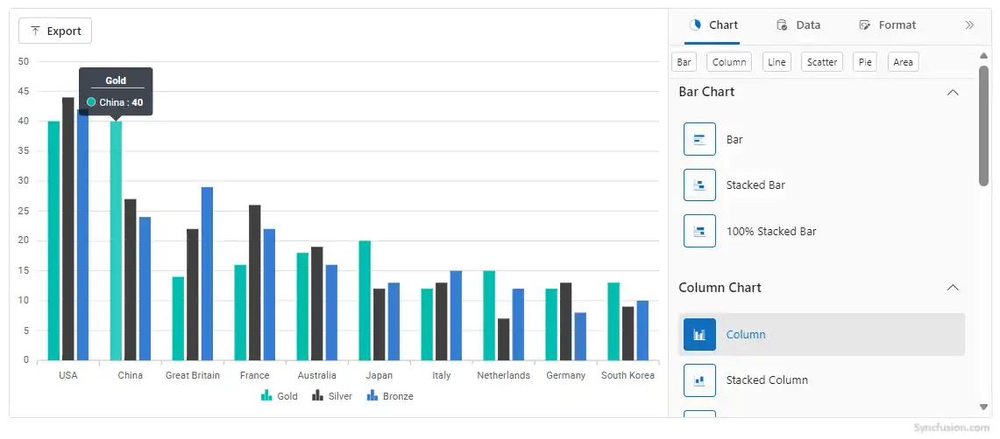
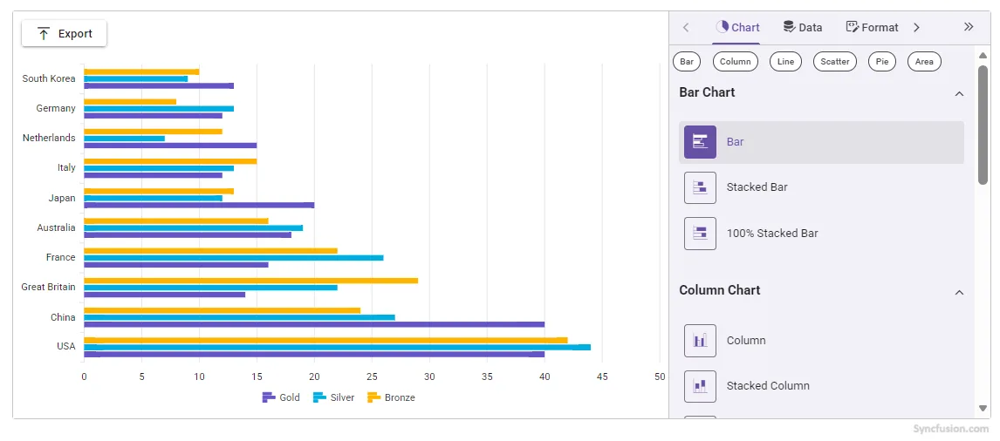

<!-- markdownlint-disable MD040 -->

# Getting Started with Blazor Chart Wizard Component in Blazor WASM App

This section briefly explains about how to include the [Blazor Chart Wizard](https://www.syncfusion.com/blazor-components/blazor-chart-wizard) component in a Blazor WebAssembly App using [Visual Studio](https://visualstudio.microsoft.com/vs/), [Visual Studio Code](https://code.visualstudio.com/), and the [.NET CLI](https://learn.microsoft.com/en-us/dotnet/core/tools/).

> **Ready to streamline your Blazor development?**  Discover the full potential of Blazor components with AI Coding Assistants. Effortlessly integrate, configure, and enhance your projects with intelligent, context-aware code suggestions, streamlined setups, and real-time insights—all seamlessly integrated into your preferred AI-powered IDEs like VS Code, Cursor, CodeStudio and more. [Explore AI Coding Assistants](https://blazor.syncfusion.com/documentation/ai-coding-assistant/overview)

## Create a new Blazor WebAssembly (Standalone) App





Create a **Blazor WebAssembly App** using Visual Studio via [Microsoft Templates](https://learn.microsoft.com/en-us/aspnet/core/blazor/tooling?view=aspnetcore-10.0&pivots=vs) or the [Blazor Extension](https://blazor.syncfusion.com/documentation/visual-studio-integration/template-studio).





Run the following command to create a new Blazor WebAssembly App.




dotnet new blazorwasm -o BlazorApp
cd BlazorApp




Alternatively, create a **Blazor WebAssembly App** using Visual Studio Code via [Microsoft Templates](https://learn.microsoft.com/en-us/aspnet/core/blazor/tooling?view=aspnetcore-10.0&pivots=vsc) or the [Blazor Extension](https://blazor.syncfusion.com/documentation/visual-studio-code-integration/create-project), or the [C# Dev Kit](https://marketplace.visualstudio.com/items?itemName=ms-dotnettools.csdevkit) extension.





Run the following command to create a new Blazor WebAssembly App.




dotnet new blazorwasm -o BlazorApp
cd BlazorApp








## Install the required Blazor packages

Install the [Syncfusion.Blazor.ChartWizard](https://www.nuget.org/packages/Syncfusion.Blazor.ChartWizard/) and [Syncfusion.Blazor.Themes](https://www.nuget.org/packages/Syncfusion.Blazor.Themes/) NuGet packages. All Syncfusion Blazor packages are available on [nuget.org](https://www.nuget.org/packages?q=syncfusion.blazor). See the [NuGet packages](https://blazor.syncfusion.com/documentation/nuget-packages) topic for details.





1. Go to *Tools → NuGet Package Manager → Manage NuGet Packages for Solution*.
2. Search the required NuGet packages (`Syncfusion.Blazor.ChartWizard` and `Syncfusion.Blazor.Themes`) and install them.

Alternatively, you can install the same packages using the Package Manager Console with the following commands.




Install-Package Syncfusion.Blazor.ChartWizard -Version {{ site.releaseversion }}
Install-Package Syncfusion.Blazor.Themes -Version {{ site.releaseversion }}








Open the terminal and run the following commands.




dotnet add package Syncfusion.Blazor.ChartWizard -v {{ site.releaseversion }}
dotnet add package Syncfusion.Blazor.Themes -v {{ site.releaseversion }}








Open the command prompt and run the following commands.




dotnet add package Syncfusion.Blazor.ChartWizard -v {{ site.releaseversion }}
dotnet add package Syncfusion.Blazor.Themes -v {{ site.releaseversion }}








## Add import namespaces

After the package is installed, open the **~/_Imports.razor** file and import the `Syncfusion.Blazor` and `Syncfusion.Blazor.ChartWizard` namespaces.




@using Syncfusion.Blazor
@using Syncfusion.Blazor.ChartWizard




## Register the Blazor service

Open the **Program.cs** file in Blazor WebAssembly App and register the Blazor service.




....
using Syncfusion.Blazor;
....
builder.Services.AddSyncfusionBlazor();
....




## Add stylesheet and script resources
 
The theme stylesheet and script can be accessed from NuGet through [Static Web Assets](https://blazor.syncfusion.com/documentation/appearance/themes#static-web-assets). Include the [stylesheet](https://blazor.syncfusion.com/documentation/appearance/themes) and [script references](https://blazor.syncfusion.com/documentation/common/adding-script-references) in the **~wwwroot/index.html** file.




...
<link href="_content/Syncfusion.Blazor.Themes/fluent2.css" rel="stylesheet" />
...




## Add Blazor Chart Wizard component

Open a Razor file located in the **~/Pages/*.razor** (for example, **Home.razor**) and add the [Blazor Chart Wizard](https://www.syncfusion.com/blazor-components/blazor-chart-wizard) component inside the razor file.




<SfChartWizard>

</SfChartWizard>




**Run the application**





Press <kbd>Ctrl</kbd>+<kbd>F5</kbd> (Windows) or <kbd>⌘</kbd>+<kbd>F5</kbd> (macOS) to launch the application. The Blazor Chart Wizard component will render in your default web browser.





Open the terminal and run the following command.




dotnet run








Open the command prompt and run the following command.




dotnet run










## Populate Blazor Chart Wizard data

To bind data for the Chart Wizard component, you can assign a IEnumerable object to the `DataSource` property.




public class OlympicsData
{
    public string? Country { get; set; }
    public string? CountryCode { get; set; }
    public int Gold { get; set; }
    public int Silver { get; set; }
    public int Bronze { get; set; }
}

private readonly List<OlympicsData> OlympicsDataSource = new()
{
    new OlympicsData { Country = "USA", CountryCode = "USA", Gold = 40, Silver = 44, Bronze = 42 },
    new OlympicsData { Country = "China", CountryCode = "CHN", Gold = 40, Silver = 27, Bronze = 24 },
    new OlympicsData { Country = "Great Britain", CountryCode = "GBR", Gold = 14, Silver = 22, Bronze = 29 },
    new OlympicsData { Country = "France", CountryCode = "FRA", Gold = 16, Silver = 26, Bronze = 22 },
    new OlympicsData { Country = "Australia", CountryCode = "AUS", Gold = 18, Silver = 19, Bronze = 16 },
    new OlympicsData { Country = "Japan", CountryCode = "JPN", Gold = 20, Silver = 12, Bronze = 13 },
    new OlympicsData { Country = "Italy", CountryCode = "ITA", Gold = 12, Silver = 13, Bronze = 15 },
    new OlympicsData { Country = "Netherlands", CountryCode = "NLD", Gold = 15, Silver = 7,  Bronze = 12 },
    new OlympicsData { Country = "Germany", CountryCode = "DEU", Gold = 12, Silver = 13, Bronze = 8  },
    new OlympicsData { Country = "South Korea", CountryCode = "KOR", Gold = 13, Silver = 9,  Bronze = 10 }
};




Now, populate the categories and chartSeries collections with the appropriate data defining the chart’s categories and series. Then, assign these values to the `CategoryFields` and `SeriesFields` properties of the `ChartSettings`, respectively.

N>
The default series type is Line. Use the `SeriesType` property to change the series type.




@using Syncfusion.Blazor.ChartWizard

    <SfChartWizard>
        <ChartSettings DataSource="@OlympicsDataSource"
                       CategoryFields="@categories"
                       SeriesType="ChartWizardSeriesType.Column"
                       SeriesFields="@chartSeries">
        </ChartSettings>
    </SfChartWizard>

@code 
{
    private readonly List<string> chartSeries = new() { "Gold", "Silver", "Bronze" };
    private readonly List<string> categories = new() { "Country", "CountryCode" };

    public class OlympicsData
    {
        public string? Country { get; set; }
        public string? CountryCode { get; set; }
        public int Gold { get; set; }
        public int Silver { get; set; }
        public int Bronze { get; set; }
    }

    private readonly List<OlympicsData> OlympicsDataSource = new()
    {
        new OlympicsData { Country = "USA", CountryCode = "USA", Gold = 40, Silver = 44, Bronze = 42 },
        new OlympicsData { Country = "China", CountryCode = "CHN", Gold = 40, Silver = 27, Bronze = 24 },
        new OlympicsData { Country = "Great Britain", CountryCode = "GBR", Gold = 14, Silver = 22, Bronze = 29 },
        new OlympicsData { Country = "France", CountryCode = "FRA", Gold = 16, Silver = 26, Bronze = 22 },
        new OlympicsData { Country = "Australia", CountryCode = "AUS", Gold = 18, Silver = 19, Bronze = 16 },
        new OlympicsData { Country = "Japan", CountryCode = "JPN", Gold = 20, Silver = 12, Bronze = 13 },
        new OlympicsData { Country = "Italy", CountryCode = "ITA", Gold = 12, Silver = 13, Bronze = 15 },
        new OlympicsData { Country = "Netherlands", CountryCode = "NLD", Gold = 15, Silver = 7,  Bronze = 12 },
        new OlympicsData { Country = "Germany", CountryCode = "DEU", Gold = 12, Silver = 13, Bronze = 8  },
        new OlympicsData { Country = "South Korea", CountryCode = "KOR", Gold = 13, Silver = 9,  Bronze = 10 }
    };
}




## Prerequisites

In order to apply same theme update for the overall Chart Wizard UI, include the same theme stylesheet (this can be accessed from NuGet through Static Web Assets) in the <head> tag in the App.razor file as shown below:




<head>
    ....
    <link href="_content/Syncfusion.Blazor.Themes/material3.css" rel="stylesheet" />
</head>




The `Theme` property is used to specify the visual theme applied to the chart.




@using Syncfusion.Blazor.ChartWizard

    <SfChartWizard Theme="Theme.Material3">
        <ChartSettings DataSource="@OlympicsDataSource"
                       CategoryFields="@categories"
                       SeriesType="ChartWizardSeriesType.Bar"
                       SeriesFields="@chartSeries">
        </ChartSettings>
    </SfChartWizard>

@code 
{
    private readonly List<string> chartSeries = new() { "Gold", "Silver", "Bronze" };
    private readonly List<string> categories = new() { "Country", "CountryCode" };

    public class OlympicsData
    {
        public string? Country { get; set; }
        public string? CountryCode { get; set; }
        public int Gold { get; set; }
        public int Silver { get; set; }
        public int Bronze { get; set; }
    }

    private readonly List<OlympicsData> OlympicsDataSource = new()
    {
        new OlympicsData { Country = "USA", CountryCode = "USA", Gold = 40, Silver = 44, Bronze = 42 },
        new OlympicsData { Country = "China", CountryCode = "CHN", Gold = 40, Silver = 27, Bronze = 24 },
        new OlympicsData { Country = "Great Britain", CountryCode = "GBR", Gold = 14, Silver = 22, Bronze = 29 },
        new OlympicsData { Country = "France", CountryCode = "FRA", Gold = 16, Silver = 26, Bronze = 22 },
        new OlympicsData { Country = "Australia", CountryCode = "AUS", Gold = 18, Silver = 19, Bronze = 16 },
        new OlympicsData { Country = "Japan", CountryCode = "JPN", Gold = 20, Silver = 12, Bronze = 13 },
        new OlympicsData { Country = "Italy", CountryCode = "ITA", Gold = 12, Silver = 13, Bronze = 15 },
        new OlympicsData { Country = "Netherlands", CountryCode = "NLD", Gold = 15, Silver = 7,  Bronze = 12 },
        new OlympicsData { Country = "Germany", CountryCode = "DEU", Gold = 12, Silver = 13, Bronze = 8  },
        new OlympicsData { Country = "South Korea", CountryCode = "KOR", Gold = 13, Silver = 9,  Bronze = 10 }
    };
}




## See also

1. [Getting Started with Blazor for Client-Side in .NET Core CLI](https://blazor.syncfusion.com/documentation/getting-started/blazor-webassembly-app)
2. [Getting Started with Blazor for Server-Side in Visual Studio](https://blazor.syncfusion.com/documentation/getting-started/blazor-web-app)
3. [Getting Started with Blazor for Server-Side in .NET Core CLI](https://blazor.syncfusion.com/documentation/getting-started/blazor-web-app)
