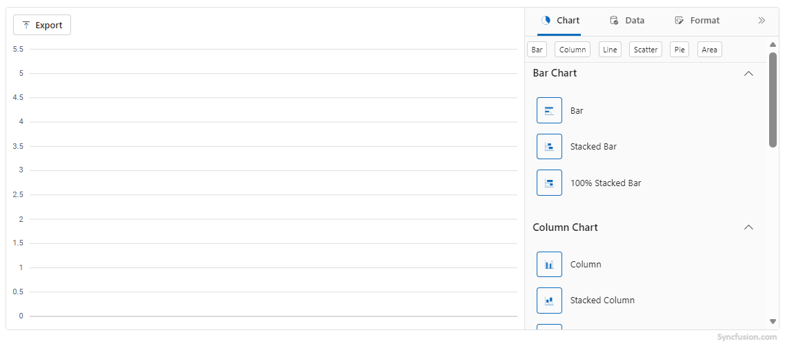
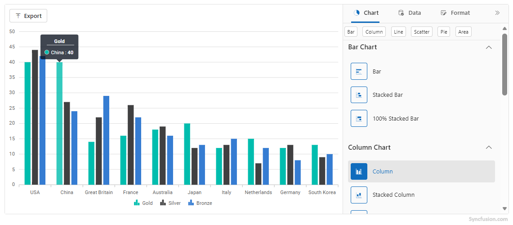

# Getting Started with Blazor Chart Wizard Component in Web App

This section briefly explains about how to include [Blazor Chart Wizard](https://www.syncfusion.com/blazor-components/blazor-chart-wizard) component in your Blazor Web App using [Visual Studio](https://visualstudio.microsoft.com/vs/), [Visual Studio Code](https://code.visualstudio.com/), and the [.NET CLI](https://learn.microsoft.com/en-us/dotnet/core/tools/).

> **Ready to streamline your Syncfusion<sup style="font-size:70%">&reg;</sup> Blazor development?** <br/>Discover the full potential of Syncfusion<sup style="font-size:70%">&reg;</sup> Blazor components with Syncfusion<sup style="font-size:70%">&reg;</sup> AI Coding Assistants. Effortlessly integrate, configure, and enhance your projects with intelligent, context-aware code suggestions, streamlined setups, and real-time insights—all seamlessly integrated into your preferred AI-powered IDEs like VS Code, Cursor, Syncfusion<sup style="font-size:70%">&reg;</sup> CodeStudio and more. [Explore Syncfusion<sup style="font-size:70%">&reg;</sup> AI Coding Assistants](https://blazor.syncfusion.com/documentation/ai-coding-assistant/overview)





## Prerequisites

* [System requirements for Blazor components](https://blazor.syncfusion.com/documentation/system-requirements)

## Create a new Blazor Web App in Visual Studio

Create a **Blazor Web App** using Visual Studio via [Microsoft Templates](https://learn.microsoft.com/en-us/aspnet/core/blazor/tooling?view=aspnetcore-10.0&pivots=vs) or the [Syncfusion<sup style="font-size:70%">&reg;</sup> Blazor Extension](https://blazor.syncfusion.com/documentation/visual-studio-integration/template-studio). For detailed instructions, refer to the [Blazor Web App Getting Started](https://blazor.syncfusion.com/documentation/getting-started/blazor-web-app) documentation.





## Prerequisites

* [System requirements for Blazor components](https://blazor.syncfusion.com/documentation/system-requirements)

## Create a new Blazor Web App in Visual Studio Code

Create a **Blazor Web App** using Visual Studio Code via [Microsoft Templates](https://learn.microsoft.com/en-us/aspnet/core/blazor/tooling?view=aspnetcore-10.0&pivots=vsc) or the [Syncfusion<sup style="font-size:70%">&reg;</sup> Blazor Extension](https://blazor.syncfusion.com/documentation/visual-studio-code-integration/create-project). For detailed instructions, refer to the [Blazor Web App Getting Started](https://blazor.syncfusion.com/documentation/getting-started/blazor-web-app?tabcontent=visual-studio-code) documentation.

For example, in a Blazor Web App with the `Auto` interactive render mode, use the following commands in the integrated terminal (<kbd>Ctrl</kbd>+<kbd>`</kbd>).




dotnet new blazor -o BlazorWebApp -int Auto
cd BlazorWebApp
cd BlazorWebApp.Client








## Prerequisites

Install the latest version of [.NET SDK](https://dotnet.microsoft.com/en-us/download). If you previously installed the SDK, you can determine the installed version by executing the following command in a command prompt (Windows) or terminal (macOS) or command shell (Linux).




dotnet --version




## Create a Blazor Web App using .NET CLI

Run the following command to create a new Blazor Web App in a command prompt (Windows) or terminal (macOS) or command shell (Linux). For detailed instructions, refer to the [Blazor Web App Getting Started](https://blazor.syncfusion.com/documentation/getting-started/blazor-web-app?tabcontent=.net-cli) documentation.

For example, in a Blazor Web App with the `Auto` interactive render mode, use the following commands:




dotnet new blazor -o BlazorApp -int Auto
cd BlazorApp
cd BlazorApp.Client




This command creates new Blazor Web App and places it in a new directory called `BlazorApp` inside your current location. See [Create Blazor app topic](https://dotnet.microsoft.com/en-us/learn/aspnet/blazor-tutorial/create) and [dotnet new CLI command](https://learn.microsoft.com/en-us/aspnet/core/blazor/tooling?pivots=linux-macos&view=aspnetcore-8.0) topics for more details.





N> Configure the appropriate [Interactive render mode](https://learn.microsoft.com/en-us/aspnet/core/blazor/components/render-modes?view=aspnetcore-10.0#render-modes) and [Interactivity location](https://learn.microsoft.com/en-us/aspnet/core/blazor/tooling?view=aspnetcore-10.0&pivots=vs) while creating a Blazor Web App. For detailed information, refer to the [interactive render mode documentation](https://blazor.syncfusion.com/documentation/common/interactive-render-mode).

## Install Syncfusion<sup style="font-size:70%">&reg;</sup> Blazor packages

Install [Syncfusion.Blazor.ChartWizard](https://www.nuget.org/packages/Syncfusion.Blazor.ChartWizard/) NuGet package in your project.

Alternatively, run the following command in the Package Manager Console to achieve the same.




Install-Package Syncfusion.Blazor.ChartWizard -Version {{ site.releaseversion }}




If using the `WebAssembly` or `Auto` render modes in the Blazor Web App, install this package in the client project.

N> All Syncfusion Blazor packages are available on [nuget.org](https://www.nuget.org/packages?q=syncfusion.blazor). See the [NuGet packages](https://blazor.syncfusion.com/documentation/nuget-packages) topic for details.

## Add Import Namespaces

After the package is installed, open the **~/_Imports.razor** file from the client project and import the `Syncfusion.Blazor` and `Syncfusion.Blazor.ChartWizard` namespaces.




@using Syncfusion.Blazor
@using Syncfusion.Blazor.ChartWizard




## Register Syncfusion<sup style="font-size:70%">&reg;</sup> Blazor Service

Register the Syncfusion<sup style="font-size:70%">&reg;</sup> Blazor Service in the **Program.cs** file of your Blazor Web App.




....
using Syncfusion.Blazor;
....
builder.Services.AddSyncfusionBlazor();
....




N> If the **Interactive Render Mode** is set to `WebAssembly` or `Auto`, register the Syncfusion<sup style="font-size:70%">&reg;</sup> Blazor service in **Program.cs** files of both the server and client projects in your Blazor Web App.

## Add script resources

The script can be accessed from NuGet through [Static Web Assets](https://blazor.syncfusion.com/documentation/appearance/themes#static-web-assets). Include the script reference in the **~/Components/App.razor** file.

```html

<script src="_content/Syncfusion.Blazor.Core/scripts/syncfusion-blazor.min.js" type="text/javascript"></script>

<!-- Blazor Chart Wizard Component script reference.-->
<!-- <script src="_content/Syncfusion.Blazor.ChartWizard/scripts/sf-chart-wizard.min.js" type="text/javascript"></script> -->

```

N> Check out the [Adding Script Reference](https://blazor.syncfusion.com/documentation/common/adding-script-references) topic to learn different approaches for adding script references in your Blazor application.

## Add Syncfusion<sup style="font-size:70%">&reg;</sup> Blazor Chart Wizard component

Add the Syncfusion<sup style="font-size:70%">&reg;</sup> Blazor Chart Wizard component in the **~/Components/Pages/*.razor** file. If the interactivity location is set to `Per page/component` in the Web App, define a render mode at the top of the `~Pages/*.razor` file. (For example, `InteractiveServer`, `InteractiveWebAssembly` or `InteractiveAuto`).

N> If the **Interactivity Location** is set to `Global` with `Auto` or `WebAssembly`, the render mode is automatically configured in the `App.razor` file by default.




@* desired render mode define here *@
@rendermode InteractiveAuto







<SfChartWizard>

</SfChartWizard>




* Press <kbd>Ctrl</kbd>+<kbd>F5</kbd> (Windows) or <kbd>⌘</kbd>+<kbd>F5</kbd> (macOS) to launch the application. This will render the Syncfusion<sup style="font-size:70%">&reg;</sup> Blazor Chart Wizard component in the default web browser.



## Populate Blazor Chart Wizard data

To bind data for the chart wizard component, you can assign a IEnumerable object to the [DataSource]() property.




public class OlympicsData
{
    public string? Country { get; set; }
    public string? CountryCode { get; set; }
    public int Gold { get; set; }
    public int Silver { get; set; }
    public int Bronze { get; set; }
}

private readonly List<OlympicsData> OlympicsDataSource = new()
{
    new OlympicsData { Country = "USA", CountryCode = "USA", Gold = 40, Silver = 44, Bronze = 42 },
    new OlympicsData { Country = "China", CountryCode = "CHN", Gold = 40, Silver = 27, Bronze = 24 },
    new OlympicsData { Country = "Great Britain", CountryCode = "GBR", Gold = 14, Silver = 22, Bronze = 29 },
    new OlympicsData { Country = "France", CountryCode = "FRA", Gold = 16, Silver = 26, Bronze = 22 },
    new OlympicsData { Country = "Australia", CountryCode = "AUS", Gold = 18, Silver = 19, Bronze = 16 },
    new OlympicsData { Country = "Japan", CountryCode = "JPN", Gold = 20, Silver = 12, Bronze = 13 },
    new OlympicsData { Country = "Italy", CountryCode = "ITA", Gold = 12, Silver = 13, Bronze = 15 },
    new OlympicsData { Country = "Netherlands", CountryCode = "NLD", Gold = 15, Silver = 7,  Bronze = 12 },
    new OlympicsData { Country = "Germany", CountryCode = "DEU", Gold = 12, Silver = 13, Bronze = 8  },
    new OlympicsData { Country = "South Korea", CountryCode = "KOR", Gold = 13, Silver = 9,  Bronze = 10 }
};




Now, populate the categories and chartSeries collections with the appropriate data defining the chart’s categories and series. Then, assign these values to the `CategoryFields` and `SeriesFields` properties of the `ChartSettings`, respectively.

N>
The default series type is Line. Use the `SeriesType` property to change the series type.




<div class="control-section">
    <SfChartWizard>
        <ChartSettings DataSource="@OlympicsDataSource"
                       CategoryFields="@categories"
                       SeriesType="ChartWizardSeriesType.Column"
                       SeriesFields="@chartSeries">
        </ChartSettings>
    </SfChartWizard>
</div>

@code {
    private readonly List<string> chartSeries = new() { "Gold", "Silver", "Bronze" };
    private readonly List<string> categories = new() { "Country", "CountryCode" };

    public class OlympicsData
    {
        public string? Country { get; set; }
        public string? CountryCode { get; set; }
        public int Gold { get; set; }
        public int Silver { get; set; }
        public int Bronze { get; set; }
    }

    private readonly List<OlympicsData> OlympicsDataSource = new()
    {
        new OlympicsData { Country = "USA", CountryCode = "USA", Gold = 40, Silver = 44, Bronze = 42 },
        new OlympicsData { Country = "China", CountryCode = "CHN", Gold = 40, Silver = 27, Bronze = 24 },
        new OlympicsData { Country = "Great Britain", CountryCode = "GBR", Gold = 14, Silver = 22, Bronze = 29 },
        new OlympicsData { Country = "France", CountryCode = "FRA", Gold = 16, Silver = 26, Bronze = 22 },
        new OlympicsData { Country = "Australia", CountryCode = "AUS", Gold = 18, Silver = 19, Bronze = 16 },
        new OlympicsData { Country = "Japan", CountryCode = "JPN", Gold = 20, Silver = 12, Bronze = 13 },
        new OlympicsData { Country = "Italy", CountryCode = "ITA", Gold = 12, Silver = 13, Bronze = 15 },
        new OlympicsData { Country = "Netherlands", CountryCode = "NLD", Gold = 15, Silver = 7,  Bronze = 12 },
        new OlympicsData { Country = "Germany", CountryCode = "DEU", Gold = 12, Silver = 13, Bronze = 8  },
        new OlympicsData { Country = "South Korea", CountryCode = "KOR", Gold = 13, Silver = 9,  Bronze = 10 }
    };
}






## Theme
Blazor Chart Wizard has built-in themes that can be used to change the appearance of the chart.

### Prerequisites
In order to apply same theme update for the overall Chart Wizard UI, include the same theme stylesheet (this can be accessed from NuGet through Static Web Assets) in the <head> tag in the App.razor file as shown below:




<head>
    ....
    <link href="_content/Syncfusion.Blazor.Themes/material3.css" rel="stylesheet" />
</head>




The `Theme` property is used to specify the visual theme applied to the chart.




<div class="control-section">
    <SfChartWizard Theme="Theme.Material3">
        <ChartSettings DataSource="@OlympicsDataSource"
                       CategoryFields="@categories"
                       SeriesType="ChartWizardSeriesType.Bar"
                       SeriesFields="@chartSeries">
        </ChartSettings>
    </SfChartWizard>
</div>

@code {
    private readonly List<string> chartSeries = new() { "Gold", "Silver", "Bronze" };
    private readonly List<string> categories = new() { "Country", "CountryCode" };

    public class OlympicsData
    {
        public string? Country { get; set; }
        public string? CountryCode { get; set; }
        public int Gold { get; set; }
        public int Silver { get; set; }
        public int Bronze { get; set; }
    }

    private readonly List<OlympicsData> OlympicsDataSource = new()
    {
        new OlympicsData { Country = "USA", CountryCode = "USA", Gold = 40, Silver = 44, Bronze = 42 },
        new OlympicsData { Country = "China", CountryCode = "CHN", Gold = 40, Silver = 27, Bronze = 24 },
        new OlympicsData { Country = "Great Britain", CountryCode = "GBR", Gold = 14, Silver = 22, Bronze = 29 },
        new OlympicsData { Country = "France", CountryCode = "FRA", Gold = 16, Silver = 26, Bronze = 22 },
        new OlympicsData { Country = "Australia", CountryCode = "AUS", Gold = 18, Silver = 19, Bronze = 16 },
        new OlympicsData { Country = "Japan", CountryCode = "JPN", Gold = 20, Silver = 12, Bronze = 13 },
        new OlympicsData { Country = "Italy", CountryCode = "ITA", Gold = 12, Silver = 13, Bronze = 15 },
        new OlympicsData { Country = "Netherlands", CountryCode = "NLD", Gold = 15, Silver = 7,  Bronze = 12 },
        new OlympicsData { Country = "Germany", CountryCode = "DEU", Gold = 12, Silver = 13, Bronze = 8  },
        new OlympicsData { Country = "South Korea", CountryCode = "KOR", Gold = 13, Silver = 9,  Bronze = 10 }
    };
}





## See also

1. [Getting Started with Syncfusion<sup style="font-size:70%">&reg;</sup> Blazor Web Assembly App in Visual Studio or .NET CLI](https://blazor.syncfusion.com/documentation/getting-started/blazor-webassembly-app)
2. [Getting Started with Syncfusion<sup style="font-size:70%">&reg;</sup> Blazor Web App in Visual Studio or .NET CLI](https://blazor.syncfusion.com/documentation/getting-started/blazor-web-app)

