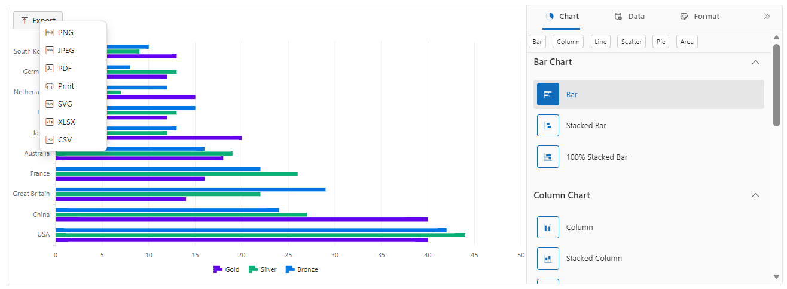

# Print and Export in Blazor ChartWizard Component

The ChartWizard supports exporting the current chart to common file formats. Available export options include `PNG`, `JPEG`, `SVG`, `PDF`, `CSV`, `XLSX`, `PRINT`.

### ChartExportSettings

`ChartExportSettings` provides a declarative way to configure export behavior inside `SfChartWizard`. Common attributes:

- `FileName` — Sets the file name of the export.
- `Width` — Sets the requested output width in pixels for image/PDF exports.
- `Height` — Sets the requested output height in pixels for image/PDF exports.
- `Orientation` — Sets the page orientation for PDF/print (`Portrait` or `Landscape`).

```
<SfChartWizard>
    ...
    <ChartExportSettings ExportType="ExportType.Pdf" FileName="SalesReport" Width="800" Height="500" Orientation="PageOrientation.Landscape" />
</SfChartWizard>
```

N>
`PRINT`: Opens the browser print dialog and prints the rendered chart. This option invokes the print workflow (it does not produce a downloadable file) and is useful for creating physical copies or printing to PDF via the browser's print-to-PDF capability.

## Exporting event

When an export is initiated the component raises an `Exporting` event and provides a `ChartExportingEventArgs` instance. Fields available on `ChartExportingEventArgs` include:

- `FileName` — the filename to use for the exported file (without extension). The component will append the appropriate extension for the selected export type.
- `Cancel` — set to `true` to cancel the export operation.
- `Width` — optional width in pixels to use for the exported output (when supported by the export type); useful to control output resolution.
- `Height` — optional height in pixels to use for the exported output (when supported by the export type).
- `Orientation` — page orientation for printable exports (`Portrait` or `Landscape`). Applies primarily to PDF/print workflows.

The following example shows how to handle the `Exporting` event.

```

@using Syncfusion.Blazor.ChartWizard

<div class="control-section">
    <SfChartWizard Exporting="OnExporting">
        <ChartSettings DataSource="@OlympicsDataSource"
                       CategoryFields="@(new[] { "Country" })"
                       SeriesFields="@(new[] { "Gold", "Silver", "Bronze" })"
                       SeriesType="ChartWizardSeriesType.Bar">
            <ChartExportSettings FileName="Medals" />
        </ChartSettings>
    </SfChartWizard>
</div>

@code {
    private void OnExporting(ChartExportingEventArgs args)
    {
        // Set a custom file name
        args.FileName = "CountriesMedalDetails";

        // Set explicit output dimensions when generating image/pdf outputs
        args.Width = 950; // pixels
        args.Height = 650; // pixels

        // Set page orientation for PDF/print exports
        args.Orientation = PageOrientation.Landscape; // or "Portrait"

        if (OlympicsDataSource == null || OlympicsDataSource.Count == 0)
        {
            // prevent export
            args.Cancel = true;
        }
    }

    private readonly List<OlympicsData> OlympicsDataSource = new()
    {
        new OlympicsData { Country = "USA", CountryCode = "USA", Gold = 40, Silver = 44, Bronze = 42 },
        new OlympicsData { Country = "China", CountryCode = "CHN", Gold = 40, Silver = 27, Bronze = 24 },
        new OlympicsData { Country = "Great Britain", CountryCode = "GBR", Gold = 14, Silver = 22, Bronze = 29 },
        new OlympicsData { Country = "France", CountryCode = "FRA", Gold = 16, Silver = 26, Bronze = 22 },
        new OlympicsData { Country = "Australia", CountryCode = "AUS", Gold = 18, Silver = 19, Bronze = 16 },
        new OlympicsData { Country = "Japan", CountryCode = "JPN", Gold = 20, Silver = 12, Bronze = 13 },
        new OlympicsData { Country = "Italy", CountryCode = "ITA", Gold = 12, Silver = 13, Bronze = 15 },
        new OlympicsData { Country = "Netherlands", CountryCode = "NLD", Gold = 15, Silver = 7,  Bronze = 12 },
        new OlympicsData { Country = "Germany", CountryCode = "DEU", Gold = 12, Silver = 13, Bronze = 8  },
        new OlympicsData { Country = "South Korea", CountryCode = "KOR", Gold = 13, Silver = 9,  Bronze = 10 }
    };

    public class OlympicsData
    {
        public string Country { get; set; }
        public int Gold { get; set; }
        public int Silver { get; set; }
        public int Bronze { get; set; }
    }
}
```

N>
- Use `args.Cancel = true` to prevent exporting.
- `FileName` should not include the file extension; the component will append the proper extension for the selected `ExportType`.
- Data export formats such as `CSV` and `XLSX` export the underlying data table and do not use `Width`/`Height`/`Orientation`.

> 

## See also

- Explore the [Chart Wizard Demo]("Demo_Link") for interactive samples.