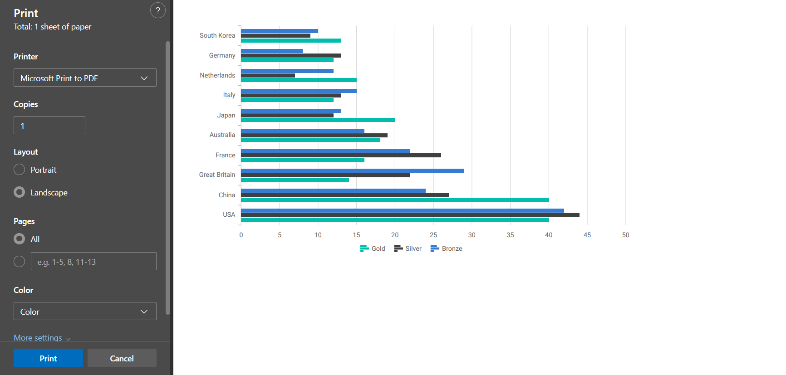

# Print and Export in Blazor Chart Wizard Component

The Chart Wizard support the export of current chart to a variety of popular file formats. Supported export options include: `PNG`, `JPEG`, `SVG`, `PDF`, `CSV`, `XLSX`, and `PRINT`.


## Configuring Export Options

Configure export behavior declaratively using the `ChartExportSettings` within `ChartSettings`. The main properties include:

- `FileName` — Sets the file name of the export.
- `Width` — Sets the requested output width in pixels for image/PDF exports.
- `Height` — Sets the requested output height in pixels for image/PDF exports.
- `Orientation` — Sets the page orientation for PDF/print (`Portrait` or `Landscape`).

```cshtml

@using Syncfusion.Blazor.ChartWizard

<div class="control-section">
    <SfChartWizard>
        <ChartSettings DataSource="@OlympicsDataSource"
                       CategoryFields="@categories"
                       SeriesFields="@chartSeries"
                       SeriesType="ChartWizardSeriesType.Bar">
            <ChartExportSettings FileName="OlympicsReport" Width="800" Height="500" Orientation="PageOrientation.Landscape" />
        </ChartSettings>
    </SfChartWizard>
</div>

@code {
    private readonly List<string> chartSeries = new() { "Gold", "Silver", "Bronze" };
    private readonly List<string> categories = new() { "Country", "CountryCode" };

    private readonly List<OlympicsData> OlympicsDataSource = new()
    {
        new OlympicsData { Country = "USA", CountryCode = "USA", Gold = 40, Silver = 44, Bronze = 42 },
        new OlympicsData { Country = "China", CountryCode = "CHN", Gold = 40, Silver = 27, Bronze = 24 },
        new OlympicsData { Country = "Great Britain", CountryCode = "GBR", Gold = 14, Silver = 22, Bronze = 29 },
        new OlympicsData { Country = "France", CountryCode = "FRA", Gold = 16, Silver = 26, Bronze = 22 },
        new OlympicsData { Country = "Australia", CountryCode = "AUS", Gold = 18, Silver = 19, Bronze = 16 },
        new OlympicsData { Country = "Japan", CountryCode = "JPN", Gold = 20, Silver = 12, Bronze = 13 },
        new OlympicsData { Country = "Italy", CountryCode = "ITA", Gold = 12, Silver = 13, Bronze = 15 },
        new OlympicsData { Country = "Netherlands", CountryCode = "NLD", Gold = 15, Silver = 7,  Bronze = 12 },
        new OlympicsData { Country = "Germany", CountryCode = "DEU", Gold = 12, Silver = 13, Bronze = 8  },
        new OlympicsData { Country = "South Korea", CountryCode = "KOR", Gold = 13, Silver = 9,  Bronze = 10 }
    };

    public class OlympicsData
    {
        public string? Country { get; set; }
        public string? CountryCode { get; set; }
        public int Gold { get; set; }
        public int Silver { get; set; }
        public int Bronze { get; set; }
    }
}

```


N> `PRINT` opens the browser's print dialog and prints the rendered chart. This does not generate a downloadable file, but is ideal for creating physical copies or printing to PDF using your browser's print-to-PDF feature.





## Customizing the Exported Chart with the Exporting Event

When an export is triggered, the component fires an `Exporting` event and supplies a `ChartExportingEventArgs` instance. You can use this to customize the export process. Available fields include:

- `FileName` — sets the filename to use for the exported file (without extension). The component will append the appropriate extension for the selected export type.
- `Cancel` — set to `true` to cancel the export operation.
- `Width` — sets width in pixels to use for the exported output (when supported by the export type); useful to control output resolution.
- `Height` — sets height in pixels to use for the exported output (when supported by the export type).
- `Orientation` — sets page orientation for printable exports (`Portrait` or `Landscape`). Applies primarily to PDF/Print workflows.


Here’s an example of handling the `Exporting` event:

```


@using Syncfusion.Blazor.ChartWizard

<div class="control-section">
    <SfChartWizard Exporting="OnExporting">
        <ChartSettings DataSource="@OlympicsDataSource"
                       CategoryFields="@categories"
                       SeriesFields="@chartSeries"
                       SeriesType="ChartWizardSeriesType.Bar">
            <ChartExportSettings FileName="Medals" />
        </ChartSettings>
    </SfChartWizard>
</div>

@code {
    private readonly List<string> chartSeries = new() { "Gold", "Silver", "Bronze" };
    private readonly List<string> categories = new() { "Country", "CountryCode" };

    private void OnExporting(ChartExportingEventArgs args)
    {
        // Set a custom file name
        args.FileName = "OlympicsMedalDetails";

        // Set explicit output dimensions when generating image/pdf outputs
        args.Width = 950; // pixels
        args.Height = 650; // pixels

        // Set page orientation for PDF/print exports
        args.Orientation = PageOrientation.Landscape; // or "Portrait"

        if (OlympicsDataSource == null || OlympicsDataSource.Count == 0)
        {
            // prevent export
            args.Cancel = true;
        }
    }

    private readonly List<OlympicsData> OlympicsDataSource = new()
    {
        new OlympicsData { Country = "USA", CountryCode = "USA", Gold = 40, Silver = 44, Bronze = 42 },
        new OlympicsData { Country = "China", CountryCode = "CHN", Gold = 40, Silver = 27, Bronze = 24 },
        new OlympicsData { Country = "Great Britain", CountryCode = "GBR", Gold = 14, Silver = 22, Bronze = 29 },
        new OlympicsData { Country = "France", CountryCode = "FRA", Gold = 16, Silver = 26, Bronze = 22 },
        new OlympicsData { Country = "Australia", CountryCode = "AUS", Gold = 18, Silver = 19, Bronze = 16 },
        new OlympicsData { Country = "Japan", CountryCode = "JPN", Gold = 20, Silver = 12, Bronze = 13 },
        new OlympicsData { Country = "Italy", CountryCode = "ITA", Gold = 12, Silver = 13, Bronze = 15 },
        new OlympicsData { Country = "Netherlands", CountryCode = "NLD", Gold = 15, Silver = 7,  Bronze = 12 },
        new OlympicsData { Country = "Germany", CountryCode = "DEU", Gold = 12, Silver = 13, Bronze = 8  },
        new OlympicsData { Country = "South Korea", CountryCode = "KOR", Gold = 13, Silver = 9,  Bronze = 10 }
    };

    public class OlympicsData
    {
        public string? Country { get; set; }
        public string? CountryCode { get; set; }
        public int Gold { get; set; }
        public int Silver { get; set; }
        public int Bronze { get; set; }
    }
}
```


N>
- Use `args.Cancel = true` to prevent exporting when needed.
- The `FileName` property should not include a file extension; the component will add the correct extension based on the selected `ExportType`.
- Data export formats like `CSV` and `XLSX` export the underlying data table and do not use `Width`, `Height`, or `Orientation`.


## See Also

- Explore the [Chart Wizard Demo](#) for interactive samples.