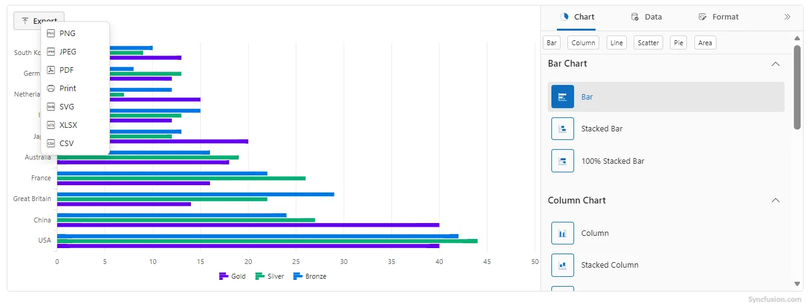
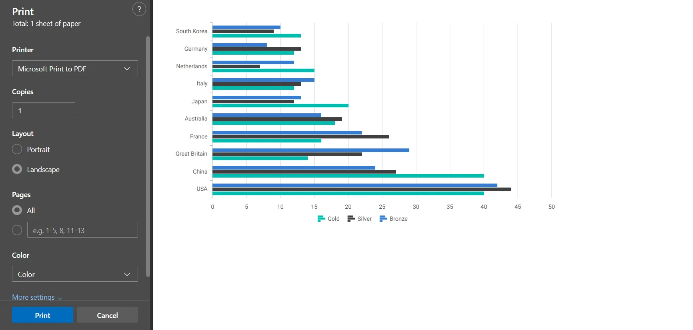

# Blazor Chart Wizard Print and Export

The Chart Wizard supports exporting the current chart to the following file formats: `PNG`, `JPEG`, `SVG`, `PDF`, `CSV`, and `XLSX`. It also supports printing the chart. Export and print actions are initiated from the export and print options in the Chart Wizard toolbar at runtime; the settings described below control the generated output.

## Configuring Export Options

Configure export settings using [`ChartExportSettings`](https://help.syncfusion.com/cr/blazor/Syncfusion.Blazor.ChartWizard.ChartExportSettings.html) in [`ChartSettings`](https://help.syncfusion.com/cr/blazor/Syncfusion.Blazor.ChartWizard.ChartSettings.html). The following properties are available:

- `FileName` - Specifies the file name for the exported file, without the file extension. The appropriate extension is appended automatically based on the selected format.
- `Width` - Specifies the output width, in pixels, for image and PDF exports.
- `Height` - Specifies the output height, in pixels, for image and PDF exports.
- `Orientation` - Specifies the page orientation for PDF and print exports. This property is of type `PageOrientation`; supported values are `PageOrientation.Portrait` and `PageOrientation.Landscape`.

```cshtml

@using Syncfusion.Blazor.ChartWizard

<div class="control-section">
    <SfChartWizard>
        <ChartSettings DataSource="@OlympicsDataSource"
                       CategoryFields="@categories"
                       SeriesFields="@chartSeries"
                       SeriesType="ChartWizardSeriesType.Bar">
            <ChartExportSettings FileName="OlympicsReport" Width="800" Height="500" Orientation="PageOrientation.Landscape" />
        </ChartSettings>
    </SfChartWizard>
</div>

@code {
    private readonly List<string> chartSeries = new() { "Gold", "Silver", "Bronze" };
    private readonly List<string> categories = new() { "Country", "CountryCode" };

    private readonly List<OlympicsData> OlympicsDataSource = new()
    {
        new OlympicsData { Country = "USA", CountryCode = "USA", Gold = 40, Silver = 44, Bronze = 42 },
        new OlympicsData { Country = "China", CountryCode = "CHN", Gold = 40, Silver = 27, Bronze = 24 },
        new OlympicsData { Country = "Great Britain", CountryCode = "GBR", Gold = 14, Silver = 22, Bronze = 29 },
        new OlympicsData { Country = "France", CountryCode = "FRA", Gold = 16, Silver = 26, Bronze = 22 },
        new OlympicsData { Country = "Australia", CountryCode = "AUS", Gold = 18, Silver = 19, Bronze = 16 },
        new OlympicsData { Country = "Japan", CountryCode = "JPN", Gold = 20, Silver = 12, Bronze = 13 },
        new OlympicsData { Country = "Italy", CountryCode = "ITA", Gold = 12, Silver = 13, Bronze = 15 },
        new OlympicsData { Country = "Netherlands", CountryCode = "NLD", Gold = 15, Silver = 7,  Bronze = 12 },
        new OlympicsData { Country = "Germany", CountryCode = "DEU", Gold = 12, Silver = 13, Bronze = 8  },
        new OlympicsData { Country = "South Korea", CountryCode = "KOR", Gold = 13, Silver = 9,  Bronze = 10 }
    };

    public class OlympicsData
    {
        public string? Country { get; set; }
        public string? CountryCode { get; set; }
        public int Gold { get; set; }
        public int Silver { get; set; }
        public int Bronze { get; set; }
    }
}

```




N> The **Print** option opens the browser's print dialog and prints the rendered chart. It does not generate a downloadable file. Use it to print the chart directly or to save it as a PDF using the browser's print-to-PDF feature.





## Customizing the Exported Chart with the Exporting Event

When an export operation is initiated, the component triggers the `Exporting` event and provides a [`ChartExportingEventArgs`](https://help.syncfusion.com/cr/blazor/Syncfusion.Blazor.ChartWizard.ChartExportingEventArgs.html) object. Use this event to customize the export operation.

The `ChartExportingEventArgs` object exposes the same `FileName`, `Width`, `Height`, and `Orientation` values as `ChartExportSettings` (pre-populated from those settings), plus:

- `Cancel` - Determines whether to cancel the export operation. Set this property to `true` to prevent the export.

Any changes made to `FileName`, `Width`, `Height`, or `Orientation` in the event handler override the configured `ChartExportSettings` values for the current export. `Orientation` is of type `PageOrientation` (`PageOrientation.Portrait` or `PageOrientation.Landscape`).


The following example shows how to handle the `Exporting` event:

```cshtml

@using Syncfusion.Blazor.ChartWizard

<div class="control-section">
    <SfChartWizard Exporting="OnExporting">
        <ChartSettings DataSource="@OlympicsDataSource"
                       CategoryFields="@categories"
                       SeriesFields="@chartSeries"
                       SeriesType="ChartWizardSeriesType.Bar">
            <ChartExportSettings FileName="Medals" />
        </ChartSettings>
    </SfChartWizard>
</div>

@code {
    private readonly List<string> chartSeries = new() { "Gold", "Silver", "Bronze" };
    private readonly List<string> categories = new() { "Country", "CountryCode" };

    private void OnExporting(ChartExportingEventArgs args)
    {
        // Set a custom file name
        args.FileName = "OlympicsMedalDetails";

        // Set explicit output dimensions when generating image/pdf outputs
        args.Width = 950; // pixels
        args.Height = 650; // pixels

        // Set page orientation for PDF/print exports
        args.Orientation = PageOrientation.Landscape; // or PageOrientation.Portrait

        if (OlympicsDataSource == null || OlympicsDataSource.Count == 0)
        {
            // prevent export
            args.Cancel = true;
        }
    }

    private readonly List<OlympicsData> OlympicsDataSource = new()
    {
        new OlympicsData { Country = "USA", CountryCode = "USA", Gold = 40, Silver = 44, Bronze = 42 },
        new OlympicsData { Country = "China", CountryCode = "CHN", Gold = 40, Silver = 27, Bronze = 24 },
        new OlympicsData { Country = "Great Britain", CountryCode = "GBR", Gold = 14, Silver = 22, Bronze = 29 },
        new OlympicsData { Country = "France", CountryCode = "FRA", Gold = 16, Silver = 26, Bronze = 22 },
        new OlympicsData { Country = "Australia", CountryCode = "AUS", Gold = 18, Silver = 19, Bronze = 16 },
        new OlympicsData { Country = "Japan", CountryCode = "JPN", Gold = 20, Silver = 12, Bronze = 13 },
        new OlympicsData { Country = "Italy", CountryCode = "ITA", Gold = 12, Silver = 13, Bronze = 15 },
        new OlympicsData { Country = "Netherlands", CountryCode = "NLD", Gold = 15, Silver = 7,  Bronze = 12 },
        new OlympicsData { Country = "Germany", CountryCode = "DEU", Gold = 12, Silver = 13, Bronze = 8  },
        new OlympicsData { Country = "South Korea", CountryCode = "KOR", Gold = 13, Silver = 9,  Bronze = 10 }
    };

    public class OlympicsData
    {
        public string? Country { get; set; }
        public string? CountryCode { get; set; }
        public int Gold { get; set; }
        public int Silver { get; set; }
        public int Bronze { get; set; }
    }
}
```


N>
- Set `args.Cancel` to `true` to cancel the export operation.
- Data export formats such as `CSV` and `XLSX` export the underlying data and do not use the `Width`, `Height`, or `Orientation` properties.
- `CSV` and `XLSX` exports are not affected by the `Exporting` event's dimension and orientation settings.


## See Also

- Explore the [Chart Wizard Demo](#) for interactive samples.
- [Working with Data in Blazor Chart Wizard](./working-with-data)
- [Serialization in Blazor Chart Wizard](./serialization)