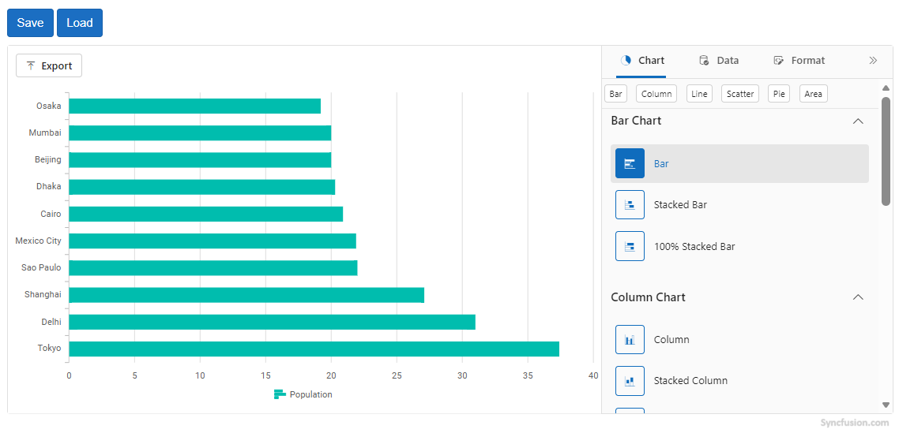

# Serialization in Blazor Chart Wizard Component

The `Chart Wizard` component makes it simple to save and restore your entire chart wizard configuration. This is useful for persisting user settings, sharing chart setups, or restoring previous states.

Serialization can be achieved using the following key methods:

- `SaveChart()` — Serializes the current chart state (including settings, series, axes, titles, styles, and more) and returns it as a JSON string.
- `LoadChartAsync(string data)` — Loads a chart configuration from a JSON string (produced by `SaveChart()`) and applies it to the wizard instance.

N>
- The serialized JSON captures the full runtime state of the chart wizard. You can store this string in a database, file, or browser storage for later use.
- `LoadChartAsync` resets the chart to its default state before applying the values from the JSON.
- Always use the JSON string produced by `SaveChart()` as input for `LoadChartAsync()`.

```cshtml

@using Syncfusion.Blazor.ChartWizard

<div class="control-section">
    <div class="toolbar-container">
        <div>
            <button class="btn btn-primary" @onclick="SaveChartAsync">Save</button>
            <button class="btn btn-primary" @onclick="OpenChartAsync">Load</button>
        </div>
    </div>
    <div class="content-wrapper">
        <SfChartWizard @ref="ChartWizard" Width="100%">
            <ChartSettings DataSource="@Top10Cities" CategoryFields="@categories" SeriesFields="@chartSeries" SeriesType="@chartWizardSeriesType">
            </ChartSettings>
        </SfChartWizard>
    </div>
</div>
<style>
    .toolbar-container {
        width: 100%;
        height: 10%;
        padding-top: 10px;
        padding-bottom: 10px;
    }
</style>

@code {
    private SfChartWizard? ChartWizard;
    private readonly List<string> chartSeries = new() { "Population" };
    private readonly List<string> categories = new() { "City", "Country" };
    private ChartWizardSeriesType chartWizardSeriesType = ChartWizardSeriesType.Bar;
    public string? serializedString;

    public class GlobalCityPopulationItem
    {
        public string? City { get; set; }
        public string? Country { get; set; }
        public double? Population { get; set; }
    }

    private readonly List<GlobalCityPopulationItem> Top10Cities = new()
    {
        new() { City = "Tokyo", Country = "Japan", Population = 37.4 },
        new() { City = "Delhi", Country = "India", Population = 31.0 },
        new() { City = "Shanghai", Country = "China", Population = 27.1 },
        new() { City = "Sao Paulo", Country = "Brazil", Population = 22.0 },
        new() { City = "Mexico City", Country = "Mexico", Population = 21.9 },
        new() { City = "Cairo", Country = "Egypt", Population = 20.9 },
        new() { City = "Dhaka", Country = "Bangladesh", Population = 20.3 },
        new() { City = "Beijing", Country = "China", Population = 20.0 },
        new() { City = "Mumbai", Country = "India", Population = 20.0 },
        new() { City = "Osaka", Country = "Japan", Population = 19.2 }
    };

    private async Task SaveChartAsync()
    {
        if(ChartWizard != null)
            serializedString = ChartWizard.SaveChart();
    }

    private async Task OpenChartAsync()
    {
        if(ChartWizard != null)
            await ChartWizard.LoadChartAsync(serializedString);
    }
}

```




## See Also

- Explore the [Chart Wizard Demo](#) for interactive samples.