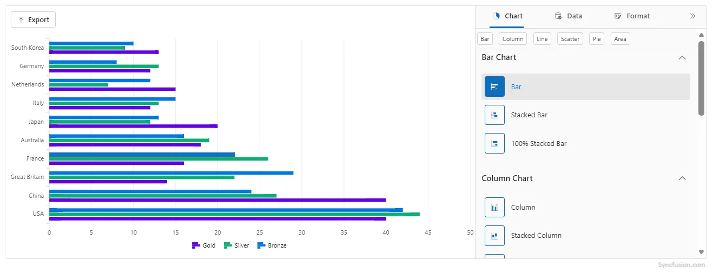
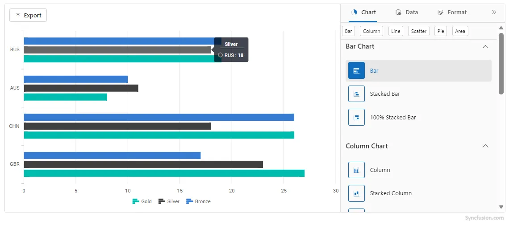

# Working with Data in Blazor Chart Wizard Component

The primary configuration for the chart wizard is provided via the `ChartSettings`. Key properties:

- `DataSource` (`IEnumerable<Object>`) — Supplies the collection of data objects for the chart. Each object should have fields referenced by `CategoryFields` and `SeriesFields`.
- `CategoryFields` (`IEnumerable<string>`) — Specifies one or more field names from your data objects to use as category (x-axis) values. Example: `new List<string>{ "Country" }` or `new[] { "Month" }`.
- `SeriesFields` (`IEnumerable<string>`) — Lists one or more numeric field names to render as chart series. Use multiple names for multi-series charts (e.g., `new[]{ "Gold", "Silver", "Bronze" }`).
- `SeriesType` (`ChartWizardSeriesType`) — Selects the chart type for rendering series. Common values include `Bar`, `Column`, `Line`, `Area`, `Pie`, and more.

## Configuring Fields

- **Single-category, single-series chart**

```
<ChartSettings DataSource="@SalesData"
               CategoryFields="@(new[]{ "Month" })"
               SeriesFields="@(new[]{ "Sales" })"
               SeriesType="ChartWizardSeriesType.Column" />
```


- **Multi-series chart**

```
<ChartSettings DataSource="@OlympicsData"
               CategoryFields="@(new[]{ "Country" })"
               SeriesFields="@(new[]{ "Gold", "Silver", "Bronze" })"
               SeriesType="ChartWizardSeriesType.Bar" />
```


N>
- The order of `SeriesFields` determines the default series ordering.
- `CategoryFields` can include multiple fields for nested or grouped categories; the wizard will combine them as specified.

## List Binding

Any IEnumerable object can be assigned to the `DataSource` property of the `ChartSettings`.

```

@using Syncfusion.Blazor.ChartWizard

<div class="control-section">
    <SfChartWizard Width="90%" Theme="Theme.Fluent2" PropertyPanelExpanded="true">
        <ChartSettings DataSource="@OlympicsDataSource"
                        CategoryFields="@(new[] { "Country" })"
                        SeriesFields="@(new[] { "Gold", "Silver", "Bronze" })"
                        SeriesType="ChartWizardSeriesType.Bar"
                        EnablePropertyPanel="true"
                        AllowExport="true">
        </ChartSettings>
    </SfChartWizard>
</div>

@code {
    private readonly List<string> chartSeries = new() { "Gold", "Silver", "Bronze" };
    private readonly List<string> categories = new() { "Country" };

    private readonly List<OlympicsData> OlympicsDataSource = new()
    {
        new OlympicsData { Country = "USA", CountryCode = "USA", Gold = 40, Silver = 44, Bronze = 42 },
        new OlympicsData { Country = "China", CountryCode = "CHN", Gold = 40, Silver = 27, Bronze = 24 },
        new OlympicsData { Country = "Great Britain", CountryCode = "GBR", Gold = 14, Silver = 22, Bronze = 29 },
        new OlympicsData { Country = "France", CountryCode = "FRA", Gold = 16, Silver = 26, Bronze = 22 },
        new OlympicsData { Country = "Australia", CountryCode = "AUS", Gold = 18, Silver = 19, Bronze = 16 },
        new OlympicsData { Country = "Japan", CountryCode = "JPN", Gold = 20, Silver = 12, Bronze = 13 },
        new OlympicsData { Country = "Italy", CountryCode = "ITA", Gold = 12, Silver = 13, Bronze = 15 },
        new OlympicsData { Country = "Netherlands", CountryCode = "NLD", Gold = 15, Silver = 7,  Bronze = 12 },
        new OlympicsData { Country = "Germany", CountryCode = "DEU", Gold = 12, Silver = 13, Bronze = 8  },
        new OlympicsData { Country = "South Korea", CountryCode = "KOR", Gold = 13, Silver = 9,  Bronze = 10 }
    };

    public class OlympicsData
    {
        public string? Country { get; set; }
        public int Gold { get; set; }
        public int Silver { get; set; }
        public int Bronze { get; set; }
    }
}

```




## ObservableCollection

The [ObservableCollection](https://learn.microsoft.com/en-us/dotnet/api/system.collections.objectmodel.observablecollection-1?view=net-6.0) (dynamic data collection) provides notifications when items are added, removed, and moved. The implemented [INotifyCollectionChanged](https://learn.microsoft.com/en-us/dotnet/api/system.collections.specialized.inotifycollectionchanged?view=net-6.0) provides notification when the dynamic changes of adding, removing, moving, and clearing the collection occur.

```
@using Syncfusion.Blazor.ChartWizard
@using System.Collections.ObjectModel

<div class="control-section">
    <SfChartWizard>
        <ChartSettings DataSource="@OlympicsDataSource"
                    CategoryFields="@categories"
                    SeriesFields="@chartSeries"
                    SeriesType="ChartWizardSeriesType.Bar" />
    </SfChartWizard>
</div>

@code {
    private readonly List<string> chartSeries = new() { "Gold", "Silver", "Bronze" };
    private readonly List<string> categories = new() { "CountryCode" };
    private ObservableCollection<OlympicsData>? OlympicsDataSource;

    public class OlympicsData
    {
        public string? CountryCode { get; set; }
        public double Gold { get; set; }
        public double Silver { get; set; }
        public double Bronze { get; set; }
        public static ObservableCollection<OlympicsData> GetData()
        {
            return new ObservableCollection<OlympicsData>
            {
                new OlympicsData { CountryCode = "GBR", Gold = 27, Silver = 23, Bronze = 17 },
                new OlympicsData { CountryCode = "CHN", Gold = 26, Silver = 18, Bronze = 26 },
                new OlympicsData { CountryCode = "AUS", Gold = 8, Silver = 11, Bronze = 10 },
                new OlympicsData { CountryCode = "RUS", Gold = 19, Silver = 18, Bronze = 19 }
            };
        }
    }

    protected override void OnInitialized()
    {
        OlympicsDataSource = OlympicsData.GetData();
    }
}

```




## See Also

- Explore the [Chart Wizard Demo](#) for interactive samples.
